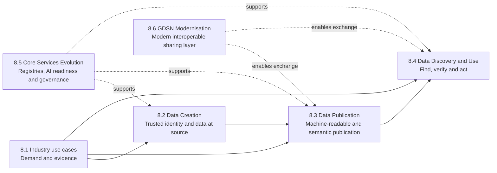

<!--
Document: GS1 Future of Data Sharing repository README
Version: v0.1.0
Status: Draft baseline
Date: 2026-07-11
-->

# GS1 Future of Data Sharing

**Vision 2030 — Objective 8**

> **Trusted identification. Trusted data. An AI-driven world.**

This repository is the shared implementation and knowledge space for GS1's **Future of Data Sharing** programme. It brings together strategic framing, project artefacts, technical specifications, machine-readable examples, prototypes, validation evidence and implementation guidance across Objective 8.

The programme addresses how GS1 identifiers, standards, vocabularies, registries, data-sharing services and governance must evolve so that trusted GS1 data can be created, published, discovered, verified and used consistently by people, organisations, regulatory systems, data spaces, software applications and AI agents.

## Contents

- [Strategic intent](#strategic-intent)
- [Programme model](#programme-model)
- [Objective 8 portfolio](#objective-8-portfolio)
  - [8.1 Industry use cases driving relevance](#81-industry-use-cases-driving-relevance)
  - [8.2 Data Creation](#82-data-creation)
  - [8.3 Data Publication](#83-data-publication)
  - [8.4 Data Discovery and Use](#84-data-discovery-and-use)
  - [8.5 Core Services Evolution](#85-core-services-evolution)
  - [8.6 GDSN Modernisation](#86-gdsn-modernisation)
- [Cross-cutting principles](#cross-cutting-principles)
- [Repository scope](#repository-scope)
- [Artefact status and versioning](#artefact-status-and-versioning)
- [Zensical documentation site](#zensical-documentation-site)
- [Contributing](#contributing)
- [Governance and usage](#governance-and-usage)

## Strategic intent

The Future of Data Sharing programme is intended to make trusted GS1 identification and data usable across a rapidly changing digital ecosystem. Its focus is not a single platform or technology. It is the coordinated evolution of the GS1 system so that authoritative information can move from the point of creation to the point of decision with its identity, meaning, provenance and governance intact.

The programme supports outcomes including:

- product, party, location and asset verification at scale;
- trusted consumer, patient and business interactions through advanced data carriers and GS1 Digital Link;
- faster and more interoperable cross-border trade;
- regulatory transparency and market surveillance;
- trustworthy AI-assisted discovery and agentic commerce;
- interoperable participation in data spaces;
- sustainable and circular-economy use cases, including Digital Product Passports;
- consistent, federated implementation across GS1 Global Office and Member Organisations.

## Programme model

Objective 8 connects industry demand to the capabilities required to create, publish, discover and use trusted data.



The initiatives are complementary:

- **8.1 defines and validates demand.**
- **8.2 strengthens trusted data at the point of creation.**
- **8.3 makes standards and data assets machine-readable, semantically explicit and publishable.**
- **8.4 makes trusted information discoverable, verifiable and usable at the point of decision.**
- **8.5 evolves the core services and governance on which the other initiatives depend.**
- **8.6 modernises GDSN as an interoperable data-sharing layer while preserving its distinct role from GS1 registries.**

## Objective 8 portfolio

### 8.1 Industry use cases driving relevance

**Purpose:** establish the demand, evidence and priority outcomes that should shape the Future of Data Sharing capability portfolio.

The seven workstreams explore market needs, stakeholder roles, required capabilities, value and adoption signals, and the conditions or gaps that affect implementation.

#### 8.1.a Verification at Scale

Explore the next stage of product, party and licence verification, including the operating, commercial and federation capabilities required to scale trusted verification services.

#### 8.1.b Scan to Trust

Explore trusted scan-to-content journeys using advanced data carriers, GS1 Digital Link, resolver services and links registries so that a single scan can reach authoritative, current and audience-appropriate information.

#### 8.1.c Borders Without Barriers

Develop a repeatable model for applying GS1 identification and trusted data in customs, tax, logistics and cross-border trade processes, drawing on existing Member Organisation and authority integrations.

#### 8.1.d Regulatory Trust

Explore how GS1 identifiers, registries, standards and trusted data can support regulators, market-surveillance authorities and compliance workflows without creating parallel identification systems.

#### 8.1.e AI Gateway

Explore how external AI systems and agents can discover, interpret, verify and use GS1-enabled data, standards and services through governed, safe and interoperable access patterns.

#### 8.1.f Data Spaces

Define GS1's strategic and architectural role in data spaces, including the reuse of GS1 identifiers, vocabularies, data services, catalogues and trust mechanisms.

#### 8.1.g Expanding our Reach

Explore new adoption and delegation models that extend GS1 identification and trusted data into additional sectors and supply-chain tiers, including agriculture and upstream ecosystems.

### 8.2 Data Creation

**Purpose:** establish trusted identity and high-quality, trusted data at the point of creation.

This initiative focuses on the controls, operating patterns and supporting capabilities needed so that identifiers and data are authoritative from the outset rather than repaired downstream.

Current capability themes include:

- trusted allocation and use of GS1 identifiers;
- licence, party and location verification;
- data quality, completeness and validation at source;
- provenance and responsibility for created data;
- third-party delegation and authorised data creation;
- verifiable claims and credentials where cryptographic proof is justified;
- consistent support for brand owners, solution providers and Member Organisations.

### 8.3 Data Publication

**Purpose:** enable GS1 standards and data to be published in machine-readable, interoperable and AI-ready forms so they can be understood and used by industry systems, regulatory platforms, data spaces and emerging AI tools.

#### 8.3.a Machine-readable standards and models

Structure, express, version and maintain selected GS1 standards, models, code lists and related artefacts as authoritative machine-readable resources. The objective is to move beyond human-only documents towards standards as governed digital artefacts.

Typical outputs may include structured data models, schemas, code lists, machine-readable rules, APIs and versioned artefact packages.

#### 8.3.b Semantic and AI-ready publication

Define and validate **Semantic Publication Profiles** that transform authoritative 8.3.a artefacts into trusted, discoverable and reusable publication packages.

These profiles specify how artefacts are:

- persistently identified and versioned;
- semantically described and linked;
- published in representations such as Markdown, JSON-LD, RDF and OpenAPI;
- validated using schemas and constraints;
- supplied with provenance, lifecycle, rights and governance metadata;
- made FAIR and retrievable by search, retrieval-augmented generation and AI agents;
- projected safely into agent-facing interfaces such as MCP or A2A where appropriate.

#### 8.3.c Publication model evolution

Assess longer-term changes to GS1 publication models for AI, regulatory and data-space needs, including sidecar approaches where justified. This area is retained as a future capability topic rather than an active FY26/27 delivery priority unless separately approved and resourced.

### 8.4 Data Discovery and Use

**Purpose:** make trusted GS1 data easy to find, interpret, verify and use at the point of decision across multiple ecosystems.

Relevant areas of work include:

#### Get All Licences commercialisation

Develop the commercial, onboarding, support and governance model required to make licence and verification capabilities usable and sustainable at scale.

#### 8.4.b AI Interfaces

Define and validate AI-compatible interfaces through which authorised systems and agents can interact with GS1 knowledge and services.

The intended interaction journey includes:

1. **discover** the relevant GS1 capability or resource;
2. **identify** the product, party, location, asset or standards artefact;
3. **retrieve** authoritative data and context;
4. **interpret** meaning using governed semantics;
5. **verify** identity, provenance, status and applicable claims;
6. **act** through controlled APIs, workflows or agent tools.

AI Interfaces consume authoritative artefacts from 8.3 and operational capabilities from registries, Digital Link, resolver services and other GS1 services; they do not redefine those sources of truth.

### 8.5 Core Services Evolution

**Purpose:** evolve core registry capabilities, AI readiness and data governance so that trusted GS1 services can support human, organisational, regulatory and machine audiences consistently.

#### 8.5.a AI-assisted natural-language search

Improve the discovery of GS1 standards, identifiers, data and guidance through natural-language and semantic search grounded in authoritative GS1 sources.

#### Core-service and sidecar capabilities

Explore reusable capabilities that augment existing registries and services with semantic metadata, provenance, policy, discovery and agent-readiness information without unnecessarily replacing proven operational platforms.

#### 8.5.c AI-assisted translation of global components

Use AI-assisted methods to improve the speed and consistency of translating GS1 global components while preserving approved terminology, meaning, structure and governance.

#### Data governance evolution

Strengthen common policies for data quality, stewardship, access, provenance, lifecycle, auditability and responsible AI-enabled use across the federation.

### 8.6 GDSN Modernisation

**Purpose:** evolve the Global Data Synchronisation Network into a modern, interoperable sharing layer that continues to support reliable master-data exchange while integrating with newer digital and regulatory ecosystems.

Relevant capability areas include:

- modern API and integration patterns;
- migration from legacy interfaces where appropriate;
- data-model alignment and extensibility;
- improved reporting, monitoring and operational transparency;
- interoperability with regulatory, sustainability and data-space requirements;
- alignment with machine-readable and semantic publication outputs;
- preservation of the architectural distinction between **GDSN operational synchronisation** and **GS1 registry identity, authority and verification services**.

## Cross-cutting principles

All Objective 8 work should apply the following principles:

1. **Trusted identification first** — persistent, governed identifiers anchor data, claims and interactions.
2. **Authoritative data over scraped approximation** — systems and agents should be able to cite and retrieve the source responsible for the information.
3. **Semantics as infrastructure** — meaning, context and relationships must be explicit and reusable.
4. **FAIR by design** — artefacts should be findable, accessible under declared conditions, interoperable and reusable.
5. **Provenance and verifiability** — users and machines must be able to determine origin, authority, version, status and integrity.
6. **Open, established standards** — reuse suitable external standards and protocols rather than creating unnecessary GS1-specific alternatives.
7. **Federation consistency** — global interoperability depends on coherent implementation across Global Office and Member Organisations.
8. **Security, privacy and controlled action** — discovery and automation must respect access policy, purpose, risk and confirmation requirements.
9. **Separation of concerns** — identifiers, registries, GDSN, publication, discovery and AI interfaces are connected but architecturally distinct capabilities.
10. **Evidence-led evolution** — capability investment should be guided by validated use cases, market evidence and measurable outcomes.

## Repository scope

This repository may contain:

- strategic and architectural documents;
- project plans and decision records;
- use cases, user stories and evidence;
- Semantic Publication Profiles;
- machine-readable standards artefacts and examples;
- JSON-LD contexts, RDF vocabularies and SHACL shapes;
- JSON Schemas and validation rules;
- OpenAPI, Arazzo, MCP and A2A examples or overlays;
- DCAT and data-product descriptions;
- prototypes, reference implementations and test data;
- conformance tests and validation reports;
- implementation guidance for Global Office, Member Organisations and industry users.

Repository content is implementation-oriented. An artefact is not a normative GS1 standard merely because it is stored here.

## Artefact status and versioning

Each substantive artefact should declare:

- title and persistent identifier where available;
- semantic version;
- status, such as `concept`, `draft`, `candidate`, `validated`, `approved`, `deprecated` or `superseded`;
- owner or responsible workstream;
- date and change history;
- source and provenance;
- licence or usage conditions;
- dependencies and applicable conformance profile.

Recommended semantic-versioning practice:

- `0.x.x` — exploratory or draft content;
- `1.0.0` — first approved or stable baseline;
- increment **minor** for backward-compatible material additions;
- increment **patch** for corrections that do not change meaning or conformance;
- increment **major** for incompatible structural, semantic or governance changes.

## Zensical documentation site

The curated documentation site is maintained under `docs/` and configured by `zensical.toml`. The generated static site is written to `site/`, which is treated as build output and is not intended to be committed.

Use the project virtual environment when running Zensical:

```bash
.venv/bin/zensical serve --dev-addr localhost:8000
```

This builds the documentation and serves it locally at `http://localhost:8000/`.

To run a production-style build without starting a local server:

```bash
.venv/bin/zensical build --clean
```

The GitHub Pages deployment is handled by `.github/workflows/docs.yml`. On pushes to `main` or `master`, the workflow:

1. checks out the repository;
2. installs Python and `zensical`;
3. runs `zensical build --clean`;
4. uploads the generated `site/` directory as a Pages artifact;
5. deploys it using GitHub Pages.

For GitHub Pages to publish correctly, configure the repository Pages source to use **GitHub Actions**.

For RDF/JSON-LD conversion and OWL-to-Schema.org projection, see the
[OWL/RDF and JSON-LD guide](docs/ontology/jsonld.md). With CPython 3.14.4,
install using `.venv/bin/python -m pip install -e .`, then run `.venv/bin/owl-jsonld --help`.

## Contributing

Contributions should:

1. identify the relevant Objective 8 initiative or subproject;
2. state the problem, use case or requirement being addressed;
3. preserve authoritative GS1 terminology and identifiers;
4. distinguish normative proposals from informative examples;
5. include provenance and references;
6. provide machine-readable artefacts and validation evidence where applicable;
7. avoid introducing duplicate semantics, identifiers or local variants without an explicit mapping and governance rationale;
8. use pull requests so changes can be reviewed, discussed and traced.

Detailed contribution, review and approval procedures should be maintained in a separate `CONTRIBUTING.md` as the repository operating model matures.

## Governance and usage

This repository is a collaborative working environment for the Future of Data Sharing programme. Publication here does not by itself imply formal GS1 approval, production support, certification or normative status.

Formal standards, policies and production services remain subject to their established GS1 governance, architecture, product-management, security, legal and Global Standards Management Process controls.

---

**Trusted identification. Trusted data. An AI-driven world.**
