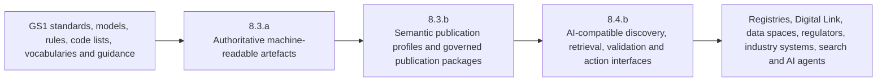

# GS1 8.3.b Semantic Publication Profiles

## A profile family for FAIR, linked-data, Markdown and agent-ready publication of GS1 standards and data assets

**Version:** v1.2.0  
**Status:** Draft for discussion and validation  
**Date:** 6 July 2026

---

## Table of contents

- [Executive summary](#executive-summary)
  - [Executive formulation](#executive-formulation)
- [1. Purpose](#1-purpose)
- [2. Strategic context](#2-strategic-context)
- [3. Workstream boundaries and handoffs](#3-workstream-boundaries-and-handoffs)
  - [3.1 Capability chain](#31-capability-chain)
  - [3.2 Responsibilities](#32-responsibilities)
  - [3.3 Boundary statement](#33-boundary-statement)
- [4. Definition of a semantic publication profile](#4-definition-of-a-semantic-publication-profile)
- [5. Common requirements for all profiles](#5-common-requirements-for-all-profiles)
- [6. Proposed profile family](#6-proposed-profile-family)
- [7. Base semantic publication profiles](#7-base-semantic-publication-profiles)
  - [7.1 GS1 Standards Artefact Semantic Publication Profile](#71-gs1-standards-artefact-semantic-publication-profile)
  - [7.2 GS1 Controlled Vocabulary and Code List Publication Profile](#72-gs1-controlled-vocabulary-and-code-list-publication-profile)
  - [7.3 GS1 Ontology and Web Vocabulary Publication Profile](#73-gs1-ontology-and-web-vocabulary-publication-profile)
  - [7.4 GS1 Context Data Product Publication Profile](#74-gs1-context-data-product-publication-profile)
  - [7.5 GS1 Semantic Mapping Publication Profile](#75-gs1-semantic-mapping-publication-profile)
  - [7.6 GS1 Registry Record Semantic Publication Profile](#76-gs1-registry-record-semantic-publication-profile)
  - [7.7 GS1 Verifiable Claims Publication Profile](#77-gs1-verifiable-claims-publication-profile)
  - [7.8 GS1 GenAI-Enabled API Semantic Publication Profile](#78-gs1-genai-enabled-api-semantic-publication-profile)
- [8. FAIR conformance overlay](#8-fair-conformance-overlay)
  - [8.1 Positioning](#81-positioning)
  - [8.2 FAIR-to-profile requirements mapping](#82-fair-to-profile-requirements-mapping)
  - [8.3 FAIR profile deliverables](#83-fair-profile-deliverables)
  - [8.4 FAIR profile test question](#84-fair-profile-test-question)
- [9. Linked Data Serialisation Overlay](#9-linked-data-serialisation-overlay)
  - [9.1 Purpose](#91-purpose)
  - [9.2 Required representations](#92-required-representations)
  - [9.3 Linked Data rules](#93-linked-data-rules)
  - [9.4 Candidate vocabulary stack](#94-candidate-vocabulary-stack)
  - [9.5 Linked Data package example](#95-linked-data-package-example)
- [10. Markdown Serialisation Overlay](#10-markdown-serialisation-overlay)
  - [10.1 Purpose](#101-purpose)
  - [10.2 Required Markdown controls](#102-required-markdown-controls)
  - [10.3 Recommended front matter](#103-recommended-front-matter)
  - [10.4 Semantic Markdown sidecars](#104-semantic-markdown-sidecars)
  - [10.5 AI retrieval requirements](#105-ai-retrieval-requirements)
- [11. Agentic Interface Overlay](#11-agentic-interface-overlay)
  - [11.1 Purpose](#111-purpose)
  - [11.2 OpenAPI baseline](#112-openapi-baseline)
  - [11.3 Agent-relevant OpenAPI enhancements](#113-agent-relevant-openapi-enhancements)
  - [11.4 Candidate GS1 OpenAPI extensions](#114-candidate-gs1-openapi-extensions)
  - [11.5 Use of the OpenAPI Overlay Specification](#115-use-of-the-openapi-overlay-specification)
  - [11.6 Arazzo workflow profile](#116-arazzo-workflow-profile)
  - [11.7 MCP projection profile](#117-mcp-projection-profile)
  - [11.8 A2A projection profile](#118-a2a-projection-profile)
  - [11.9 Relationship between OpenAPI, MCP and A2A](#119-relationship-between-openapi-mcp-and-a2a)
- [12. AI-Retrievable Standards Overlay](#12-ai-retrievable-standards-overlay)
  - [12.1 Purpose](#121-purpose)
  - [12.2 Requirements](#122-requirements)
  - [12.3 Retrieval result contract](#123-retrieval-result-contract)
- [13. Worked examples of the handoff](#13-worked-examples-of-the-handoff)
  - [13.1 General Specifications section 4.13](#131-general-specifications-section-413)
  - [13.2 GPC](#132-gpc)
  - [13.3 EPCIS API](#133-epcis-api)
  - [13.4 Digital Product Passport context product](#134-digital-product-passport-context-product)
  - [13.5 GS1 registry record](#135-gs1-registry-record)
- [14. Conformance model](#14-conformance-model)
  - [14.1 Suggested conformance classes](#141-suggested-conformance-classes)
  - [14.2 Example conformance claim](#142-example-conformance-claim)
  - [14.3 Conformance evidence](#143-conformance-evidence)
- [15. Recommended FY26/27 validation set](#15-recommended-fy2627-validation-set)
  - [Pilot 1 — General Specifications semantic publication](#pilot-1-general-specifications-semantic-publication)
  - [Pilot 2 — GPC semantic publication](#pilot-2-gpc-semantic-publication)
  - [Pilot 3 — EPCIS GenAI-enabled API profile](#pilot-3-epcis-genai-enabled-api-profile)
  - [Pilot 4 — DPP Context Data Product](#pilot-4-dpp-context-data-product)
- [16. Minimum deliverables for each pilot](#16-minimum-deliverables-for-each-pilot)
- [17. Governance model](#17-governance-model)
  - [17.1 Governance principles](#171-governance-principles)
  - [17.2 Candidate decision rights](#172-candidate-decision-rights)
- [18. Key risks and controls](#18-key-risks-and-controls)
- [19. Success measures](#19-success-measures)
- [20. Recommended immediate decisions](#20-recommended-immediate-decisions)
- [21. Core test of semantic publication readiness](#21-core-test-of-semantic-publication-readiness)
- [22. Normative and informative reference basis](#22-normative-and-informative-reference-basis)
  - [GS1 sources](#gs1-sources)
  - [ISO standards and work items](#iso-standards-and-work-items)
  - [FAIR and semantic Web](#fair-and-semantic-web)
  - [API and agent protocols](#api-and-agent-protocols)
- [23. Change log](#23-change-log)
- [24. Proposed next-version topics](#24-proposed-next-version-topics)

## Executive summary

A **semantic publication profile** is a governed, testable publication contract defining how a class of GS1 digital artefact is identified, described, structured, linked, validated, versioned, discovered, represented and made usable by humans, software and AI agents.

### Executive formulation

> **Semantic publication profiles define the repeatable rules by which GS1 standards, models and data assets are transformed from merely machine-readable artefacts into trusted, discoverable and AI-ready resources. They specify how each artefact is identified, described, versioned, linked, validated, governed and published across formats such as Linked Data, JSON-LD, Markdown and OpenAPI, while also embedding FAIR principles, provenance and agentic access patterns. In doing so, they create a consistent semantic contract between 8.3.a and downstream capabilities: 8.3.a produces the authoritative machine-readable content, 8.3.b makes that content semantically explicit and reusable, and 8.4.b exposes it through interfaces that machines, registries, data spaces and AI agents can reliably discover, interpret, verify and act upon.**

It is not simply a choice of file format. Publishing a standard as JSON, rendering it as Markdown or exposing an endpoint through OpenAPI does not, by itself, make the result semantically explicit, FAIR or agent-ready. The profile must establish the meaning, authority, provenance, lifecycle, relationships, access conditions and conformance requirements that allow an unfamiliar machine to use the artefact correctly.

The intended workstream relationship is:

- **8.3.a — Machine-readable standards and models** creates and maintains authoritative structured standards artefacts, data models, code lists, schemas and related machine-readable outputs.
- **8.3.b — Semantic and AI-ready publication** defines and validates the repeatable semantic publication profiles applied to those outputs, including FAIR metadata, linked-data representations, Markdown serialisations, validation rules and agentic description overlays.
- **8.4.b — AI Interfaces** uses the published semantic contracts to expose trustworthy discovery, retrieval, interpretation, validation and action capabilities through APIs, tools, search, agent protocols and other interfaces.

The central handoff can be summarised as:

> **8.3.a produces the authoritative digital artefact; 8.3.b turns it into a governed semantic publication package; 8.4.b exposes and applies that package through AI-compatible interfaces.**

This document proposes a profile family consisting of a common core and specialised profiles for standards artefacts, code lists, ontologies, context data products, mappings, registry records, verifiable claims and GenAI-enabled APIs, together with Markdown, linked-data, AI-retrieval and agentic-interface overlays. FAIR Data Principles are treated as cross-cutting conformance requirements rather than a separate publication format.

---

## 1. Purpose

This document defines candidate semantic publication profiles for GS1 workstream **8.3.b — Semantic and AI-ready publication**. It expands the initial profile examples to include:

- FAIR Data Principles;
- agentic profiles;
- a dedicated GenAI-Enabled API Semantic Publication Profile;
- OpenAPI enhancement and overlay patterns;
- JSON-LD contexts that provide machine-interpretable API and payload semantics;
- deterministic projection requirements for MCP resources and tools;
- Arazzo workflow descriptions;
- MCP resource and tool projections;
- A2A agent capability descriptions;
- Markdown serialisation requirements;
- linked-data serialisations;
- discovery, provenance and validation controls;
- clear handoffs to 8.3.a and 8.4.b.

The document is intended to support FY26/27 profile definition, pilot selection, validation and governance planning. It deliberately avoids assuming that 8.3.b must create a new standalone platform. The capability may be implemented through common specifications, publication pipelines, sidecars, overlays, templates, validation services and governance controls applied across existing GS1 publication channels.

---

## 2. Strategic context

The 8.3.a project defines machine-readable standards as GS1 standards content published in a structured formal format so software can discover, interpret and use it without relying on human interpretation of narrative text. Its planned outputs include structured General Specifications artefacts, Application Identifier semantics, EDI artefacts, GPC, EPCIS and CBV updates, TDS/TDT artefacts, glossary data, Web Vocabulary mappings, and regulatory artefacts for EUDR and Digital Product Passports.

Those outputs create the authoritative digital source material, but downstream use still requires a consistent publication contract. Different artefacts may otherwise use inconsistent identifiers, metadata, versioning, semantic modelling, provenance, access mechanisms and validation rules. This would reproduce document-era fragmentation in machine-readable form.

8.3.b therefore addresses the question:

> **How should GS1 standards and data assets be published so that machines and agents can determine what an artefact is, what it means, whether it is authoritative, which version applies, how it relates to other artefacts, how it may be accessed, and whether a given use conforms?**

This is the difference between **machine-readable syntax** and **machine-actionable semantic publication**.

---

## 3. Workstream boundaries and handoffs

### 3.1 Capability chain



### 3.2 Responsibilities

| Concern | 8.3.a | 8.3.b | 8.4.b |
| --- | --- | --- | --- |
| Authoritative standards content | Owns or coordinates creation and maintenance | References and preserves authority | Consumes without redefining |
| Structured source artefact | Produces and versions | Defines publication conformance | Exposes through interfaces |
| Semantic identity and metadata | Provides source identifiers where available | Defines mandatory semantic metadata and persistent identification | Uses identifiers for discovery and responses |
| Linked-data representation | May generate source serialisation | Defines contexts, profiles, mappings, content negotiation and validation | Retrieves and serves representations |
| Markdown representation | May generate source text | Defines source-preserving Markdown serialisation profile | Uses Markdown for retrieval, citation and human-readable responses |
| OpenAPI | May describe a standards-related API | Defines agentic and semantic augmentation profile | Implements and operates API/interface |
| Agent protocols | Supplies authoritative operations and resources | Defines semantic projection and protocol binding rules | Implements MCP, A2A, UCP or other interfaces |
| FAIR conformance | Supplies authoritative metadata and identifiers | Defines FAIR controls and tests | Preserves FAIR access and discovery behaviour |
| Registry platform operation | Out of scope except standards dependencies | Defines semantic registry record profile | Implements query, verification and agent access |

### 3.3 Boundary statement

8.3.b should **not** be described as creating a new infrastructure platform unless a separately approved implementation decision requires one. Its primary output is a reusable semantic publication capability comprising:

- application profiles;
- semantic models and mappings;
- metadata requirements;
- serialisation rules;
- publication manifests;
- validation shapes and schemas;
- provenance patterns;
- agentic overlays and projections;
- conformance tests;
- governance and lifecycle rules.

---

## 4. Definition of a semantic publication profile

A semantic publication profile is a named, versioned specification that constrains and combines existing standards and GS1 requirements for a defined publication purpose.

Every profile should state:

1. **Scope** — the artefact classes and use cases covered.
2. **Normative basis** — the external and GS1 specifications reused.
3. **Semantic model** — the classes, properties, controlled terms and relationships required.
4. **Identity rules** — persistent identifiers for the artefact, version, components and concepts.
5. **Metadata rules** — descriptive, administrative, technical and governance metadata.
6. **Representations** — mandatory and optional serialisations.
7. **Access and discovery** — how metadata and representations are found and retrieved.
8. **Validation** — executable constraints and conformance tests.
9. **Provenance and authority** — source, publisher, approver, derivation and change history.
10. **Lifecycle** — status, versioning, supersession, deprecation and persistence.
11. **Agentic affordances** — how machines discover capabilities, interpret operations and assess safety.
12. **Conformance classes** — mandatory, recommended and optional requirements.

A profile should be published as a complete package, not only as prose. The normative package should normally include:

- human-readable specification;
- machine-readable profile metadata;
- JSON Schema and/or SHACL shapes;
- controlled vocabulary or ontology module;
- valid and invalid examples;
- conformance test suite;
- change log;
- implementation guidance;
- publication manifest;
- source-to-output traceability information.

---

## 5. Common requirements for all profiles

The proposed **GS1 Core Semantic Publication Profile** supplies requirements inherited by every specialised profile.

| Requirement area | Core requirement |
| --- | --- |
| Persistent identity | Each artefact, version and addressable component has a globally unique, persistent and dereferenceable identifier where feasible. |
| Authority | The authoritative publisher, owner, approving body and maintenance responsibility are explicit. |
| Artefact classification | The resource is typed as a standard, clause, table, code list, schema, ontology, profile, mapping, API description, dataset, service or other governed class. |
| Rich metadata | Title, description, scope, language, audience, status, dates, themes, keywords, applicable sectors and dependencies are supplied. |
| Versioning | Current version, version identifier, release date, prior version, successor, compatibility and change classification are machine-readable. |
| Provenance | Source artefact, derivation activity, transformation software, responsible agents, approval and publication events are recorded. |
| Semantic relationships | References, dependencies, mappings, imports, compositions, replacements and applicability relations are qualified rather than embedded only as text. |
| Representation | The abstract artefact is distinguished from each distribution or serialisation. |
| Validation | Machine-executable constraints and test examples are provided for structured outputs. |
| Discoverability | Metadata are registered or indexed in a searchable catalogue or registry and linked from the authoritative page. |
| Access | Access protocols, authentication, authorisation, media types and content negotiation are documented. |
| Rights and policy | Licence, usage conditions, confidentiality and access restrictions are explicit. |
| Persistence | Metadata remain available when a version or distribution is withdrawn; tombstone records preserve identity and status. |
| Human usability | Human-readable HTML and/or Markdown representations accompany machine-oriented outputs. |
| Machine citation | Addressable components have stable anchors or identifiers suitable for citation and retrieval. |
| Security | Security classification, sensitivity, unsafe operations and policy constraints are declared where applicable. |
| Observability | Conformance status, generation timestamp, checksum and validation report are publishable. |

---

## 6. Proposed profile family

```mermaid
flowchart TB
    CORE[GS1 Core Semantic Publication Profile]

    CORE --> STD[Standards Artefact Profile]
    CORE --> VOC[Vocabulary and Code List Profile]
    CORE --> ONT[Ontology and Web Vocabulary Profile]
    CORE --> DP[Context Data Product Profile]
    CORE --> MAP[Semantic Mapping Profile]
    CORE --> REG[Registry Record Profile]
    CORE --> VC[Verifiable Claims Profile]
    CORE --> API[GenAI-Enabled API Profile]

    FAIR[FAIR Conformance Overlay]
    MD[Markdown Serialisation Overlay]
    LD[Linked Data Serialisation Overlay]
    AIR[AI Retrieval Overlay]
    AG[Agentic Interface Overlay]

    FAIR -. applies to .-> STD
    FAIR -. applies to .-> VOC
    FAIR -. applies to .-> ONT
    FAIR -. applies to .-> DP
    MD -. applies to .-> STD
    MD -. applies to .-> DP
    LD -. applies to .-> VOC
    LD -. applies to .-> ONT
    LD -. applies to .-> DP
    AIR -. applies to .-> STD
    LD -. applies to .-> API
    FAIR -. applies to .-> API
    AG -. applies to .-> API
    AG -. applies to .-> REG
    AG -. applies to .-> DP
```



The distinction between **base profiles** and **overlays** prevents unnecessary proliferation. For example, AI retrieval requirements can be applied to a standards artefact, ontology or data product without creating three unrelated AI profiles.

---

## 7. Base semantic publication profiles

### 7.1 GS1 Standards Artefact Semantic Publication Profile

**Purpose:** Publish standards and standards components as authoritative, versioned, addressable and semantically linked digital artefacts.

**Applicable outputs:**

- General Specifications clauses and tables;
- EDI message artefacts;
- EPCIS and CBV standards;
- TDS/TDT syntax structures and rules;
- regulatory standards packages;
- implementation guidelines;
- normative examples and conformance requirements.

**Required capabilities:**

- document, chapter, clause, table, figure, requirement and example identifiers;
- normative versus informative classification;
- explicit applicability and dependency relationships;
- links to referenced identifiers, data elements, schemas and code lists;
- machine-readable requirement statements;
- version and effective-date semantics;
- source-preserving human representation;
- conformance rules and test cases;
- change impact metadata.

**Example:** General Specifications section 4.13 may be published as a package containing structured table data, links to Application Identifier concepts, JSON and JSON-LD distributions, a Markdown/HTML rendering, provenance to the source edition, a validation schema, and relationships to superseded versions.

---

### 7.2 GS1 Controlled Vocabulary and Code List Publication Profile

**Purpose:** Publish controlled values as resolvable, multilingual, versioned semantic resources.

**Applicable outputs:**

- Application Identifiers;
- GPC concepts;
- Core Business Vocabulary terms;
- EDI code lists;
- glossary terms;
- regulatory code lists.

**Recommended semantic basis:** SKOS, supplemented by OWL and GS1-specific terms where the semantics exceed thesaurus relationships.

**Required capabilities:**

- concept scheme and concept identifiers;
- code or notation;
- preferred, alternative and hidden labels;
- definitions, scope notes and examples;
- language tagging;
- broader, narrower and related relationships;
- exact, close, broad and narrow mappings where appropriate;
- status, effective dates and deprecation;
- scheme and concept provenance;
- hierarchy and label validation.

**Example:** A GPC brick is published with its code, multilingual labels, hierarchy, inclusion/exclusion notes, mappings to GS1 Web Vocabulary classes, release provenance, JSON-LD/RDF distributions and SHACL validation.

---

### 7.3 GS1 Ontology and Web Vocabulary Publication Profile

**Purpose:** Govern publication of ontologies, semantic modules and mappings that provide machine-interpretable meaning.

**Applicable outputs:**

- GS1 Web Vocabulary releases;
- domain ontology modules;
- regulatory extensions;
- mappings from GDSN, CBV, SDD and GPC;
- context-specific subsets of larger semantic models.

**Required capabilities:**

- ontology and module identifiers;
- canonical term IRIs;
- version IRI and prior-version relations;
- class, property and individual declarations;
- definitions, usage notes and examples;
- import and dependency policy;
- semantic mapping assertions;
- deprecation and replacement policy;
- OWL consistency checks where applicable;
- SHACL validation shapes;
- release-difference report.

**Example:** A product sustainability module contains only the terms needed for materials, origin, repairability, recyclability, certification, manufacturer and facility identity while retaining links to the authoritative GS1 Web Vocabulary terms.

---

### 7.4 GS1 Context Data Product Publication Profile

**Purpose:** Package a purpose-specific collection of GS1 artefacts, semantics, constraints and examples as a reusable data product for a business, regulatory or AI context.

**Candidate contexts:**

- Digital Product Passport;
- EUDR due diligence;
- customs and cross-border trade;
- food allergens;
- healthcare product safety;
- sustainability and circularity;
- agentic product discovery and commerce.

**Recommended basis:**

- DCAT for catalogue and distribution metadata;
- a data-product vocabulary or DPROD-style wrapper for product-level responsibilities and service expectations;
- GS1 Web Vocabulary for domain semantics;
- SKOS for controlled concepts;
- SHACL for constraints;
- PROV-O for provenance;
- ODRL or an equivalent model for usage policy where needed;
- GS1 identifiers and Digital Link URIs for identity and resolution.

**Required package contents:**

- context and competency questions;
- included semantic modules and code lists;
- data model and constraints;
- sample payloads;
- API and file distributions;
- provenance and ownership;
- quality and service expectations;
- licence and usage conditions;
- change and compatibility policy;
- machine-readable catalogue record.

**Example:** A Television Digital Product Passport Context Data Product contains the relevant Web Vocabulary subset, GPC concepts, GTIN and GLN rules, origin/material/repairability/end-of-life properties, regulatory concepts, SHACL shapes, JSON-LD examples, provenance metadata and links back to source standards.

---

### 7.5 GS1 Semantic Mapping Publication Profile

**Purpose:** Treat mappings as governed semantic artefacts rather than informal spreadsheets.

**Applicable mappings:**

- GDSN to GS1 Web Vocabulary;
- CBV to GS1 Web Vocabulary;
- GPC to external classifications;
- GS1 Web Vocabulary to schema.org;
- GS1 terms to regulatory models;
- GS1 models to data-space application profiles.

**Required capabilities:**

- source and target model identifiers and versions;
- mapping relation type;
- transformation or derivation rule;
- confidence and review state;
- responsible authority;
- approval and review dates;
- known information loss or qualification;
- examples and test cases;
- machine-readable mapping distribution;
- impact assessment when either side changes.

---

### 7.6 GS1 Registry Record Semantic Publication Profile

**Purpose:** Define the semantic form of information published about an identifier, entity or registry entry without prescribing the operational registry platform.

**Required capabilities:**

- identifier and identifier type;
- allocating organisation and authoritative party;
- entity classification;
- registration and verification status;
- temporal validity;
- source and evidence;
- associated data products and Digital Link relationships;
- provenance;
- access and privacy classification;
- lifecycle and tombstone behaviour.

**Boundary:** 8.3.b defines what a conformant registry record means; 8.4.b defines how agents and applications query, verify or subscribe to that record.

---

### 7.7 GS1 Verifiable Claims Publication Profile

**Purpose:** Define the semantics of claims that may be issued, signed, verified or revoked through Verifiable Credentials or equivalent trust mechanisms.

**Candidate claims:**

- country of origin;
- organic certification;
- product authenticity;
- sustainability assertion;
- facility accreditation;
- recall status;
- regulatory conformance.

**Required capabilities:**

- identified claim subject, normally anchored by a GS1 identifier;
- claim type and semantic definition;
- issuer identity and authority;
- evidence and source;
- issue, validity and expiry dates;
- jurisdiction and scope;
- verification method;
- credential status or revocation mechanism;
- provenance;
- links to governing vocabulary terms and standards.

---


### 7.8 GS1 GenAI-Enabled API Semantic Publication Profile

**Purpose:** Define the mandatory publication contract for an API description that can be reliably discovered, interpreted, selected, invoked and governed by generative-AI systems and deterministically projected into MCP tools, MCP resources, Arazzo workflows, A2A skills and comparable agent interfaces.

A conformant API is not merely an OpenAPI document that passes syntactic validation. It is an authoritative, semantically explicit and operationally safe capability description in which the meaning of the API, its operations, inputs, outputs, policies, provenance, effects and failure modes can be interpreted without relying on undocumented human knowledge.

The profile establishes a three-layer model:

1. **Authoritative interface contract** — a complete OpenAPI description of the HTTP API.
2. **Semantic context contract** — versioned JSON-LD contexts and profile identifiers that connect API elements and payload fields to GS1 and external semantic resources.
3. **Agent projection contract** — deterministic rules for generating MCP resources and tools, Arazzo workflows, A2A skills and other approved agent-facing representations.

The OpenAPI description remains the authoritative technical interface definition. JSON-LD supplies semantic context; it does not replace JSON Schema validation. MCP, Arazzo and A2A artefacts are governed projections; they must not become independent, divergent sources of API meaning.

**Applicable APIs include:**

- GS1 identifier resolution and verification APIs;
- registry and licence-data APIs;
- GS1 Digital Link services;
- EPCIS capture, query and validation APIs;
- GPC classification and vocabulary APIs;
- standards and semantic-artefact discovery APIs;
- Digital Product Passport and regulatory-data APIs;
- validation, transformation and conformance services;
- data-product and catalogue APIs;
- trusted claims and provenance services.

#### Technical baseline

| Concern | Profile baseline |
| --- | --- |
| HTTP interface description | OpenAPI Specification 3.2.0 is the target baseline. OpenAPI 3.1.x may be accepted as a managed migration class where tooling constraints are documented. |
| Schema language | An explicit JSON Schema dialect must be declared. JSON Schema 2020-12 should be used where supported. |
| Semantic context | JSON-LD 1.1 contexts, with stable IRIs and controlled context lifecycle. |
| Semantic validation | SHACL for RDF/JSON-LD graph constraints where graph-level validation is required. |
| OpenAPI augmentation | Standard OpenAPI fields first; controlled `x-gs1-*` extensions and OpenAPI Overlay documents only where required. |
| Multi-operation workflow | Arazzo for defined outcomes involving multiple API operations. |
| Agent-to-tool projection | MCP resources, resource templates and tools generated from approved API operations and semantic publication artefacts. |
| Agent-to-agent projection | A2A Agent Cards and skills where delegation, task lifecycle or independent agent behaviour is required. |
| Provenance | PROV-O or an equivalent governed provenance representation. |
| Discovery | DCAT or an equivalent catalogue profile for API and service discovery where appropriate. |

#### Mandatory API-level requirements

| Requirement area | Conformance requirement |
| --- | --- |
| API identity | The OpenAPI description has a persistent identifier, stable retrieval URI and independently versioned API-description identifier. In OpenAPI 3.2, `$self` should identify the description document. |
| API metadata | `info.title`, `info.summary`, `info.description`, `info.version`, publisher/contact, terms of service and licence information are complete and meaningful to humans and machines. |
| Semantic identity | The API has a persistent semantic IRI distinct from its deployment URL and OpenAPI-document location. |
| Audience and purpose | The intended users, systems, agents and business outcomes are declared. |
| Authority | The accountable publisher, service owner, governing standard and authoritative source are explicit. |
| Servers | Every server has a clear purpose, environment classification and policy. Production, test and sandbox endpoints are unambiguous. |
| Version policy | API version, OpenAPI-description version, semantic-profile version and deployment release are distinguished. Compatibility and deprecation rules are published. |
| External documentation | Normative standards, profile specifications, vocabularies, examples and operational guidance are linked through stable references. |
| Security | Security schemes, OAuth scopes, audience restrictions and authentication requirements are fully specified at API and operation level. |
| FAIR service metadata | Discovery metadata, access protocol, licence, publisher, persistence and provenance are available in a catalogue record or publication manifest. |
| Integrity | The publication package provides a digest or signature for the OpenAPI document, contexts, overlays and generated agent artefacts. |

#### Mandatory operation-level requirements

Every operation selected for GenAI or agent use must define:

| Requirement | Required treatment |
| --- | --- |
| Stable operation identity | A unique, durable `operationId` and a persistent semantic operation IRI. Renaming either requires explicit replacement metadata. |
| Human-readable name | A precise `summary` that distinguishes the capability from similar operations. |
| Model-readable purpose | A `description` stating the business intent, appropriate use, non-goals and expected outcome. |
| Preconditions | Required state, authority, identifiers, data availability and validation conditions before invocation. |
| Postconditions | The state, evidence or output guaranteed after successful completion. |
| Effects | Classification as read-only, state-changing, transactional, compensatable or irreversible. |
| Idempotency | Explicit declaration of idempotent behaviour and any idempotency-key requirements. |
| Confirmation policy | Whether invocation requires no confirmation, user confirmation, privileged approval or external human review. |
| Data classification | Public, internal, confidential, personal, commercially sensitive or regulated classification for inputs and outputs. |
| Freshness | Currency, effective time, cacheability, validity interval and requirement for real-time verification. |
| Cost and quota | Material cost, rate limits, quotas and expected latency relevant to agent planning. |
| Input profile | The semantic publication profile and JSON-LD context applicable to the request. |
| Output profile | The semantic publication profile, JSON-LD context, provenance and evidence applicable to the response. |
| Errors | Structured error schema, error taxonomy, retrievability, remediation guidance and escalation path. |
| Citations | Stable identifiers for the standards clauses, rules, code lists or registry evidence supporting the operation. |
| Observability | Correlation identifier, traceability, audit event and invocation timestamp requirements. |
| Deprecation | Machine-readable deprecation status, successor operation and withdrawal date where applicable. |
| Agent exposure | Explicit decision on whether the operation may be projected as an MCP tool, MCP resource, Arazzo step, A2A skill or must remain unavailable to agents. |

Descriptions must be sufficiently discriminating for tool selection. Statements such as “gets data”, “updates item” or “processes request” are non-conformant because they do not allow a model to distinguish intent, constraints or effects.

#### JSON Schema quality requirements

A GenAI-enabled API depends on schemas that are explicit enough to support model selection, argument construction, validation and self-correction.

Every request and structured response schema should:

- declare its JSON Schema dialect through the OpenAPI `jsonSchemaDialect` default or an explicit `$schema`;
- have a stable `$id` where it is published as an independently reusable schema resource;
- define `type` explicitly;
- identify mandatory properties through `required`;
- define string formats, patterns, length constraints and examples;
- define numeric ranges, units and precision where relevant;
- use enumerations or controlled-value references rather than unconstrained strings;
- state nullability explicitly rather than relying on implementation convention;
- use `readOnly` and `writeOnly` consistently;
- constrain unexpected properties with `additionalProperties: false` or `unevaluatedProperties: false` where closed-world payloads are intended;
- describe array item meaning, ordering, uniqueness and cardinality;
- provide discriminators or unambiguous composition rules for polymorphic payloads;
- include realistic valid examples and representative invalid examples;
- separate transport constraints from semantic constraints;
- link each significant schema and property to its semantic identifier;
- support deterministic conversion into MCP `inputSchema` and, where appropriate, MCP `outputSchema`.

A schema that validates syntactically but leaves key fields semantically undefined is not GenAI-ready.

#### JSON-LD semantic context requirements

JSON-LD provides the semantic bridge between compact API payload names and globally identified concepts. Each GenAI-enabled API must publish one or more versioned JSON-LD 1.1 contexts covering the API's principal request and response models.

The context must:

- have a persistent, dereferenceable and versioned identifier;
- use `@version: 1.1`;
- protect governed term definitions using `@protected: true` where appropriate;
- define stable namespace prefixes;
- map payload terms to GS1 or approved external IRIs;
- declare IRI-valued fields using `@type: "@id"`;
- declare datatypes for dates, times, quantities and other typed literals where required;
- define language handling and multilingual containers where applicable;
- define array/set/list semantics through `@container` where these distinctions matter;
- avoid ambiguous term reuse across incompatible payload meanings;
- document imported, scoped and nested contexts;
- identify the source vocabulary version and semantic publication profile;
- provide provenance, publisher, release date and integrity information;
- remain resolvable after supersession through a persistence or tombstone policy;
- pass JSON-LD expansion, compaction and round-trip tests against approved examples.

Remote contexts are executable semantic dependencies. They must therefore be governed, immutable within a released version, cacheable, integrity-protected and subject to an allow-list or equivalent trust control in production agent environments.

#### Supported JSON-LD publication patterns

The profile permits three controlled patterns.

| Pattern | Use | Requirements |
| --- | --- | --- |
| **Native JSON-LD** | The API directly sends or receives `application/ld+json`. | The payload includes its `@context` in the document body. Request and response schemas describe the compacted form and the semantic graph is validated separately where required. |
| **Ordinary JSON with external context** | Existing clients require `application/json`. | The OpenAPI document links the payload schema to a versioned context. HTTP responses should provide a single `Link` header using `rel="http://www.w3.org/ns/json-ld#context"` and `type="application/ld+json"` when ordinary JSON is to be interpreted as JSON-LD. |
| **Semantic sidecar mapping** | Payloads cannot be altered and HTTP headers cannot be controlled. | A governed sidecar maps each schema and property JSON Pointer to a semantic IRI and context term. The sidecar is linked from OpenAPI and included in the publication manifest. |

Native JSON-LD is preferred for new semantic APIs. Ordinary JSON plus a governed external context is appropriate for compatibility. A sidecar is the minimum acceptable pattern for legacy APIs and should have a migration plan.

#### Semantic alignment between OpenAPI and JSON-LD

| OpenAPI element | Semantic publication treatment |
| --- | --- |
| OpenAPI document | Persistent API-description identifier and semantic API IRI. |
| `info` | Publisher, licence, authority, service classification and catalogue metadata. |
| Tag | Capability domain or controlled thematic concept. |
| Path item | Addressable resource pattern or interaction surface. |
| Operation | Persistent action/capability IRI, intent, effect and outcome. |
| Parameter | Semantic property IRI, identifier type, datatype and value constraints. |
| Schema | Semantic class/profile IRI and JSON-LD context reference. |
| Schema property | Semantic property IRI and value-node semantics. |
| Enumeration | Link to a controlled concept scheme and individual concept identifiers. |
| Response | Outcome class, evidence profile, provenance and freshness semantics. |
| Error response | Error concept, retryability and remediation semantics. |
| Link object | Typed transition to a related operation or resource. |
| Security scope | Governed permission or policy concept. |
| Server | Deployment environment, operator and jurisdiction metadata. |

#### Candidate OpenAPI extension vocabulary

Standard OpenAPI fields must be used whenever they express the requirement. The following `x-gs1-*` extensions are candidate profile terms for requirements not represented by standard fields:

```yaml
x-gs1-semantic-id: "https://ref.gs1.org/api/id/registry"
x-gs1-profile:
  - "https://ref.gs1.org/profile/genai-api/1.0"
x-gs1-jsonld-context:
  href: "https://ref.gs1.org/context/registry/1.0.0.jsonld"
  version: "1.0.0"
  integrity: "sha256-..."
  appliesTo:
    - request
    - response
x-gs1-authority:
  publisher: "GS1"
  sourceStandard: "https://ref.gs1.org/standards/..."
x-gs1-agent-action:
  intent: "verify-product-identity"
  outcome: "authoritative registry evidence returned"
  effect: "read"
  idempotent: true
  confirmation: "none"
  retryable: true
x-gs1-input-profile: "https://ref.gs1.org/profile/registry-query/1.0"
x-gs1-output-profile: "https://ref.gs1.org/profile/registry-evidence/1.0"
x-gs1-provenance-profile: "https://ref.gs1.org/profile/provenance/1.0"
x-gs1-mcp:
  exposeAs: "tool"
  name: "gs1.verify_product_identity"
  outputMode: "structuredContent"
x-gs1-data-classification: "public"
x-gs1-human-review:
  required: false
  escalationPolicy: "https://ref.gs1.org/policy/..."
```

These names are illustrative until approved through a controlled extension registry. Their schemas, permitted locations, cardinalities, inheritance rules and compatibility policy must be machine-readable.

#### Illustrative OpenAPI fragment

```yaml
openapi: 3.2.0
$self: https://ref.gs1.org/api/registry/openapi/1.0.0
jsonSchemaDialect: https://json-schema.org/draft/2020-12/schema

info:
  title: GS1 Registry Verification API
  summary: Verify a GS1 identifier and retrieve authoritative evidence.
  description: >
    Resolves a supported GS1 identifier and returns current registry evidence,
    authority, validity and provenance. This API does not establish product
    authenticity beyond the evidence explicitly returned.
  version: 1.0.0
  license:
    name: GS1 terms
    url: https://www.gs1.org/terms-use
  x-gs1-semantic-id: https://ref.gs1.org/api/id/registry-verification
  x-gs1-profile:
    - https://ref.gs1.org/profile/genai-api/1.0
  x-gs1-jsonld-context:
    href: https://ref.gs1.org/context/registry/1.0.0.jsonld
    version: 1.0.0

paths:
  /identifiers/{identifier}:
    get:
      operationId: verifyGs1Identifier
      summary: Verify a GS1 identifier
      description: >
        Use when authoritative GS1 registry evidence is required for a supplied
        identifier. Returns verification status, authoritative party, temporal
        validity and provenance. Do not use as the sole basis for an authenticity
        decision when additional evidence is required.
      x-gs1-semantic-id: https://ref.gs1.org/api/action/verify-identifier
      x-gs1-agent-action:
        intent: verify-product-identity
        outcome: authoritative-registry-evidence
        effect: read
        idempotent: true
        confirmation: none
      x-gs1-mcp:
        exposeAs: tool
        name: gs1.verify_identifier
        outputMode: structuredContent
      parameters:
        - name: identifier
          in: path
          required: true
          description: Canonical GS1 identifier value or GS1 Digital Link URI.
          schema:
            type: string
            minLength: 1
          x-gs1-semantic-id: https://ref.gs1.org/voc/gs1Identifier
      responses:
        "200":
          description: Current verification evidence.
          content:
            application/ld+json:
              schema:
                $ref: "#/components/schemas/VerificationEvidence"
        "400":
          description: The identifier is malformed or unsupported.
          content:
            application/problem+json:
              schema:
                $ref: "#/components/schemas/Problem"
```

#### Illustrative JSON-LD context

The following is illustrative and subject to GS1 namespace governance:

```json
{
  "@context": {
    "@version": 1.1,
    "@protected": true,
    "gs1": "https://ref.gs1.org/voc/",
    "prov": "http://www.w3.org/ns/prov#",
    "xsd": "http://www.w3.org/2001/XMLSchema#",

    "identifier": {
      "@id": "gs1:gs1Identifier"
    },
    "verificationStatus": {
      "@id": "gs1:verificationStatus",
      "@type": "@id"
    },
    "authoritativeParty": {
      "@id": "gs1:authoritativeParty",
      "@type": "@id"
    },
    "validFrom": {
      "@id": "gs1:validFrom",
      "@type": "xsd:dateTime"
    },
    "validThrough": {
      "@id": "gs1:validThrough",
      "@type": "xsd:dateTime"
    },
    "generatedAtTime": {
      "@id": "prov:generatedAtTime",
      "@type": "xsd:dateTime"
    },
    "wasDerivedFrom": {
      "@id": "prov:wasDerivedFrom",
      "@type": "@id"
    }
  }
}
```

#### Deterministic MCP projection contract

A conformant API profile must define whether and how each operation is projected into MCP.

| OpenAPI/API construct | MCP projection requirement |
| --- | --- |
| Readable semantic artefact or static reference data | Project as an MCP resource when application-driven context selection is appropriate. |
| Parameterised retrievable resource | Project as an MCP resource template when the operation is resource-oriented and free of side effects. |
| Model-invokable operation | Project as an MCP tool only when the operation is explicitly approved for agent invocation. |
| `operationId` | Source for a stable MCP tool name, subject to the MCP naming constraints and a governed collision strategy. |
| `summary` | Source for the MCP tool title. |
| Agent-oriented `description` | Source for the MCP tool description; must retain non-goals, risk and effect information. |
| Request parameters/body | Combined deterministically into MCP `inputSchema`. |
| Successful structured response | Project into MCP `outputSchema` where a stable structured result exists. |
| Structured API response | Returned through MCP `structuredContent`; a compatible textual rendering may also be supplied. |
| OpenAPI links | Candidate next actions or related resources, not automatic permission to invoke. |
| Effect and confirmation metadata | Mapped to MCP annotations and enforced by the host or gateway policy. |
| Security scopes | Mapped to MCP authorisation and runtime policy; credentials are never embedded in generated tool definitions. |
| API errors | Mapped to actionable tool-execution errors that allow a model to correct inputs or decide not to retry. |
| Provenance and citations | Included in structured results or linked MCP resources. |
| Version/deprecation | Propagated to tool metadata and list-change notifications where supported. |

The generator must use an explicit inclusion policy. The presence of an OpenAPI operation does not automatically authorise exposure as an MCP tool.

#### MCP tool eligibility rules

An operation may be projected as an MCP tool only when:

- its purpose and outcome are unambiguous;
- inputs and outputs have complete JSON Schemas;
- effects, idempotency and confirmation requirements are declared;
- authentication and authorisation requirements can be enforced;
- input validation and output sanitisation are defined;
- structured errors support correction or safe termination;
- rate, cost and data-classification constraints are known;
- the operation has passed security and misuse review;
- provenance and audit requirements are supported;
- the generated tool can be tested against approved positive and negative examples.

State-changing, financially material, legally significant, privacy-sensitive or irreversible operations require explicit human confirmation or an approved delegated-authority policy.

#### Arazzo and A2A projections

Arazzo should be used when a user or agent outcome requires multiple OpenAPI operations, branching, parameter transfer, success criteria or recovery actions. The workflow must reference operations by stable identifiers and preserve semantic profiles, confirmation points and audit outputs.

A2A should be used only where the capability is genuinely presented as an autonomous or semi-autonomous agent skill with task lifecycle, delegation and status semantics. A2A must not be used merely to wrap a single deterministic API call when an MCP tool is sufficient.

#### Trust, safety and policy requirements

A conformant GenAI-enabled API publication must include:

- input validation at the API and agent-gateway boundaries;
- output validation and sanitisation before results are supplied to a model;
- explicit data-exfiltration and prompt-injection controls for externally sourced content;
- allow-listed remote JSON-LD contexts and external schema references;
- SSRF and unsafe-reference protections for remote retrieval;
- least-privilege security scopes;
- rate limiting, timeouts and circuit-breaking;
- user confirmation for sensitive tools;
- audit logging of tool selection, supplied arguments, identity, authority, result and policy decision;
- separation of model-generated narrative from authoritative structured evidence;
- cryptographic or digest-based integrity for generated artefacts;
- a revocation or withdrawal mechanism for compromised tools, contexts or profiles;
- continuous equivalence tests between OpenAPI, JSON-LD contexts and generated MCP/A2A artefacts.

#### Publication package

A complete API profile package should contain:

```text
api-publication-package/
├── openapi.yaml
├── overlays/
│   ├── semantic.overlay.yaml
│   ├── trust.overlay.yaml
│   └── agent-safety.overlay.yaml
├── schemas/
│   ├── request.schema.json
│   ├── response.schema.json
│   └── problem.schema.json
├── contexts/
│   └── api-context-1.0.0.jsonld
├── shapes/
│   └── response.shacl.ttl
├── workflows/
│   └── outcome.arazzo.yaml
├── mcp/
│   ├── projection-manifest.json
│   ├── tools.json
│   └── resources.json
├── a2a/
│   └── agent-card.json
├── examples/
│   ├── valid-request.json
│   ├── valid-response.jsonld
│   └── invalid-request.json
├── provenance/
│   └── publication-prov.jsonld
├── tests/
│   ├── openapi-conformance/
│   ├── json-schema/
│   ├── json-ld/
│   ├── mcp-equivalence/
│   └── security/
└── manifest.jsonld
```

Only artefacts applicable to the API need be present, but every omission must be justified by the declared conformance class.

#### Conformance requirements

A publication claiming conformance to the **GS1 GenAI-Enabled API Semantic Publication Profile** must pass:

1. OpenAPI structural and profile-rule validation.
2. JSON Schema validation for all examples.
3. JSON-LD context syntax, expansion and semantic-mapping tests.
4. Referential-integrity tests for external schemas, contexts and profile identifiers.
5. Operation-description quality checks.
6. Effect, idempotency, confirmation and data-classification completeness checks.
7. Security-scheme and scope validation.
8. Error-schema and retry-behaviour tests.
9. Deterministic MCP projection and schema-equivalence tests where MCP is claimed.
10. Arazzo workflow resolution tests where workflows are claimed.
11. A2A Agent Card and skill-reference tests where A2A is claimed.
12. Provenance, versioning, integrity and deprecation tests.
13. Positive, negative, misuse and prompt-injection test cases.
14. Human review for operations with material side effects.

#### Profile test question

> Can an unfamiliar authorised AI system determine what this API does, when it should and should not use each operation, what every input and output means, which authority and standards support the result, what effects and risks invocation creates, how to recover from failure, and how to generate an equivalent MCP tool or resource without inventing missing semantics?

If any answer depends on undocumented institutional knowledge, the API is not yet fully GenAI-enabled.

---

## 8. FAIR conformance overlay

### 8.1 Positioning

FAIR means that digital resources are **Findable, Accessible, Interoperable and Reusable** by humans and machines. FAIR does not mean that every resource must be openly accessible, nor does FAIR alone guarantee intrinsic data quality, ethics, security or fitness for a particular decision. A resource may be FAIR while requiring authentication or operating under restrictive usage conditions, provided those conditions are explicit and machine-readable.

FAIR should be embedded as a cross-cutting conformance overlay across the GS1 profile family.

### 8.2 FAIR-to-profile requirements mapping

| FAIR principle | Semantic publication requirement |
| --- | --- |
| F1 | Assign globally unique and persistent identifiers to artefacts, versions and significant components. |
| F2 | Provide rich descriptive, technical, administrative, governance and provenance metadata. |
| F3 | Ensure metadata explicitly identify the artefact or distribution they describe. |
| F4 | Register or index metadata in a searchable catalogue, registry or discovery service. |
| A1 | Make metadata and permitted representations retrievable by identifier using a standard protocol. |
| A1.1 | Prefer open, implementable Web protocols and documented media types. |
| A1.2 | Support authentication and authorisation where needed without obscuring access conditions. |
| A2 | Preserve metadata and tombstone records even when a distribution or version is withdrawn. |
| I1 | Use formal, accessible and broadly applicable knowledge-representation languages, including RDF/JSON-LD, SKOS, OWL and SHACL where appropriate. |
| I2 | Use vocabularies that are themselves identified, documented, versioned and accessible. |
| I3 | Express qualified links to related artefacts, standards, concepts, mappings and provenance. |
| R1 | Provide accurate, relevant and sufficiently rich attributes for reuse beyond the original publication channel. |
| R1.1 | State licence and usage conditions clearly and machine-readably. |
| R1.2 | Associate detailed provenance with artefacts and distributions. |
| R1.3 | Conform to GS1 and domain-relevant community standards and profiles. |

### 8.3 FAIR profile deliverables

A FAIR-conformant publication package should include:

- a persistent identifier policy;
- DCAT or equivalent discovery metadata;
- a machine-readable licence;
- PROV-O or equivalent provenance;
- distribution metadata and access URLs;
- authentication and authorisation metadata where relevant;
- vocabulary dependencies;
- qualified relationships;
- a persistence and tombstone policy;
- a FAIR conformance report.

### 8.4 FAIR profile test question

> Can a machine find the artefact, retrieve its metadata and permitted representations, interpret the semantics using accessible vocabularies, establish provenance and usage conditions, and determine whether it is suitable for reuse?

---

## 9. Linked Data Serialisation Overlay

### 9.1 Purpose

The Linked Data overlay defines how a profile-conformant GS1 artefact is represented as an RDF graph and connected to other GS1 and external resources.

### 9.2 Required representations

The selected representation set should be based on the artefact and intended consumers. A typical package may include:

- JSON-LD for Web and developer integration;
- Turtle for ontology and expert review;
- RDF dataset formats where named graphs or provenance bundles are required;
- HTML with embedded structured data for human and machine discovery;
- SHACL shapes in Turtle or JSON-LD;
- a JSON-LD context where compact developer-facing JSON is needed.

### 9.3 Linked Data rules

1. Use canonical HTTPS IRIs for addressable GS1 resources where an approved identifier policy exists.
2. Distinguish the conceptual artefact from a version and from each distribution.
3. Make IRIs dereferenceable to useful metadata or representations.
4. Support content negotiation where operationally practical.
5. Use explicit RDF types.
6. Reuse established vocabularies before defining new terms.
7. Publish the meaning and governance of every GS1-specific term.
8. Qualify mappings and references rather than relying indiscriminately on `owl:sameAs`.
9. Represent provenance at artefact and distribution level.
10. Publish SHACL constraints for expected graph structures.
11. Preserve language tags and datatype semantics.
12. Provide deterministic identifiers or skolem IRIs where blank nodes would impede citation or comparison.

### 9.4 Candidate vocabulary stack

| Concern | Candidate vocabulary or standard |
| --- | --- |
| Catalogue and distributions | DCAT 3 |
| General metadata | Dublin Core Terms |
| Provenance | PROV-O |
| Controlled concepts | SKOS |
| Ontology semantics | RDF Schema and OWL 2 |
| Validation | SHACL |
| Linked-data JSON | JSON-LD 1.1 |
| Rights and policy | DCTERMS and ODRL where justified |
| Products and organisations | GS1 Web Vocabulary and GS1 identifiers |
| Web discovery | schema.org mappings where semantically appropriate |

### 9.5 Linked Data package example

```text
publication-package/
├── manifest.jsonld
├── metadata.ttl
├── artefact.jsonld
├── artefact.ttl
├── shapes.ttl
├── context.jsonld
├── provenance.ttl
├── examples/
│   ├── valid-example.jsonld
│   └── invalid-example.jsonld
└── validation-report.ttl
```

---

## 10. Markdown Serialisation Overlay

### 10.1 Purpose

Markdown is valuable for standards-as-code, source control, diffing, static-site publication, AI retrieval and human review. However, a raw conversion from PDF or Word to Markdown can lose identity, hierarchy, table semantics, normative status, references and provenance. The Markdown profile therefore defines a **source-preserving semantic serialisation**, not merely a text conversion.

### 10.2 Required Markdown controls

| Concern | Requirement |
| --- | --- |
| Document metadata | YAML front matter identifies title, artefact identifier, version, status, language, publisher, source and licence. |
| Stable hierarchy | Headings reflect the authoritative structural hierarchy and carry stable anchors. |
| Component identity | Clauses, requirements, tables, figures, notes and examples have explicit identifiers where they are independently cited or retrieved. |
| Normative status | Normative, informative, note, example, warning and deprecated content are explicitly marked. |
| Requirement semantics | Normative keywords and obligation level are preserved and, where feasible, represented in a sidecar manifest. |
| Tables | Simple tables use Markdown; complex normative tables retain a structured JSON/CSV/JSON-LD sidecar linked from the Markdown. |
| References | Internal and external references resolve to stable identifiers, not page numbers alone. |
| Figures | Alt text, figure identifier, caption and source are mandatory. |
| Code and schemas | Language-labelled fenced blocks are used; downloadable source files remain authoritative where appropriate. |
| Provenance | Generation tool, source version, timestamp and content hash are recorded. |
| Retrieval units | A chunk manifest maps retrieval units to authoritative component identifiers and source locations. |
| Round-trip protection | The profile states whether Markdown is authoritative source, generated view or both. |
| Security | Embedded HTML and executable content are restricted by policy. |

### 10.3 Recommended front matter

```yaml
title: "GS1 Standard Component Title"
artefact_id: "<persistent artefact identifier>"
component_id: "<persistent component identifier>"
version: "<standard version>"
status: "normative"
language: "en"
publisher: "GS1"
source:
  title: "<authoritative source standard>"
  version: "<source version>"
  component: "<source clause or table>"
representations:
  html: "<canonical HTML location>"
  json_ld: "<JSON-LD distribution>"
  schema: "<validation schema>"
provenance:
  generated_at: "<timestamp>"
  generator: "<pipeline and version>"
  content_hash: "<digest>"
```

### 10.4 Semantic Markdown sidecars

Markdown should be accompanied by sidecars when semantics cannot be expressed safely in prose:

- `manifest.jsonld` — artefact and distribution metadata;
- `components.json` — heading, clause, table and requirement identifiers;
- `requirements.jsonld` — machine-readable obligations and applicability;
- `tables/*.json` — structured normative table content;
- `links.jsonld` — qualified references and dependencies;
- `provenance.ttl` — derivation and publication history;
- `chunks.json` — retrieval units and citation anchors.

### 10.5 AI retrieval requirements

A conformant Markdown publication should allow an AI retrieval system to:

- retrieve a clause without losing its parent standard and version;
- distinguish normative requirements from examples and commentary;
- cite a stable component identifier;
- follow definitions and referenced concepts;
- determine applicability and effective date;
- identify superseded content;
- verify that the retrieved text matches the authoritative version.

---

## 11. Agentic Interface Overlay

### 11.1 Purpose

The Agentic Interface Overlay is applied to APIs that first conform to the **GS1 GenAI-Enabled API Semantic Publication Profile** in section 7.8. It augments that authoritative API publication so an AI agent can safely discover, select, plan and invoke capabilities using authoritative GS1 semantics.

An agentic profile should not create a second, divergent API definition. The preferred approach is:

1. maintain an authoritative OpenAPI description;
2. apply a reusable GS1 semantic and agentic **OpenAPI Overlay**;
3. describe multi-operation outcomes using **Arazzo**;
4. project selected operations into MCP resources or tools;
5. describe agent-level skills through A2A Agent Cards where agent-to-agent delegation is required;
6. preserve the same semantic identifiers, schemas, policies and provenance across every projection.

### 11.2 OpenAPI baseline

The current OpenAPI publication family includes OpenAPI Specification 3.2.0. GS1 should select an organisational baseline based on tooling support, while defining a controlled migration path from existing 3.0 or 3.1 descriptions.

The semantic publication profile should avoid directly forking OpenAPI. Use standard fields where available and controlled `x-gs1-*` extensions or Overlay documents for GS1-specific semantics.

### 11.3 Agent-relevant OpenAPI enhancements

| Agent requirement | OpenAPI/profile treatment |
| --- | --- |
| Stable operation identity | Stable `operationId` plus a persistent semantic operation IRI. |
| Purpose and outcome | Concise description of intended outcome, not only implementation behaviour. |
| Input meaning | Schema properties linked to GS1 semantic terms and identifier types. |
| Output meaning | Response schemas linked to profiles, shapes and provenance expectations. |
| Preconditions | Machine-readable conditions that must be true before invocation. |
| Postconditions | Expected state or evidence after successful invocation. |
| Side effects | Explicit declaration of read-only, state-changing, transactional or irreversible behaviour. |
| Idempotency | Stated semantics and idempotency-key requirements. |
| Authorisation | OAuth scopes and policy semantics understandable to planning systems. |
| Data classification | Public, restricted, personal, confidential or regulated classification. |
| Trust and authority | Publisher, authoritative source, verification level and provenance. |
| Freshness | Timestamp, validity period, cacheability and real-time check requirements. |
| Failure semantics | Structured error codes, remediation guidance and retry policy. |
| Human escalation | Conditions requiring confirmation, review or manual intervention. |
| Rate and service constraints | Limits, latency expectations and service-level metadata relevant to planning. |
| Citation | Source artefact and component identifiers supporting returned data. |

### 11.4 Candidate GS1 OpenAPI extensions

The following are illustrative extension names for profile validation. They should not become normative until reviewed for overlap with standard OpenAPI, JSON Schema, security and policy mechanisms.

```yaml
x-gs1-semantic-id: "<persistent semantic identifier for the operation>"
x-gs1-standard-source:
  artefact: "<standard identifier>"
  component: "<clause, table or rule identifier>"
  version: "<standard version>"
x-gs1-agent-action:
  intent: "verify-product-identity"
  outcome: "authoritative registry evidence returned"
  sideEffect: "none"
  idempotent: true
  confirmationRequired: false
x-gs1-input-profile: "<semantic input profile identifier>"
x-gs1-output-profile: "<semantic output profile identifier>"
x-gs1-provenance-profile: "<provenance profile identifier>"
x-gs1-data-classification: "public"
x-gs1-trust-level: "authoritative-gs1-source"
x-gs1-digital-link-relations:
  - "<supported link relation identifier>"
```

### 11.5 Use of the OpenAPI Overlay Specification

The OpenAPI Overlay Specification is suited to 8.3.b because it allows metadata and transformations to remain separate from the source OpenAPI description. A GS1 agentic overlay can therefore:

- add semantic identifiers;
- insert provenance metadata;
- add or refine operation descriptions for agent interpretation;
- declare side effects and confirmation requirements;
- attach semantic profile identifiers to schemas;
- remove internal-only operations before external publication;
- apply a consistent GS1 publication policy across multiple APIs;
- generate audience-specific views without changing the authoritative source.

Candidate overlay types include:

- **GS1 Semantic Overlay** — semantic identifiers and vocabulary mappings;
- **GS1 Trust Overlay** — authority, provenance and verification metadata;
- **GS1 Agent Safety Overlay** — side effects, confirmation, escalation and policy;
- **GS1 Public Publication Overlay** — redaction and audience-specific descriptions;
- **GS1 FAIR Overlay** — identifiers, licences, catalogue and persistence metadata.

### 11.6 Arazzo workflow profile

OpenAPI describes individual HTTP operations. Agents often need an outcome requiring several calls. Arazzo can describe ordered calls and dependencies as a workflow.

Candidate GS1 workflows include:

- identify a product, retrieve registry evidence and resolve authorised links;
- retrieve a DPP context product, validate it and return provenance;
- check recall status, retrieve manufacturer guidance and subscribe to updates;
- classify an item using GPC and validate required attributes;
- validate an EPCIS event and retrieve relevant CBV definitions.

The GS1 Arazzo profile should require:

- a persistent workflow identifier;
- intended business outcome;
- referenced OpenAPI source descriptions;
- input and output semantic profiles;
- step preconditions and success criteria;
- failure and compensation paths;
- human confirmation points;
- provenance and audit outputs;
- examples and conformance tests.

### 11.7 MCP projection profile

MCP provides standard constructs for exposing resources and tools to AI applications. The 8.3.b profile should define a deterministic projection from GS1 semantic publication packages rather than treating an MCP server as the source of truth.

**MCP resources** are appropriate for:

- standards clauses and tables;
- vocabulary concepts;
- ontology modules;
- profile specifications;
- validation reports;
- registry metadata that is safe to retrieve as a resource.

**MCP tools** are appropriate for controlled actions such as:

- resolve a GS1 identifier;
- verify a registry record;
- validate JSON-LD against a GS1 profile;
- retrieve the current definition of an Application Identifier;
- classify a product against GPC candidates;
- obtain a Digital Link relation set;
- check whether an artefact version is current.

The profile should require:

- stable mapping from OpenAPI operation to MCP tool;
- tool name and description generated from authoritative metadata;
- JSON Schema `inputSchema` and, where stable structured results exist, `outputSchema`;
- structured results through MCP `structuredContent`, with a compatible textual rendering where required;
- semantic profile identifiers and JSON-LD context references;
- side-effect and confirmation metadata;
- authorisation scope mapping;
- source citations in tool results;
- provenance and validation status;
- version and deprecation policy.

### 11.8 A2A projection profile

A2A is appropriate when a GS1 capability is presented as an independent agent able to receive, manage and return tasks, rather than as a simple API tool.

A GS1 A2A profile should define:

- Agent Card identity and publisher;
- supported skills;
- input and output modes;
- semantic profile identifiers for each skill;
- authentication requirements;
- task lifecycle and status semantics;
- provenance and evidence returned with results;
- delegated authority boundaries;
- error, cancellation and human escalation behaviour;
- links back to the source OpenAPI/Arazzo descriptions.

Candidate agent skills include:

- product identity verification;
- standards interpretation with citations;
- semantic validation;
- Digital Product Passport compliance checking;
- registry evidence assembly;
- standards artefact impact analysis.

### 11.9 Relationship between OpenAPI, MCP and A2A

| Layer | Primary role | Source of semantics |
| --- | --- | --- |
| OpenAPI | HTTP operation description | 8.3.a schemas plus 8.3.b semantic and trust overlays |
| Arazzo | Multi-operation outcome and workflow | OpenAPI operations plus 8.3.b workflow semantics |
| MCP | Agent-to-tool/resource access | Projection from OpenAPI, schemas and semantic publication packages |
| A2A | Agent-to-agent discovery, delegation and task interaction | Projection from approved GS1 agent skills and workflows |
| 8.4.b implementation | Runtime interface, gateway, search or agent service | Must preserve the 8.3.b semantic contract |

---

## 12. AI-Retrievable Standards Overlay

### 12.1 Purpose

This overlay makes standards content reliably retrievable, interpretable and citable by AI-assisted search and retrieval-augmented generation systems without prescribing a particular model, vector database or vendor.

### 12.2 Requirements

- stable identifiers at document, clause, table, rule and concept level;
- explicit document hierarchy;
- normative/informative classification;
- language and jurisdiction metadata;
- effective version and applicability;
- machine-readable definitions and references;
- retrieval units aligned to semantic boundaries rather than arbitrary token windows;
- citations back to authoritative identifiers;
- supersession and deprecation relationships;
- integrity hash and publication timestamp;
- access and rights metadata;
- examples and counterexamples separated from normative requirements;
- links to schemas and SHACL shapes.

### 12.3 Retrieval result contract

A retrieval response should be able to return:

- the authoritative text or structured assertion;
- component identifier;
- parent standard and version;
- normative status;
- effective date;
- definitions required for interpretation;
- referenced components;
- provenance and validation status;
- canonical human-readable link.

---

## 13. Worked examples of the handoff

### 13.1 General Specifications section 4.13

| Stage | Output |
| --- | --- |
| 8.3.a | Authoritative structured table artefact and updated Application Identifier dataset. |
| 8.3.b | Standards Artefact Profile, Markdown rendering, JSON-LD links to AI concepts, provenance, version metadata, SHACL/JSON Schema validation and FAIR catalogue record. |
| 8.4.b | Search and agent tools that retrieve the applicable rule, validate a payload and cite the exact clause/table version. |

### 13.2 GPC

| Stage | Output |
| --- | --- |
| 8.3.a | Maintained GPC machine-readable hierarchy and publication tool. |
| 8.3.b | SKOS-based Vocabulary Profile, multilingual labels, term IRIs, Web Vocabulary mappings, release provenance, SHACL checks and linked-data/Markdown distributions. |
| 8.4.b | Classification API, search interface or MCP tool returning candidate concepts with definitions, hierarchy and evidence. |

### 13.3 EPCIS API

| Stage | Output |
| --- | --- |
| 8.3.a | Updated EPCIS and CBV artefacts, schemas and OpenAPI source description. |
| 8.3.b | Semantic OpenAPI Overlay linking operations and schemas to EPCIS/CBV semantics; agent safety and trust metadata; Arazzo validation workflow; Markdown and linked-data documentation. |
| 8.4.b | Runtime validation/search interface, MCP projection or agent gateway that preserves the same schemas and semantic identifiers. |

### 13.4 Digital Product Passport context product

| Stage | Output |
| --- | --- |
| 8.3.a | DPP data points, machine-readable artefacts and supporting Web tool outputs. |
| 8.3.b | Context Data Product Profile with DCAT metadata, Web Vocabulary subset, SHACL shapes, JSON-LD examples, provenance, regulatory mappings, Markdown guidance and agentic API overlays. |
| 8.4.b | DPP discovery, validation and retrieval interfaces for regulators, brands, data spaces and agents. |

### 13.5 GS1 registry record

| Stage | Output |
| --- | --- |
| 8.3.a | Applicable identifier rules, data model and status semantics. |
| 8.3.b | Registry Record Profile defining identity, authority, verification, temporal validity, provenance and Digital Link relationships. |
| 8.4.b | Registry query and verification operations exposed through API, MCP or A2A with structured evidence and citations. |

---

## 14. Conformance model

A publication may claim conformance to one base profile and multiple overlays.

### 14.1 Suggested conformance classes

| Class | Meaning |
| --- | --- |
| **MR — Machine-readable** | The artefact is expressed in a structured format with an authoritative schema or model. Primarily an 8.3.a outcome. |
| **SP — Semantically published** | Core identity, metadata, semantics, versioning, provenance, relationships, validation and representations conform to an 8.3.b base profile. |
| **FAIR — FAIR-conformant publication** | The publication meets the FAIR overlay requirements and supplies a conformance report. |
| **LD — Linked Data** | The publication supplies conformant RDF/JSON-LD representations and resolvable semantic links. |
| **MD — Semantic Markdown** | The Markdown representation preserves authority, hierarchy, identifiers, normative status and provenance. |
| **AIR — AI-retrievable** | Retrieval units, citations, version context and integrity information support grounded AI retrieval. |
| **GAPI — GenAI-enabled API** | OpenAPI, JSON Schema and JSON-LD context conform to the API profile and support governed deterministic projection to MCP and related agent interfaces. |
| **AG — Agent-ready** | API, workflow or agent capability descriptions include semantic, trust, policy, safety and side-effect metadata. |

### 14.2 Example conformance claim

```yaml
conforms_to:
  - GS1-Core-Semantic-Publication-Profile-v1
  - GS1-Standards-Artefact-Profile-v1
  - GS1-FAIR-Overlay-v1
  - GS1-Markdown-Overlay-v1
  - GS1-AI-Retrieval-Overlay-v1
```

### 14.3 Conformance evidence

Every claim should link to:

- profile version;
- validation date;
- validation engine and version;
- test suite version;
- machine-readable validation report;
- exceptions or warnings;
- responsible publisher.

---

## 15. Recommended FY26/27 validation set

### Pilot 1 — General Specifications semantic publication

**Artefact:** Section 4.13 tables and Application Identifier semantics.  
**Profiles:** Standards Artefact, FAIR, Markdown, Linked Data, AI Retrieval.  
**Why:** Tests complex normative tables, clause-level identity, source traceability and AI citation.

### Pilot 2 — GPC semantic publication

**Artefact:** Selected GPC segment or complete release.  
**Profiles:** Vocabulary and Code List, FAIR, Linked Data, AI Retrieval.  
**Why:** Tests multilingual SKOS publication, hierarchy, mappings, term persistence and search.

### Pilot 3 — EPCIS GenAI-enabled API profile

**Artefact:** Selected EPCIS query or validation API.  
**Profiles:** GenAI-Enabled API Semantic Publication Profile, JSON-LD context, Agentic OpenAPI Overlay, Arazzo workflow, MCP projection and FAIR service metadata.  
**Why:** Tests whether one authoritative OpenAPI and semantic context can produce safe, equivalent MCP tools and resources while preserving EPCIS/CBV meaning, provenance and validation.

### Pilot 4 — DPP Context Data Product

**Artefact:** Priority DPP data points and semantic subset.  
**Profiles:** Context Data Product, FAIR, Linked Data, Markdown, Agentic Interface.  
**Why:** Tests regulatory mapping, data spaces, semantic packaging, validation and agent discovery.

---

## 16. Minimum deliverables for each pilot

Each pilot should produce a complete, reviewable publication package:

1. Profile specification in semantic Markdown.
2. Machine-readable profile metadata.
3. Source artefact and version declaration.
4. JSON Schema and/or SHACL shapes.
5. Linked-data context and example serialisation.
6. Human-readable HTML/Markdown rendering.
7. Provenance record.
8. FAIR mapping and conformance report.
9. Valid and invalid examples.
10. Automated validation tests.
11. Change and compatibility policy.
12. Agentic overlay or projection where applicable.
13. For API pilots: conformant OpenAPI, JSON-LD context, projection manifest and MCP schema-equivalence report.
14. Publication manifest listing all distributions.
15. Findings, limitations and recommendations.

---

## 17. Governance model

### 17.1 Governance principles

- **One authoritative meaning:** Serialisations and interfaces must derive from the same governed semantic source.
- **Profiles before platforms:** Agree the publication contract before selecting or extending infrastructure.
- **No hidden transformations:** Every generated representation must be traceable to its source and transformation activity.
- **Version everything independently:** Artefact, profile, vocabulary, schema, mapping and interface versions must be explicit.
- **Persistent metadata:** Withdrawn resources retain resolvable metadata and status.
- **Executable conformance:** Narrative requirements should be backed by validation rules wherever practical.
- **Federation-aware design:** Global semantics remain consistent while MOs can publish conformant local distributions and services.
- **Open standards first:** Reuse W3C, OpenAPI Initiative and recognised agent protocol specifications before adding GS1-specific extensions.

### 17.2 Candidate decision rights

| Decision | Proposed owner or forum |
| --- | --- |
| Authoritative standards content | Relevant GSMP governance and 8.3.a business owners |
| Core semantic publication profile | 8.3.b with Standards, Web Technology and Product review |
| GS1 semantic vocabulary terms | Established semantic governance authority |
| OpenAPI agentic overlay | Joint 8.3.b and 8.4.b review |
| Runtime interface behaviour | 8.4.b and product/service owner |
| FAIR conformance criteria | 8.3.b with FAIR and data governance expertise |
| Publication platform implementation | Relevant product and technology owner |
| External protocol alignment | Architecture, Standards and ecosystem liaison governance |

---

## 18. Key risks and controls

| Risk | Consequence | Control |
| --- | --- | --- |
| Format-first delivery | JSON or Markdown is labelled AI-ready without semantic governance. | Require profile conformance and machine-readable evidence. |
| Duplicate semantics | OpenAPI, MCP and A2A descriptions diverge. | Generate projections from a shared semantic source and test equivalence. |
| Profile proliferation | Every project creates a bespoke profile. | Use a core profile plus reusable overlays. |
| Unstable identifiers | Citations, mappings and agent references break. | Approve persistent identifier and tombstone policy early. |
| Lossy Markdown conversion | Normative meaning or table structure is lost. | Use source-preserving transformation and structured sidecars. |
| FAIR interpreted as open | Restricted or sensitive data is exposed incorrectly. | Separate FAIR accessibility from open access; publish auth and policy metadata. |
| OpenAPI extension sprawl | Tooling ignores uncontrolled `x-` fields. | Prefer standard fields and Overlay documents; govern a minimal extension registry. |
| Semantic context drift | OpenAPI schemas and JSON-LD contexts evolve independently. | Version them independently, bind them through profile metadata and run schema-to-context equivalence tests. |
| Unsafe remote context resolution | A compromised or unexpected JSON-LD context changes payload meaning or triggers unsafe retrieval. | Use versioned immutable contexts, integrity checks, caching and an approved context allow-list. |
| Automatic over-exposure | Every OpenAPI operation is generated as an MCP tool regardless of risk or relevance. | Require explicit operation eligibility and human/security approval before projection. |
| Agent unsafe action | An agent invokes a state-changing operation without confirmation. | Declare side effects, idempotency, risk and confirmation requirements. |
| Semantic drift | Artefacts and mappings change independently. | Version dependencies and automate impact assessment. |
| Platform scope creep | 8.3.b becomes a broad implementation programme. | Keep scope on profiles, publication pipelines, validation and initial pilots. |

---

## 19. Success measures

Success should be measured by conformance and reuse rather than by the number of files converted.

Candidate measures include:

- percentage of pilot artefacts with persistent identifiers at required granularity;
- percentage with complete provenance and version metadata;
- FAIR conformance score and unresolved exceptions;
- percentage of structured outputs passing validation;
- number of serialisations generated from one authoritative source;
- ability to cite exact standards components in AI retrieval results;
- equivalence between OpenAPI and MCP input/output schemas;
- percentage of API schema properties mapped to governed semantic IRIs;
- percentage of JSON-LD contexts passing expansion, integrity and persistence tests;
- percentage of agent-exposed operations passing MCP eligibility, safety and projection tests;
- percentage of agent operations with declared side effects and confirmation policy;
- time required to publish a new conformant artefact version;
- number of downstream services reusing the same profile;
- reduction in bespoke semantic mappings and publication patterns;
- successful validation by selected MOs, regulators, data-space participants or solution providers.

---

## 20. Recommended immediate decisions

1. Approve the concept of a **Core Semantic Publication Profile plus specialised base profiles and overlays**.
2. Confirm FAIR as a cross-cutting conformance overlay, not a standalone serialisation.
3. Confirm that Markdown and Linked Data are complementary representations of the same governed artefact.
4. Approve the **GS1 GenAI-Enabled API Semantic Publication Profile** as the base profile for APIs intended for AI and agent consumption.
5. Require a governed JSON-LD context and deterministic MCP projection manifest for every API claiming GenAI-enabled conformance.
6. Use OpenAPI Overlay rather than forking source OpenAPI descriptions for GS1 semantic and agentic augmentation.
7. Use Arazzo for multi-operation outcome workflows where justified.
8. Treat MCP and A2A descriptions as projections from authoritative semantic and API artefacts, not as independent sources of meaning.
9. Select the four validation pilots and agree explicit exit criteria.
10. Establish a small controlled registry for profile identifiers, versions and approved `x-gs1-*` extensions.
11. Align profile lifecycle and change governance with the emerging 8.3.a MRS maintenance process.
12. Preserve the boundary that 8.3.b defines publication capability while 8.4.b implements operational AI interfaces.

---

## 21. Core test of semantic publication readiness

A GS1 artefact is semantically publication-ready when an unfamiliar authorised machine can determine:

- what the artefact is;
- who published and approved it;
- which version is authoritative;
- what its concepts and fields mean;
- which vocabularies and standards it depends on;
- how it relates to other GS1 artefacts;
- which representations are available;
- how to retrieve it;
- which access and usage conditions apply;
- how it was derived;
- whether it passes its declared constraints;
- whether it is current, superseded or deprecated;
- how to cite it;
- which safe actions and workflows are available through downstream interfaces.

When these questions can be answered from machine-readable metadata and validated artefacts, the output has progressed beyond machine readability to **FAIR, semantically governed and agent-ready publication**.

---

## 22. Normative and informative reference basis

The profile family should be aligned with the current approved versions selected by GS1 governance. Candidate reference specifications include:

### GS1 sources

- Project 8.3.a: Machine-readable standards and models — project organisation, objectives and deliverables, June 2026.
- 8.3 Data Publication — initiative overview and structure, June 2026.
- GS1 AI Situational Analysis v0.3.0.
- GS1 Web Vocabulary.
- GS1 Digital Link.
- Applicable GS1 General Specifications, EPCIS, CBV, GPC, EDI and regulatory artefacts.

### ISO standards and work items

- ISO/IEC PWI 26889 — *FAIR data principles framework and requirements*. Proposed Work Item under ISO/IEC JTC 1/SC 32/WG 6. Project Leader: Chris Day.

### FAIR and semantic Web

- GO FAIR, FAIR Principles: https://www.go-fair.org/fair-principles/
- W3C, Data Catalog Vocabulary — DCAT Version 3: https://www.w3.org/TR/vocab-dcat-3/
- W3C, JSON-LD 1.1: https://www.w3.org/TR/json-ld11/
- W3C, JSON-LD 1.1 Framing: https://www.w3.org/TR/json-ld11-framing/
- JSON Schema, Draft 2020-12 Core and Validation specifications: https://json-schema.org/draft/2020-12/
- W3C, PROV-O: https://www.w3.org/TR/prov-o/
- W3C, Shapes Constraint Language: https://www.w3.org/TR/shacl/
- W3C, SKOS Simple Knowledge Organization System Reference: https://www.w3.org/TR/skos-reference/

### API and agent protocols

- OpenAPI Initiative, OpenAPI Specification v3.2.0: https://spec.openapis.org/oas/v3.2.0.html
- OpenAPI Initiative, Overlay Specification v1.1.0: https://spec.openapis.org/overlay/v1.1.0.html
- OpenAPI Initiative, Arazzo Specification v1.1.0: https://spec.openapis.org/arazzo/v1.1.0.html
- Model Context Protocol specification, version 2025-11-25: https://modelcontextprotocol.io/specification/2025-11-25
- Model Context Protocol, Tools: https://modelcontextprotocol.io/specification/2025-11-25/server/tools
- Model Context Protocol, Resources: https://modelcontextprotocol.io/specification/2025-11-25/server/resources
- Agent2Agent Protocol specification: https://a2a-protocol.org/latest/

---

## 23. Change log

| Version | Date | Change |
| --- | --- | --- |
| v1.2.0 | 2026-07-06 | Added the GS1 GenAI-Enabled API Semantic Publication Profile, defining complete OpenAPI, JSON Schema, JSON-LD context, MCP projection, safety, trust, provenance, conformance and publication-package requirements. Updated the profile family, pilot set, conformance model, risks, success measures, decisions, references and TOC. |
| v1.1.2 | 2026-07-06 | Added a generated Markdown table of contents covering all major sections and subsections. |
| v1.1.1 | 2026-07-06 | Added ISO/IEC PWI 26889 — *FAIR data principles framework and requirements* — to the normative and informative reference basis, identifying it as a Proposed Work Item under ISO/IEC JTC 1/SC 32/WG 6 and Chris Day as Project Leader. |
| v1.1.0 | 2026-07-06 | Added the strong executive formulation positioning Semantic Publication Profiles as the repeatable semantic contract connecting authoritative 8.3.a artefacts to 8.4.b AI-compatible interfaces. |
| v1.0.0 | 2026-06-24 | Initial complete profile family. Added FAIR conformance, linked-data and semantic Markdown overlays, OpenAPI Overlay and Arazzo patterns, MCP and A2A projections, conformance classes, pilots, governance and success measures. |

---

## 24. Proposed next-version topics

The following items are candidates for v1.3.0 after stakeholder review:

- formal profile namespace and identifier policy;
- complete SHACL model for profile metadata;
- controlled vocabulary for artefact types and lifecycle states;
- Arazzo workflow example;
- A2A Agent Card example;
- DCAT/DPROD application profile alignment;
- ODRL usage-policy model;
- FAIR conformance questionnaire and test suite;
- source-to-Markdown transformation specification;
- publication manifest JSON Schema;
- complete worked package for the first 8.3.a pilot.
