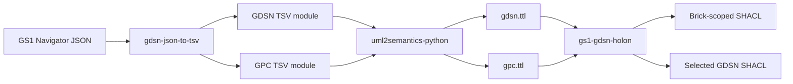
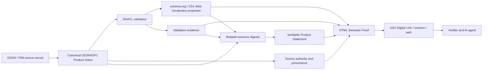

---
"@context":
  dct: "http://purl.org/dc/terms/"
  foaf: "http://xmlns.com/foaf/0.1/"
  prov: "http://www.w3.org/ns/prov#"
  adms: "http://www.w3.org/ns/adms#"
  owl: "http://www.w3.org/2002/07/owl#"
"@id": "urn:document:gs1-product-holon-technical-evidence:1.3.0"
"@type": "foaf:Document"
dct:title: "GS1 Product Holon Architecture — Technical Evidence and Reference Implementation"
dct:description: >
  Technical evidence pack supporting the GS1 Product Holon Architecture,
  including source inspection, reference pipeline, SHACL generation and
  validation, worked Product Holons, mapping experiments, SSSOM governance,
  OWL/SWRL/SPARQL design decisions, K10X motivating context, HTML Semantic Proof,
  Verifiable Product Statement profile and source references.
dct:identifier: "GS1_Product_Holon_Architecture_Technical_Evidence_and_Reference_Implementation_v1.3.0"
dct:created: "2026-08-02"
dct:modified: "2026-08-17"
dct:language: "en-GB"
owl:versionInfo: "1.3.0"
adms:status: "Working Draft — technical evidence companion"
dct:creator:
  "@type": "foaf:Person"
  foaf:name: "Chris Day"
  foaf:mbox: "mailto:chris.day@perdl.com"
prov:wasDerivedFrom:
  - "@type": "foaf:Document"
    dct:title: "K10X Layer 1 and GS1 Web Vocabulary in retail shopping experiences"
    dct:identifier: "gs1-gdsn-holon-v1.31.0"
    owl:versionInfo: "1.31.0"
  - "@type": "foaf:Document"
    dct:title: "GS1 Product Holon Architecture"
    dct:identifier: "GS1_Product_Holon_Architecture_v2.1.0"
dct:references:
  - "https://www.gs1.org/standards/gdsn"
  - "https://ref.gs1.org/voc/"
  - "https://ref.gs1.org/standards/resolver/"
  - "https://www.w3.org/TR/shacl/"
  - "https://www.w3.org/TR/owl2-overview/"
  - "https://www.w3.org/TR/sparql11-query/"
  - "https://www.w3.org/submissions/SWRL/"
  - "https://mapping-commons.github.io/sssom/"
  - "https://www.w3.org/TR/json-ld11/"
  - "https://www.w3.org/TR/vc-data-model-2.0/"
  - "https://www.w3.org/TR/vc-data-integrity/"
  - "https://www.w3.org/TR/vc-di-ecdsa/"
  - "https://www.w3.org/TR/vc-bitstring-status-list/"
  - "https://www.w3.org/TR/cid-1.0/"
dct:license: "To be determined before external publication"
---

# GS1 Product Holon Architecture

## Technical Evidence and Reference Implementation

**Version:** 1.3.0  
**Date:** 17 August 2026  
**Status:** Working Draft — companion to `GS1_Product_Holon_Architecture_v2.1.0.md`  
**Authority notice:** The Product Holon is a proposed architectural construct. The evidence pack distinguishes approved GS1 capabilities, source-derived semantic artefacts, reference implementations, candidate mappings and proposed design choices.

---

## Document control

### Purpose

This document preserves the technical evidence, implementation detail and decision history underlying the core GS1 Product Holon Architecture. It replaces the chronological research-dossier structure of `gs1-gdsn-holon-v1.31.0.md` with an evidence-oriented structure. Superseded conclusions are not repeated as current recommendations; they are retained through Architecture Decision Records and explicit correction notes.

### Relationship to the core architecture

The core architecture defines the proposed model, phases, components, governance and adoption roadmap. This companion provides:

- the source inventory and verification boundaries;
- direct observations from the supplied GDSN, GPC, SHACL and mapping artefacts;
- the K10X use case that motivated the initial investigation;
- worked Product Holons and SHACL examples;
- the ontology and shape-generation pipeline;
- mapping-candidate generation and SSSOM curation evidence;
- OWL, DL-safe SWRL and SPARQL design exhibits;
- validation and reconciliation results;
- Architecture Decision Records;
- limitations, unresolved questions and references;
- the HTML Semantic Proof and Verifiable Product Statement reference profile, including a source-authority example, HTML scripts, credential structure and acceptance tests.

### Evidence labels

| Label | Meaning in this pack |
|---|---|
| **Observed** | Directly present in or computed from a supplied artefact. |
| **Demonstrated** | Executed or validated in the source investigation or reference implementation. |
| **Corroborated candidate** | Supported by more than one source or method but still awaiting formal governance review. |
| **Proposed** | An architectural or implementation choice not established as an existing GS1 requirement. |
| **Superseded** | A historical conclusion replaced by later evidence. |
| **Unresolved** | The available sources do not establish the answer. |

### Editorial policy

The evidence pack uses an institutional technical voice. First-person session language, conversational corrections and version annotations in headings have been removed. The evidence itself remains traceable to the source document and named files.

---

## Contents

- [Executive evidence summary](#executive-evidence-summary)
- [Part I — Evidence basis](#part-i--evidence-basis)
- [Part II — Semantic source evidence](#part-ii--semantic-source-evidence)
- [Part III — Worked Product Holons](#part-iii--worked-product-holons)
- [Part IV — Semantic bridge evidence](#part-iv--semantic-bridge-evidence)
- [Part V — Mapping experiment evidence](#part-v--mapping-experiment-evidence)
- [Part VI — Architecture Decision Records](#part-vi--architecture-decision-records)
- [Part VII — AI, retrieval and publication evidence](#part-vii--ai-retrieval-and-publication-evidence)
- [Part VIII — Verifiable publication evidence](#part-viii--verifiable-publication-evidence)
- [Part IX — Evidence matrix and unresolved issues](#part-ix--evidence-matrix-and-unresolved-issues)
- [Part X — Migration and traceability](#part-x--migration-and-traceability)
- [Part XI — References and project artefacts](#part-xi--references-and-project-artefacts)

---

## Executive evidence summary

The source investigation began as an analysis of a K10X “Layer 1 — AI Data Interpretation” explainer and the role of GS1 Web Vocabulary in AI-enabled shopping. Direct inspection of supplied GDSN and GPC semantic artefacts broadened the work into a product-centred architecture. The evidence showed that:

- GPC provides category scope through Bricks, Attribute Types and controlled Attribute Values;
- GDSN provides deep product semantics, structured records, code lists and recipient-oriented business data;
- Web Vocabulary and schema.org provide the public and agent-facing publication layer for a bounded subset;
- a product-specific graph can be constructed by resolving a GTIN to a Brick and selecting only populated, applicable facts;
- Brick-scoped SHACL shapes can be generated mechanically and validated with deterministic tooling;
- the current `gs1-gdsn-holon` implementation independently converged on the same Brick-scoped generation and validation pattern;
- real generated GDSN CURIEs are opaque, so name matching cannot be implemented as a simple namespace substitution;
- lexical tools can generate useful candidate mappings but cannot approve them;
- SSSOM provides an appropriate source of truth for candidate, reviewed and rejected mappings;
- direct OWL equivalence is only sound for semantically and structurally compatible terms;
- conditional or structural mappings require DL-safe rules or versioned transforms;
- SPARQL remains an export/projection mechanism outside the ontology;
- Product and Offer data require separate authority and provenance;
- an LLM should retrieve and narrate validated facts rather than execute final rule logic.

The completed LOOM/BioPortal run produced 28,101 unique terms, 237 unique cross-ontology candidate pairs and 474 directional `skos:closeMatch` records. GDSN-to-Web Vocabulary candidates dominated, while GPC-to-Web Vocabulary candidates were sparse. Reconciliation with specific terms produced useful corroboration and several corrections, including the distinction between a flat GDSN allergen-statement attribute and the separate structured allergen-code chain.

This revision adds the publication proof required to make the architecture independently consumable. The proposed HTML Semantic Proof exposes a canonical GDSN/GPC-aligned Product Holon and a schema.org/GS1 Web Vocabulary discovery projection, connects them to source authority and SHACL evidence, and links a W3C Verifiable Product Statement that binds an authorised issuer to selected statements or integrity-protected resources. The credential is treated as proof of authorship, integrity and current status, not as automatic proof of factual truth.

---

# Part I — Evidence basis

## 1. Scope, method and provenance

### 1.1 Source baseline

The authoritative baseline for this restructuring is:

- `gs1-gdsn-holon-v1.31.0.md`, version 1.31.0, dated 30 July 2026.

The baseline combined 29 numbered sections, five appendices and a source list. It recorded the progressive development of the architecture, including findings later corrected by real generated artefacts. This pack consolidates the final position while retaining the reasoning behind material changes.

### 1.2 Supplied and referenced artefacts

The source baseline reports direct inspection or use of the following artefacts:

| Artefact | Reported role |
|---|---|
| `gdsn.ttl` | Source-derived GDSN ontology, RDF/XML despite the extension, 30,630 RDF descriptions. |
| `gpc.ttl` | GPC ontology, Turtle, 22,281 `owl:Class` resources. |
| `GDSN_TSV_Transformer_README_v0.1.0.md` | Documentation for Navigator JSON to TSV transformation. |
| `GDSN-TSV-Mapping-v0.1.0.md` | Mapping decisions for TSV generation. |
| `gpc-brick-10000030-with-gdsn.shacl.ttl` | Generated Cheese (Frozen) shape with selected GDSN constraints. |
| `gpc-brick-10001198-with-gdsn.shacl.ttl` | Generated Smartphones shape with selected GDSN constraints. |
| `gpc-brick-10000159-with-gdsn.shacl.ttl` | Generated Beer shape with selected GDSN constraints. |
| `gpc-brick-10000043-with-gdsn.shacl.ttl` | Generated Sugar/Sugar Substitutes shape with selected GDSN constraints. |
| `gs1_mappings_001.ttl` | 474 directional LOOM/BioPortal mapping records. |
| `gs1_terms.txt` | 28,101 extracted terms used for candidate generation. |
| `gs1_sortedUnique.txt` | Deduplicated term list, also 28,101 terms. |
| `holon_webvoc_alignment_test.py` | Representative OWL-RL and SPARQL projection verification. |
| `verify_brick10000030_route3.py` | Verification that the generic Route 3 rule handled the real Cheese shape without modification. |
| `gs1-holon-bridge.omn` | Manchester Syntax representation of the illustrative bridge and Gouda ABox. |
| `holon-webvoc-construct-rules.sparql` | Consolidated Route 2 and Route 3 SPARQL rules. |
| `CatalogueItemNotification_ADD.xml` | Concrete GDSN source-evidence example containing sender, receiver, data recipient, source data pool, content owner, information provider, brand owner, GTIN hierarchy, GPC Brick, target market and effective-time fields. |
| `gdsn(1).ttl` | Supplied GDSN ontology copy used in this revision to confirm the canonical `urn:gs1:std:gdsn:` namespace, exact source-derived CURIEs and object/datatype structure. |
| `gpc(1).ttl` | Supplied GPC ontology copy used in this revision to confirm the canonical `urn:gs1:std:gpc:` namespace and Brick identity. |
| `kato-instances(1).ttl` | Supplied RDF instance graph derived from the GDSN notification; used to confirm the native TradeItem, classification, party, market, description and code-value graph pattern. |
| `GA slide narratives.docx` | Vision 2030 narrative framing identifiers, Web Vocabulary/schema.org as grammar, Verifiable Credentials as proof, registries as the trust layer and Digital Link as the connection mechanism. |
| `Beideman Excerpts from GA meeting.pptx` | Portfolio narrative and use-case evidence for signed claims, authority-ready registries, agent reachability and standards-as-code. |
| `GS1_GDSN_Product_Holon_Architecture_Presentation_v1.1.0.pptx` | Visual architecture evidence; Phase 4 depicts JSON-LD, conformance, provenance, metadata and an optional Verifiable Credential in the publication package. |

The current conversation supplied the baseline Markdown file and, for this revision, the GDSN notification XML, the corresponding RDF instance graph, current GDSN/GPC ontology copies, portfolio narratives and Holon presentation listed above. Other historical implementation artefacts remain treated according to the evidence reported in the baseline unless separately inspected.

### 1.3 Evidence method

The original work used several evidence methods:

- direct parsing and counting of GDSN and GPC ontology artefacts;
- inspection of GPC hierarchy, Brick attributes and controlled values;
- inspection of generated SHACL shapes;
- execution of `pySHACL` against conforming and deliberately invalid instances;
- execution of `rdflib` and `owlrl` for representative entailment tests;
- execution of SPARQL CONSTRUCT rules and programmatic output checks;
- inspection of a real Web Vocabulary v1.16 source slice;
- execution and parsing of LOOM/BioPortal mappings;
- literature review of ontology mapping, SSSOM, SWRL, description logic and Graph-RAG;
- review of GS1 Digital Link resolver mechanisms;
- comparison of the evolving design with the independently implemented `gs1-gdsn-holon` tool.

### 1.4 Verification boundaries

Several limitations remain important:

- the K10X video narration and on-screen content were not transcribed directly;
- the full Web Vocabulary v1.16 source could not be fetched in one pass by the tool used in the source investigation, although later LOOM output covered the extracted full term set;
- the source baseline reports direct inspection of artefacts that are not all present in the current conversation;
- mapping outputs remain candidates until formal human review;
- illustrative product values are not claims about real commercial products;
- the Manchester Syntax listing was hand-checked but not formally parsed in the reported session;
- no production security, performance or resolver deployment was demonstrated.

### 1.5 Current-versus-historical conclusions

The following historical conclusions were superseded and are not used as current architecture positions:

| Historical statement | Current consolidated position |
|---|---|
| The GDSN-to-Web Vocabulary transition is often a local-name namespace substitution. | Real generated GDSN CURIEs are opaque. Labels and annotations may generate candidates, but mappings require SSSOM curation and structural review. |
| Allergen mapping is a direct equivalence from a coded chain to `gs1:allergenStatement`. | `gs1:allergenStatement` is a language-tagged string. The structured chain is a Route 2 transform; a separate flat GDSN statement attribute is the plausible direct candidate. |
| All six Cheese facets require generic Route 3 publication. | `gpc:20002867` has a corroborated candidate relationship to `gs1:sharpnessOfCheese`; value-level review is still required. |
| The bridge ontology contains OWL axioms, SWRL and CONSTRUCT. | The bridge **package** contains an OWL module, an imported DL-safe rule module and separate SPARQL projection/export artefacts. |
| Mapping candidate generation follows the validated Product Holon in the runtime chain. | Candidate generation and SSSOM curation are design-time control-plane processes over semantic models. |
| The Product Holon and its SHACL shape are the same document described two ways. | The Product Holon is instance data; the SHACL shape is a separate validation contract. |
| SWRL is a second infrastructure layer separate from OWL. | SWRL rules may be serialised in an imported ontology module and evaluated in the same reasoning session, subject to DL-safety and tool support. |

---

## 2. Motivating use case and terminology evidence

### 2.1 K10X context

The initial investigation concerned a K10X explainer titled “Layer 1 — AI Data Interpretation”. The source baseline described K10X as a product-data and connected-packaging company founded by Aziz Shariff, with Alfonso Bravi identified as CTO and Karim Waljee as COO/AI Lead. It identified K10X as a GS1 Australia Associate Alliance Partner and described the proposition as auditing, enriching and structuring data from PIM, ERP, supplier feeds and spreadsheets for machine-readable shopping experiences.

The video itself was not transcribed in the source investigation because the available retrieval environment could not render and play the JavaScript-based YouTube page. The K10X interpretation was therefore reconstructed from the title, channel metadata, the company’s published product pages and public GS1 material. Statements about the precise narration or diagrams remain unverified.

The motivating logic was:

- product data originates in multiple internal and supplier sources;
- machine interpretation requires standardised, structured product facts;
- GS1 Web Vocabulary and schema.org provide an appropriate public representation layer;
- GS1 Digital Link and 2D barcodes provide a route from an identifier to digital resources;
- trusted personalisation depends on accurate underlying product facts, especially for allergens, claims and regulated information.

The source did not establish that K10X uses the exact Product Holon design defined here. The case is therefore treated as a motivating example, not proof of architecture adoption.

### 2.2 Web Vocabulary role

The source investigation positioned GS1 Web Vocabulary as a public, schema.org-aligned vocabulary whose terms are informed by existing GS1 standards. Its role is to expose supported product information in forms that web pages, search engines, product feeds and AI agents can interpret.

The architecture does not treat Web Vocabulary as a complete internal product model. Its bounded scope is a strength for public publication and a limitation for Brick-specific or deep GDSN semantics. The source baseline also noted public GS1 programme material describing GDSN modernisation and semantic modelling using Web Vocabulary, schema.org and JSON-LD. That contextual material supports convergence between source semantics and web publication rather than a competing ontology strategy, but it does not by itself define the Product Holon architecture.

The resulting pattern is:

> construct and validate the Product Holon in source-derived GDSN/GPC semantics; publish an approved view in Web Vocabulary/schema.org semantics.

### 2.3 Evidence concerning the term “Product Holon”

The source baseline reviewed a set of citations offered in support of a “GS1 Product Holon” framework. It found that:

- only one cited source used “holon”, and it did so in a generic enterprise/supply-chain context rather than a GS1 standards context;
- other sources supported genuine GS1 capabilities such as GTIN, SSCC, GLN, EPCIS aggregation and context-based Digital Link resolution;
- the citations did not establish decentralised autonomous product nodes or a GS1-defined holon concept;
- the proposed Product Holon was therefore an external architectural analogy applied to GS1 assets.

The evidence supports use of the term only with an explicit proposal notice. It does not support presenting it as established GS1 terminology.

### 2.4 Standards-backed and proposed elements

| Element | Evidence status |
|---|---|
| GTIN, GLN, SSCC and other GS1 identifiers | GS1 standard capability. |
| GDSN product-data exchange | GS1 standard/service capability. |
| GPC classification | GS1 standard capability. |
| Web Vocabulary | Published GS1 vocabulary. |
| Digital Link resolver mechanisms | GS1 standard capability. |
| EPCIS aggregation relationships | GS1 standard capability. |
| Product Holon | Proposed architecture. |
| Autonomous decentralised product node | Not established by the supplied GS1 sources. |
| One resolver serving public and authenticated Product Holon lenses | Proposed use of existing resolver and HTTP primitives. |

---

# Part II — Semantic source evidence

## 3. Direct GPC and GDSN observations

### 3.1 GPC observations

The source baseline reports that the supplied GPC ontology contains 22,281 `owl:Class` resources across six levels:

| Level | Count reported |
|---|---:|
| Segment | 45 |
| Family | 162 |
| Class | 938 |
| Brick | 5,318 |
| Attribute Type | 2,085 |
| Attribute Value | 13,733 |

The evidence establishes that GPC is more than a category tree. Each Brick may define Attribute Types and controlled Attribute Values. This creates a category-scoped faceting model suitable for Product Holon construction and SHACL generation.

The Cheese (Frozen) chain used throughout the examples is:

`50000000 Food/Beverage → 50130000 Milk/Butter/Cream/Yogurts/Cheese/Eggs/Substitutes → 50131800 Cheese/Cheese Substitutes → 10000030 Cheese (Frozen)`.

### 3.2 GDSN observations

The source baseline reports:

- 30,630 RDF descriptions;
- approximately 3,946 core trade-item attributes;
- numerous retailer- and region-specific extension groups;
- 557 distinct code lists.

Examples of extension-group sizes included BestBuy, Australasian Healthcare, Carrefour and GS1 US Healthcare. The important architectural conclusion is that the source model includes both globally relevant product facts and recipient-specific or operational detail. A public Product Holon view therefore requires a deliberate allow-list.

The baseline identified code lists and attributes relevant to consumer and AI use cases, including:

- 218 allergen-type values;
- 1,080 nutrient-type values;
- 937 packaging-marked accreditation values;
- 292 claim-element values;
- ingredient statements;
- preparation instructions;
- recipes;
- recycled-content ratio;
- carbon-footprint and sustainability details;
- channel-specific marketing content.

These counts and examples are observations from the supplied source-derived ontology. They do not imply that the current reference shape exposes all of them.

### 3.3 Evidence for a bounded product unit

The source models are too large to use as per-product payloads. The evidence supports selecting a bounded subgraph based on:

1. product identifier;
2. GPC Brick and ancestor chain;
3. Brick-scoped Attribute Types and populated values;
4. populated GDSN facts selected by a profile;
5. product relationships and provenance.

This product-specific graph is the evidence basis for the Product Holon concept.

### 3.4 Value for shopping and agent use cases

The source observations support the following capabilities:

- category-appropriate faceted filtering using controlled GPC values;
- allergen and dietary filtering using structured codes and statements;
- certification and trust-signalling through controlled accreditation data;
- nutrition comparison beyond basic macros where downstream profiles support it;
- claim substantiation and regulatory context;
- sustainability and packaging information;
- localised connected-pack content.

The public interpretation layer remains Web Vocabulary/schema.org or another approved target profile rather than raw exposure of the entire source model.

---

## 4. Ontology and shape-generation pipeline

### 4.1 End-to-end source pipeline

The demonstrated source pipeline is:



### 4.2 JSON-to-TSV findings

The source investigation identified an undocumented numeric `type` field across GDSN UML classes. Five inferred categories were routed to different TSV outputs:

- XML Schema primitive-like datatypes;
- UML business classes;
- GDSN named datatypes such as GTIN or GLN;
- GS1 code-list classes;
- UML enumeration classes.

Code-valued classes were excluded from `Classes.tsv` to prevent double representation as both classes and enumerations.

### 4.3 Malformed source constraints

Fifteen of approximately 2,274 attribute multiplicities were reported as malformed, with examples such as `..`, `1..` and `0...1`. Several limits were also malformed. The transformation policy was:

- do not guess;
- leave generated minimum and maximum blank;
- preserve the original expression;
- emit `gdsn:conversionWarning` or equivalent diagnostics.

This is a material architecture principle because downstream SHACL and ontology constraints must not give false precision to defective source metadata.

### 4.4 Extended attributes

The source mapping documentation did not provide a reliable natural owner class for all extended attributes. The reference transformation therefore placed them under synthetic containers such as `gdsn:GDSNAVP` and `gdsn:GDSNExtendedAttribute`, optionally grouped by `groupName`.

This is an explicit modelling decision and should remain traceable in generated annotations and mapping records.

### 4.5 OWL generation capabilities

The reported `uml2semantics-python` capabilities include:

- classes and properties;
- datatype restrictions;
- enumeration patterns;
- `owl:unionOf` and disjointness for exclusive choices;
- property chains supplied through a dedicated TSV;
- source annotations and IRI construction.

The presence of property-chain support confirms the intended boundary: OWL can compose object-property paths, but conditional branching on data values remains outside pure OWL DL.

### 4.6 Independent convergence of the SHACL implementation

The `gs1-gdsn-holon` CLI was developed independently of the initial speculative examples but implemented the same central pattern:

- generate a Brick-scoped shape from `gpc.ttl`;
- optionally add a selected GDSN shape with `--include-gdsn`;
- require a Brick code or GTIN-to-Brick mapping because the ontology contains no product instances;
- run `pySHACL` checks by default;
- include parse, empty-graph, conforming-instance and deliberately broken-instance tests.

This convergence is supporting evidence for the architecture. It is not proof that the reference implementation is a complete GS1 solution.

---

## 5. SHACL generation design

### 5.1 Deterministic Brick-scoped generation

For a GPC Brick:

1. locate the level-4 Brick;
2. collect level-5 children as Attribute Types;
3. collect level-6 children as allowed Attribute Values;
4. emit one `sh:NodeShape` targeting the Brick;
5. emit one property shape per populated Attribute Type;
6. use `sh:in` for controlled values and `sh:maxCount 1` where supported by the demonstrated model;
7. add cross-category or category-specific GDSN shape modules separately.

### 5.2 Reusable generation prompt

The baseline contained the following reusable implementation prompt, retained here as a technical exhibit with minor editorial normalisation:

```text
You have access to gpc.ttl and, optionally, gdsn.ttl.

Given either:
  (a) a GPC Brick code; or
  (b) a GTIN, in which case first resolve the GTIN to its GPC Brick using
      authoritative trade-item data because the ontology contains schema,
      not per-GTIN product instances;

generate a valid SHACL shape as follows:

1. Locate the Brick in gpc.ttl and verify that it is a level-4 resource.
2. Collect level-5 child classes whose rdfs:subClassOf is the Brick.
3. For each Attribute Type, collect level-6 child classes whose
   rdfs:subClassOf is that Attribute Type.
4. Emit one sh:NodeShape targeting the Brick and one sh:property per
   Attribute Type, including sh:path, sh:name, sh:in and sh:maxCount 1.
5. Declare every prefix required for standalone parsing.
6. Where gdsn.ttl is available, emit the selected GDSN shape as a separate
   sh:NodeShape, using real datatypes, classes, multiplicities and code-list
   references from the generated ontology.
7. Validate the output with pySHACL against at least one conforming and one
   deliberately broken instance, and report the result.
```

### 5.3 Reference generator excerpt

```python
import re


def load_gpc(path="gpc.ttl"):
    text = open(path, encoding="utf-8").read()
    records = text.split("\n\n")

    def parse(record):
        item = {}
        match = re.match(r"gpc:(\S+)", record)
        if match:
            item["id"] = match.group(1)
        match = re.search(r"gpc:level (\d+)", record)
        if match:
            item["level"] = int(match.group(1))
        match = re.search(r'rdfs:label "([^"]*)"', record)
        if match:
            item["label"] = match.group(1)
        match = re.search(r"rdfs:subClassOf gpc:(\S+)", record)
        if match:
            item["parent"] = match.group(1)
        return item

    parsed = [parse(record) for record in records if "a owl:Class" in record]
    by_id = {item["id"]: item for item in parsed if "id" in item}
    children = {}
    for item in parsed:
        if "parent" in item:
            children.setdefault(item["parent"], []).append(item["id"])
    return by_id, children


def gpc_shape_for_brick(brick_code, by_id, children, shape_ns="gpc-shapes:"):
    brick = by_id.get(brick_code)
    if brick is None:
        raise ValueError(f"Brick {brick_code} not found in GPC ontology")

    attribute_types = [
        by_id[child_id]
        for child_id in children.get(brick_code, [])
        if by_id[child_id].get("level") == 5
    ]

    slug = lambda label: re.sub(r"[^A-Za-z0-9]+", "", label)
    shape_name = f"{shape_ns}{slug(brick['label'])}Shape"
    lines = [
        f"{shape_name} a sh:NodeShape ;",
        f"    sh:targetClass gpc:{brick_code} ;  # {brick['label']}",
    ]

    for attribute_type in attribute_types:
        values = [
            by_id[child_id]["label"]
            for child_id in children.get(attribute_type["id"], [])
            if by_id[child_id].get("level") == 6
        ]
        if not values:
            continue
        in_list = " ".join(f'"{value}"' for value in values)
        lines += [
            "    sh:property [",
            f'        sh:path gpc:{attribute_type["id"]} ; '
            f'sh:name "{attribute_type["label"]}" ;',
            f"        sh:in ( {in_list} ) ;",
            "        sh:maxCount 1 ;",
            "    ] ;",
        ]

    lines[-1] = lines[-1].rstrip(" ;") + " ."
    return shape_name, "\n".join(lines)
```

The excerpt demonstrates the deterministic pattern but is not a complete production parser. It relies on source formatting conventions and should be replaced or hardened with RDF parsing where appropriate.


## 6. SHACL validation evidence

### 6.1 Corrected illustrative SHACL

The early source fragments were corrected to provide standalone prefixes and independently targeted node shapes. The following compact form preserves the demonstrated structure:

```turtle
@prefix sh: <http://www.w3.org/ns/shacl#> .
@prefix xsd: <http://www.w3.org/2001/XMLSchema#> .
@prefix gpc: <gpc:> .
@prefix gdsn: <gdsn:> .
@prefix gpc-shapes: <https://example.org/gpc-shapes#> .

gpc-shapes:CheeseFrozenShape a sh:NodeShape ;
    sh:targetClass gpc:10000030 ;
    sh:property [
        sh:path gpc:20000192 ;
        sh:name "Firmness of Cheese" ;
        sh:in ( "HARD" "SOFT" "FIRM/SEMI-HARD" "EXTRA HARD" ) ;
        sh:maxCount 1 ;
    ] ;
    sh:property [
        sh:path gpc:20000031 ;
        sh:name "Type of Cheese" ;
        sh:in ( "GOUDA" "CHEDDAR" "BRIE" "FETA" "MOZZARELLA" "EDAM" "PARMESAN" "GRUYERE" ) ;
        sh:maxCount 1 ;
    ] .

gpc-shapes:TradeItemGDSNShape a sh:NodeShape ;
    sh:targetClass gdsn:TradeItem ;
    sh:property [
        sh:path gdsn:gtin ;
        sh:datatype xsd:string ;
        sh:minCount 1 ;
        sh:maxCount 1 ;
    ] ;
    sh:property [
        sh:path gdsn:allergenRelatedInformation ;
        sh:maxCount 1 ;
        sh:node [
            a sh:NodeShape ;
            sh:property [
                sh:path gdsn:allergen ;
                sh:node [
                    a sh:NodeShape ;
                    sh:property [
                        sh:path gdsn:allergenTypeCode ;
                        sh:in ( "ML" "MFD" "BA" "SU" "PHD" "TUR" ) ;
                        sh:minCount 1 ;
                        sh:maxCount 1 ;
                    ] ;
                    sh:property [
                        sh:path gdsn:levelOfContainmentCode ;
                        sh:minCount 1 ;
                        sh:maxCount 1 ;
                    ] ;
                ] ;
            ] ;
        ] ;
    ] ;
    sh:property [
        sh:path gdsn:nutrientHeader ;
        sh:maxCount 1 ;
        sh:node [
            a sh:NodeShape ;
            sh:property [
                sh:path gdsn:nutrientDetail ;
                sh:node [
                    a sh:NodeShape ;
                    sh:property [
                        sh:path gdsn:nutrientTypeCode ;
                        sh:in ( "ENERC" "FAT" "PRO-" "NA" "CA" ) ;
                        sh:minCount 1 ;
                        sh:maxCount 1 ;
                    ] ;
                    sh:property [
                        sh:path gdsn:quantityContained ;
                        sh:datatype xsd:decimal ;
                    ] ;
                ] ;
            ] ;
        ] ;
    ] .
```

This is an illustrative logical-name shape. The real generated artefacts use source-ID-based CURIEs and, for several associations, `sh:class` references rather than anonymous nested `sh:node` blocks.

### 6.2 Reported `pySHACL` results

| Test instance | Reported result |
|---|---|
| Conforming Cheese record with GTIN, permitted GPC values, allergen code plus containment level, and permitted nutrient code | `Conforms: True` |
| Broken record with firmness `SQUISHY`, nutrient code `PROTEIN_XYZ`, and missing containment level | `Conforms: False` |

The broken record produced three reported violations:

- two `sh:InConstraintComponent` violations;
- one `sh:MinCountConstraintComponent` violation.

The tests demonstrate that category-inappropriate values and missing structured subfields can be detected independently.

### 6.3 Generalisation evidence

The source baseline reported successful shape generation and parse/validation checks for:

| Brick | Attribute Types reported | Result |
|---|---:|---|
| `10000030` Cheese (Frozen) | 6 | Parsed; conforming test passed. |
| `10001198` Smartphones | 2 | Parsed; conforming test passed. |
| `10000159` Beer | 9 | Parsed; conforming test passed. |

A fourth supplied shape, Sugar/Sugar Substitutes (Shelf Stable), contained one Attribute Type and the same selected GDSN shape as the other examples.

### 6.4 Separation of shape and instance

A material correction from the source history is retained here:

- the Product Holon is the product-instance graph;
- the SHACL shape is a separately versioned validation contract;
- the GDSN and GPC ontology modules provide semantic definitions;
- the SSSOM mapping set governs semantic correspondences;
- the bridge package implements approved mappings;
- the Web Vocabulary/schema.org graph is a derived publication view.

Conflating these artefacts prevents independent versioning, provenance and conformance testing.

### 6.5 Reusable code-list strategy

Large code lists should not be unnecessarily repeated in every Brick shape. The evidence identified 218 allergen types and 1,080 nutrient types in the inspected GDSN model. A production SHACL design should consider reusable code-list resources, referenced shapes or generated modules so that one code-list change does not require duplicating a large `sh:in` list across thousands of Brick files.


### 6.6 Real generated shape excerpt

The following excerpt preserves the opaque source-ID-based CURIEs from the supplied Cheese (Frozen) shape. Enumerations are abbreviated only where the source baseline itself abbreviated them.

```turtle
@prefix gdsn: <gdsn:> .
@prefix gpc: <gpc:> .
@prefix gpc-shapes: <gpc-shapes:> .
@prefix rdfs: <http://www.w3.org/2000/01/rdf-schema#> .
@prefix sh: <http://www.w3.org/ns/shacl#> .
@prefix xsd: <http://www.w3.org/2001/XMLSchema#> .

gpc-shapes:Brick10000030Shape a sh:NodeShape ;
    rdfs:label "Cheese (Frozen) GPC Brick shape" ;
    sh:name "Cheese (Frozen) GPC Brick shape" ;
    sh:property [
        sh:in ( "GOUDA" "CHEDDAR" "BRIE" "FETA" "MOZZARELLA" "EDAM" "PARMESAN" "GRUYERE" "..." ) ;
        sh:maxCount 1 ;
        sh:name "Type of Cheese" ;
        sh:path gpc:20000031
    ], [
        sh:in ( "EXTRA HARD" "FIRM/SEMI-HARD" "HARD" "SOFT" ) ;
        sh:maxCount 1 ;
        sh:name "Firmness of Cheese" ;
        sh:path gpc:20000192
    ], [
        sh:in ( "BARBEQUE" "DIRECT CONSUMPTION" "FONDUE" "SMOKING" ) ;
        sh:maxCount 1 ;
        sh:name "Intended Use of Cheese" ;
        sh:path gpc:20003080
    ], [
        sh:in ( "SEMI-HARD CHEESE" "SEMI-SOFT CHEESE" "SOFT / SOFT RIPENED CHEESE" "..." ) ;
        sh:maxCount 1 ;
        sh:name "Kind of Cheese" ;
        sh:path gpc:20003081
    ], [
        sh:in ( "EXTRA EXTRA SHARP" "EXTRA SHARP" "SHARP" ) ;
        sh:maxCount 1 ;
        sh:name "Sharpness of Cheese" ;
        sh:path gpc:20002867
    ], [
        sh:in ( "AUSTRIA - TYROL/VORARLBERG/CARINTHIA" "AUSTRIA - UPPER/LOWER AUSTRIA" ) ;
        sh:maxCount 1 ;
        sh:name "Origin of Cheese" ;
        sh:path gpc:20000505
    ] ;
    sh:targetClass gpc:10000030 .

gpc-shapes:TradeItemGDSNShape a sh:NodeShape ;
    rdfs:comment "Generated from selected GDSN properties. Source property domains are preserved as sh:description because not all selected properties are direct TradeItem properties in the generated ontology." ;
    sh:name "Cross-category GDSN TradeItem shape" ;
    sh:property [
        sh:datatype gdsn:c1450 ;
        sh:maxCount 1 ;
        sh:minCount 0 ;
        sh:name "gtin" ;
        sh:path gdsn:a-1292425203
    ], [
        sh:datatype gdsn:c1481031847 ;
        sh:minCount 0 ;
        sh:name "ingredientStatement" ;
        sh:path gdsn:a812659001
    ], [
        sh:datatype xsd:float ;
        sh:maxCount 1 ;
        sh:minCount 0 ;
        sh:name "packagingRecycledContentRatio" ;
        sh:path gdsn:a212299678
    ], [
        sh:class gdsn:c2147348056 ;
        sh:minCount 0 ;
        sh:name "claimDetail" ;
        sh:path gdsn:assoc_45067187_2147348056_4
    ], [
        sh:class gdsn:c1672558995 ;
        sh:minCount 0 ;
        sh:name "allergen" ;
        sh:path gdsn:assoc_-474206270_1672558995_1
    ], [
        sh:class gdsn:c1322 ;
        sh:minCount 0 ;
        sh:name "nutrientDetail" ;
        sh:path gdsn:assoc_1336934671_1322_1
    ], [
        sh:class gdsn:c-474206270 ;
        sh:minCount 0 ;
        sh:name "allergenRelatedInformation" ;
        sh:path gdsn:assoc_-1935341322_-474206270_1
    ], [
        sh:class gdsn:c1336934671 ;
        sh:minCount 0 ;
        sh:name "nutrientHeader" ;
        sh:path gdsn:assoc_1340910615_1336934671_2
    ] ;
    sh:targetClass gdsn:c863999331 .
```

The shape’s own comment records the flattening decision: selected properties from several source domains are validated against a TradeItem-targeted shape, while the original domains remain annotations. This decision must be aligned with the Product Holon construction convention.

---

# Part III — Worked Product Holons

## 7. Product Holon construction pattern

The worked examples use the following identifiers. Digital Link AI (01) paths and GDSN GTIN values use GTIN-14 representation.

| Example | Supplied identifier | GTIN-14 used in the Product Holon | GPC Brick | Brick-scoped value used |
|---|---:|---:|---:|---|
| Cheese (Frozen) — Gouda | `09506000134352` | `09506000134352` | `10000030` | Type of Cheese = `GOUDA` |
| Smartphone | GTIN-13 `0195950643718` | `00195950643718` | `10001198` | Input Registration = `TOUCHSCREEN` |
| Beer — illustrative IPA | GTIN-14 `00083783000085` | `00083783000085` | `10000159` | Style of Beer = `INDIA PALE ALE (IPA)` |
| Sugar/Sugar Substitutes | `04005500023340` | `04005500023340` | `10000043` | Type of Sugar/Sugar Substitute = `SUCROSE` |
| Compote classification example | GTIN-13 `5000119096753` | `05000119096753` | `10000217` | Type of Jam/Marmalade = `COMPOTE` (`30000728`) |
| Milk hierarchy example — Whole Milk | GTIN-14 `05000169015254` | `05000169015254` | `10000025` (verified normalisation) | Fat content = `Whole`; Packaging type = `Plastic bottle` (user-supplied labels; GPC Attribute codes unresolved) |

### 7.1 Logical construction algorithm

For a product identifier:

1. resolve the product record and GPC Brick;
2. retain the classification ancestor chain;
3. collect populated Brick-scoped GPC facts;
4. collect applicable GDSN facts selected by the profile;
5. preserve structured records and units;
6. attach provenance and version information;
7. validate the instance graph;
8. link parent or child Product Holons where required;
9. release only after validation and publication policy checks.

### 7.2 Cheese (Frozen), Brick `10000030`

The real generated shape contained six GPC properties:

| GPC property | Label | Example value used |
|---|---|---|
| `gpc:20002867` | Sharpness of Cheese | not populated in the Gouda example |
| `gpc:20000505` | Origin of Cheese | not populated in the Gouda example |
| `gpc:20000031` | Type of Cheese | `GOUDA` |
| `gpc:20003080` | Intended Use of Cheese | `DIRECT CONSUMPTION` |
| `gpc:20000192` | Firmness of Cheese | `FIRM/SEMI-HARD` |
| `gpc:20003081` | Kind of Cheese | `SEMI-HARD CHEESE` |

The following example uses the real opaque GDSN CURIEs reported in the supplied shape where available. Nested logical property names are retained for readability where the baseline did not reproduce every opaque identifier.

```json
{
  "@id": "https://example.com/01/09506000134352",
  "@type": ["gpc:10000030", "gdsn:c863999331"],
  "gpc:20000031": "GOUDA",
  "gpc:20000192": "FIRM/SEMI-HARD",
  "gpc:20003080": "DIRECT CONSUMPTION",
  "gpc:20003081": "SEMI-HARD CHEESE",
  "gdsn:a-1292425203": "09506000134352",
  "gdsn:a812659001": "Pasteurised milk, salt, rennet, cheese cultures.",
  "gdsn:a212299678": 0.30,
  "gdsn:allergenRelatedInformation": {
    "gdsn:allergen": {
      "gdsn:allergenTypeCode": "ML",
      "gdsn:levelOfContainmentCode": "CONTAINS"
    }
  },
  "gdsn:nutrientHeader": {
    "gdsn:nutrientDetail": [
      { "gdsn:nutrientTypeCode": "ENERC", "gdsn:quantityContained": 1500 },
      { "gdsn:nutrientTypeCode": "FAT", "gdsn:quantityContained": 28 },
      { "gdsn:nutrientTypeCode": "PRO-", "gdsn:quantityContained": 24 },
      { "gdsn:nutrientTypeCode": "NA", "gdsn:quantityContained": 620 }
    ]
  }
}
```

The values are illustrative. The shape makes Sharpness and Origin optional, so leaving them absent is distinct from asserting a value.

### 7.3 Smartphones, Brick `10001198`

The supplied shape defined:

- `gpc:20002603` — Input Registration: `QWERTZ/QWERTY KEYBOARD`, `REDUCED PHONE KEYBOARD`, `TOUCHSCREEN`;
- `gpc:20001127` — System: `1 G`, `2 G`, `2.5 G`, `3 G`.

Illustrative Product Holon:

```json
{
  "@id": "https://example.com/01/00195950643718",
  "@type": ["gpc:10001198", "gdsn:c863999331"],
  "gpc:20002603": "TOUCHSCREEN",
  "gpc:20001127": "3 G",
  "gdsn:a-1292425203": "00195950643718",
  "gdsn:a212299678": 0.15
}
```

The supplied product identifier is GTIN-13 `0195950643718`. The Digital Link AI (01) path and the GDSN value above use its zero-padded GTIN-14 representation, `00195950643718`. The enumeration’s lack of 4G and 5G is a source-model limitation. It must be governed as a model issue rather than corrected silently in generated shapes.

### 7.4 Beer, Brick `10000159`

The supplied shape excerpt included:

- Colour of Beer;
- Style of Beer;
- Flavoured or mixed status;
- Type of Beer;
- Origin of Beer;
- Taste.

Illustrative Product Holon:

```json
{
  "@id": "https://example.com/01/00083783000085",
  "@type": ["gpc:10000159", "gdsn:c863999331"],
  "gpc:20003020": "AMBER",
  "gpc:20000170": "INDIA PALE ALE (IPA)",
  "gpc:20002868": "NO, BEER ONLY",
  "gpc:20000017": "ALE",
  "gpc:20000502": "UNITED KINGDOM - ENGLAND - KENT",
  "gpc:20002973": "BITTER",
  "gdsn:a-1292425203": "00083783000085",
  "gdsn:a812659001": "Water, Malted Barley, Hops, Yeast.",
  "gdsn:a212299678": 0.25,
  "gdsn:allergenRelatedInformation": {
    "gdsn:allergen": {
      "gdsn:allergenTypeCode": "BA",
      "gdsn:levelOfContainmentCode": "CONTAINS"
    }
  }
}
```

The source baseline used `BA` as a valid code but did not independently confirm its human-readable expansion. The example therefore does not assert an expansion beyond the code itself.

The supplied Beer identifier is the valid GTIN-14 `00083783000085`. It is used unchanged in the Digital Link AI (01) path and GDSN value.

### 7.5 Sugar/Sugar Substitutes, Brick `10000043`

The supplied shape defined one Brick-specific property, Type of Sugar/Sugar Substitute. An illustrative Product Holon is:

```json
{
  "@id": "https://example.com/01/04005500023340",
  "@type": ["gpc:10000043", "gdsn:c863999331"],
  "gpc:20000172": "SUCROSE",
  "gdsn:a-1292425203": "04005500023340",
  "gdsn:a812659001": "Sugar (100% sucrose).",
  "gdsn:a212299678": 0.40,
  "gdsn:nutrientHeader": {
    "gdsn:nutrientDetail": [
      { "gdsn:nutrientTypeCode": "ENERC", "gdsn:quantityContained": 1700 },
      { "gdsn:nutrientTypeCode": "FAT", "gdsn:quantityContained": 0 },
      { "gdsn:nutrientTypeCode": "PRO-", "gdsn:quantityContained": 0 },
      { "gdsn:nutrientTypeCode": "NA", "gdsn:quantityContained": 0 }
    ]
  }
}
```

An explicit zero is an assertion. An omitted nutrient is not equivalent to zero.

The earlier illustrative Sugar identifier ended in an invalid check digit. This release corrects it to valid GTIN-14 `04005500023340`; it remains illustrative and is not an assertion about an actual commercial product.

### 7.6 Compote classification example, Brick `10000217`

The supplied classification code `30000728` is not a GPC Brick identifier. It is the GPC Attribute Value **COMPOTE** for Attribute `20000118`, **Type of Jam/Marmalade**, within Brick `10000217`, **Jams/Marmalades (Shelf Stable)**. The Product Holon is therefore normalised to Brick `10000217` while retaining `30000728` as the controlled Attribute Value.

No generated SHACL shape for Brick `10000217` was supplied with the original evidence set. This example demonstrates product-instance normalisation only; it does not claim that a Brick-specific generated shape has been executed or validated for this category. Because no authoritative product master-data record was supplied, `COMPOTE` is retained as an illustrative, user-supplied classification value and requires brand-owner verification before it is treated as product truth.

```json
{
  "@id": "https://example.com/01/05000119096753",
  "@type": ["gpc:10000217", "gdsn:c863999331"],
  "gpc:20000118": "COMPOTE",
  "gdsn:a-1292425203": "05000119096753"
}
```

The supplied product identifier is GTIN-13 `5000119096753`. The Digital Link AI (01) path and GDSN value use its valid zero-padded GTIN-14 representation, `05000119096753`. No ingredients, nutrition, claims or other product assertions have been invented for this example.

### 7.7 Milk hierarchy example — Whole Milk, GTIN `05000169015254`

The supplied GTIN `05000169015254` is a valid GTIN-14. The hierarchy supplied with the example is preserved below as request provenance, but it is not used unchanged as the verified GPC classification because several supplied codes conflict with GS1 GPC source material.

| Level | Hierarchy supplied with the example | Verified GPC normalisation used in this pack |
|---|---|---|
| Segment | `10000000` — Food, Beverages and Tobacco | `50000000` — Food/Beverage/Tobacco |
| Family | `50131700` — Dairy Products | `50130000` — Milk/Butter/Cream/Yogurts/Cheese/Eggs/Substitutes |
| Class | `50131701` — Milk (Perishable) | `50131700` — Milk/Milk Substitutes |
| Brick | `10000236` — Milk - Cow's (Fresh) | `10000025` — Milk (Perishable) |

Official GS1 mapping material places `50000000` at Segment level, `50130000` at Family level, `50131700` at Class level and `10000025` at Brick level for perishable milk. Code `10000236` is used for a Nuts/Seeds prepared/processed Brick rather than a milk Brick. The label **Milk - Cow's (Fresh)** is therefore retained as a human-readable description of the requested product example, not asserted as the official label of Brick `10000236`.

The requested Brick characteristics are retained as illustrative facts:

- Fat content = `Whole`;
- Packaging type = `Plastic bottle`.

No GPC Attribute Type or Attribute Value identifiers were supplied for those characteristics, and no generated SHACL shape for Brick `10000025` was part of the evidence set. The example therefore does not invent GPC Attribute codes. It uses generic `schema:PropertyValue` records until the applicable Brick-scoped GPC attributes and controlled values are resolved from the authoritative GPC release.

```json
{
  "@context": {
    "gpc": "gpc:",
    "gdsn": "gdsn:",
    "schema": "https://schema.org/",
    "example": "https://example.com/holon-evidence/"
  },
  "@id": "https://example.com/01/05000169015254",
  "@type": ["gpc:10000025", "gdsn:c863999331"],
  "gdsn:a-1292425203": "05000169015254",
  "example:gpcHierarchy": [
    { "level": "Segment", "@id": "gpc:50000000", "label": "Food/Beverage/Tobacco" },
    { "level": "Family", "@id": "gpc:50130000", "label": "Milk/Butter/Cream/Yogurts/Cheese/Eggs/Substitutes" },
    { "level": "Class", "@id": "gpc:50131700", "label": "Milk/Milk Substitutes" },
    { "level": "Brick", "@id": "gpc:10000025", "label": "Milk (Perishable)" }
  ],
  "schema:additionalProperty": [
    {
      "@type": "schema:PropertyValue",
      "schema:name": "Fat content",
      "schema:value": "Whole",
      "example:mappingStatus": "User-supplied illustrative value; GPC Attribute identifier unresolved"
    },
    {
      "@type": "schema:PropertyValue",
      "schema:name": "Packaging type",
      "schema:value": "Plastic bottle",
      "example:mappingStatus": "User-supplied illustrative value; GPC Attribute identifier unresolved"
    }
  ]
}
```

The generic property representation is deliberate: it preserves the requested facts without misrepresenting unverified labels as governed GPC Attribute Type or Attribute Value identifiers. A later generated Brick `10000025` SHACL profile can replace these generic records with GPC-native predicates and controlled values once those identifiers have been verified.

### 7.8 Cross-Brick comparison of the selected GDSN shape

The four supplied `TradeItemGDSNShape` blocks were reported as identical. The selected properties were:

| Logical label | Reported generated path or target |
|---|---|
| GTIN | `gdsn:a-1292425203` |
| ingredientStatement | `gdsn:a812659001` |
| packagingRecycledContentRatio | `gdsn:a212299678` |
| claimDetail | `gdsn:assoc_45067187_2147348056_4` |
| allergen | `gdsn:assoc_-474206270_1672558995_1` |
| nutrientDetail | `gdsn:assoc_1336934671_1322_1` |
| allergenRelatedInformation | `gdsn:assoc_-1935341322_-474206270_1` |
| nutrientHeader | `gdsn:assoc_1340910615_1336934671_2` |

This fixed profile demonstrates cross-category reuse but also exposes irrelevant food-oriented slots for Smartphones. It should be treated as a reference profile, not the final architecture.

### 7.9 Evidence that the selected shape is too narrow

The mapping output contained cheese-relevant GDSN attributes absent from the fixed selected shape, including:

- `isRindEdible`;
- `fatInMilkContent`;
- `cheeseMaturationPeriodDescription`;
- `maturationMethod`;
- `sourceAnimal`.

This supports a modular approach: a small cross-category core plus category- and use-case-specific GDSN modules.

### 7.10 Variety packs

The source baseline reported 338 GPC Variety Pack Bricks. The product-level pattern is:

- the pack has its own GTIN and one Variety Pack Brick;
- each constituent item has its own GTIN, Brick and Product Holon;
- GDSN trade-item hierarchy relationships link parent and children;
- quantities and component counts remain explicit;
- each child remains independently validated and resolvable.

This is analogous to nested holons but should not be confused with a claim that GPC alone models every component relationship.

---

# Part IV — Semantic bridge evidence

## 8. Mapping routes and structural distinctions

### 8.1 Route framework

The final route framework is:

| Route | Evidence-based description |
|---|---|
| 1 | Same meaning and compatible graph shape; eligible for reviewed direct alignment. |
| 2 | Meaning can be preserved only through conditional or structural transformation. |
| 3 | Publishable fact without a first-class target; use `schema:PropertyValue`. |
| 4 | Inapplicable, private, B2B-only or deliberately excluded fact. |

### 8.2 Direct correspondence versus structural transform

The central technical distinction is whether the source and target assertions have the same graph shape.

A direct property equivalence can entail the same relationship under another property. It cannot:

- convert an object record into a string;
- inspect one property’s literal value to select another output property;
- create a new `PropertyValue` node with several fields;
- aggregate or format several values into one output.

Those operations require a rule or transform.

### 8.3 Allergen correction

The real Web Vocabulary v1.16 source described `gs1:allergenStatement` as a datatype property with range `rdf:langString` and a definition indicating one textual string. The real GDSN allergen structure is a two-hop coded record. Therefore:

- the structured chain is not soundly equivalent to `gs1:allergenStatement`;
- a rule may derive a text statement from the structured chain if governance approves the vocabulary lookup and formatting;
- the LOOM output identified a separate flat GDSN attribute, `gdsn:a-1463136308`, as a direct lexical candidate for `gs1:allergenStatement`;
- the flat statement and structured allergen records are related but distinct source representations.

### 8.4 Nutrient mapping

The source baseline mapped four nutrient codes to schema.org nutrition properties:

| GDSN code | Target property |
|---|---|
| `ENERC` | `schema:calories` |
| `FAT` | `schema:fatContent` |
| `PRO-` | `schema:proteinContent` |
| `NA` | `schema:sodiumContent` |

The mapping is conditional on the code in a structured record and is therefore Route 2. Calcium (`CA`) had no corresponding property in the examined `schema:NutritionInformation` set and used Route 3 in the worked example.

### 8.5 GPC generic projection

Most tested GPC Brick facets had no Web Vocabulary candidate. The generic publication pattern is:

```json
{
  "@type": "schema:PropertyValue",
  "schema:propertyID": "gpc:20000031",
  "schema:name": "Type of Cheese",
  "schema:value": "GOUDA"
}
```

This preserves the source identifier and readable label without asserting a native target property.

### 8.6 Publication allow-list

A mapping does not automatically authorise publication. Route 4 is a separate policy decision. The source evidence repeatedly distinguishes:

- internal or recipient-specific GDSN detail;
- public product facts;
- marketplace-owned commercial facts;
- inapplicable cross-category shape slots.

The bridge package therefore requires both semantic mappings and a publication allow-list.

---

## 9. SSSOM governance model

### 9.1 Why a mapping registry is required

The source evidence shows that mapping knowledge cannot safely remain in label-comparison scripts or hard-coded queries. A governed registry is needed to retain:

- candidate source;
- review status;
- mapping predicate;
- confidence;
- cardinality;
- structural assumptions;
- source and target releases;
- reviewer and decision date;
- rejection rationale;
- compilation status.

### 9.2 Representative SSSOM seed records

The following rows are based on the real LOOM output and reconciliation. They remain candidates until formally reviewed.

| subject_id | predicate_id | object_id | justification | cardinality | status note |
|---|---|---|---|---|---|
| `gdsn:a-1292425203` | `skos:closeMatch` | `gs1:gtin` | `semapv:LexicalMatching` | n:1 context | Three sibling GDSN GTIN attributes also matched; packaging level requires review. |
| `gdsn:a812659001` | `skos:closeMatch` | `gs1:ingredientStatement` | `semapv:LexicalMatching` | 1:1 candidate | Tool-corroborated; range and domain review still required. |
| `gpc:20002867` | `skos:closeMatch` | `gs1:sharpnessOfCheese` | `semapv:LexicalMatching` | 1:1 candidate | Term correspondence corroborated; value-set equivalence remains unreviewed. |
| `gdsn:a-1463136308` | `skos:closeMatch` | `gs1:allergenStatement` | `semapv:LexicalMatching` | 1:1 candidate | More structurally plausible direct candidate than the coded chain. |
| `gdsn:a2008988543` | `skos:closeMatch` | `gs1:nutrientBasisQuantity` | `semapv:LexicalMatching` | 1:1 candidate | Corroborates the earlier direct-source finding. |

### 9.3 Promotion and compilation

A candidate is not promoted merely by changing `skos:closeMatch` to `owl:equivalentProperty`. The review shall establish:

- semantic equivalence or the intended weaker relation;
- domain and range compatibility;
- datatype and language compatibility;
- graph-shape compatibility;
- cardinality and packaging-level meaning;
- target publication role;
- regression examples.

Approved SSSOM records are the source of truth. OWL axioms and rules are compiled outputs.

### 9.4 Mapping cardinality

The GTIN result demonstrates why cardinality metadata matters. Four GDSN attributes matched one target term. A reviewer must determine whether the source attributes represent:

- the same concept at different packaging levels;
- distinct roles that should map to narrower targets;
- context-specific aliases;
- false lexical matches.

Collapsing them without review could publish the wrong identifier.

### 9.5 Rejected mappings

Rejected candidates should remain in the SSSOM set with rationale. This prevents repeated rediscovery and supports audits when source labels or definitions change.


## 10. Bridge technical exhibits

### 10.1 Illustrative OWL bridge axioms

Where a reviewed source and target property are semantically and structurally equivalent, the compiled OWL bridge module may contain axioms such as:

```turtle
@prefix owl: <http://www.w3.org/2002/07/owl#> .
@prefix gs1: <https://ref.gs1.org/voc/> .
@prefix gdsn: <https://example.org/generated-gdsn/> .

# Illustrative only. Production source properties shall use reviewed mappings
# to the real generated GDSN IRIs.

gs1:ingredientStatement
    owl:equivalentProperty gdsn:reviewedIngredientStatementProperty .
```

The example demonstrates compilation form, not approval of a specific mapping.

### 10.2 Manchester Syntax model

The source baseline included a human-readable Manchester Syntax model. The consolidated form below separates stable classes and properties from conditional rules:

```text
Prefix: : <https://example.org/gs1-product-holon-bridge#>
Prefix: owl: <http://www.w3.org/2002/07/owl#>
Prefix: rdfs: <http://www.w3.org/2000/01/rdf-schema#>
Prefix: xsd: <http://www.w3.org/2001/XMLSchema#>
Prefix: gs1: <https://ref.gs1.org/voc/>
Prefix: gdsn: <https://example.org/generated-gdsn/>
Prefix: gpc: <https://example.org/generated-gpc/>
Prefix: schema: <https://schema.org/>

Ontology: <https://example.org/gs1-product-holon-bridge>

Class: gdsn:TradeItem
Class: gpc:FoodBeverage
Class: gpc:CheeseCheeseSubstitutes
    SubClassOf: gpc:FoodBeverage
Class: gpc:CheeseFrozen
    SubClassOf: gpc:CheeseCheeseSubstitutes,
                gdsn:TradeItem

Class: schema:Product
Class: gs1:Product
Class: schema:PropertyValue

ObjectProperty: gdsn:nutrientDetail
    Domain: gdsn:TradeItem

DataProperty: gdsn:nutrientTypeCode
DataProperty: gdsn:quantityContained
DataProperty: schema:calories
DataProperty: schema:fatContent
DataProperty: schema:proteinContent
DataProperty: schema:sodiumContent

ObjectProperty: gpc:hasAttribute
    Domain: gdsn:TradeItem

ObjectProperty: schema:additionalProperty
    Range: schema:PropertyValue

DataProperty: schema:propertyID
DataProperty: schema:name
DataProperty: schema:value
```

The source listing also contained a representative Gouda ABox. Its purpose was to demonstrate the distinction between the TBox, Product Holon instance data and properties deliberately left without direct `EquivalentTo` axioms.

The baseline noted that the Manchester Syntax file had been hand-checked against the grammar but not parsed by a formal Manchester parser. It should therefore be treated as an explanatory exhibit until parser validation is recorded.

### 10.3 DL-safe nutrient rules

The following rules express Route 2 derivations. Syntax varies between rule engines; the logical content is:

```text
TradeItem(?product) ^
nutrientDetail(?product, ?detail) ^
nutrientTypeCode(?detail, "ENERC") ^
quantityContained(?detail, ?quantity)
  -> calories(?product, ?quantity)

TradeItem(?product) ^
nutrientDetail(?product, ?detail) ^
nutrientTypeCode(?detail, "FAT") ^
quantityContained(?detail, ?quantity)
  -> fatContent(?product, ?quantity)

TradeItem(?product) ^
nutrientDetail(?product, ?detail) ^
nutrientTypeCode(?detail, "PRO-") ^
quantityContained(?detail, ?quantity)
  -> proteinContent(?product, ?quantity)

TradeItem(?product) ^
nutrientDetail(?product, ?detail) ^
nutrientTypeCode(?detail, "NA") ^
quantityContained(?detail, ?quantity)
  -> sodiumContent(?product, ?quantity)
```

All variables bind to named Product Holon individuals already present in the ABox. The rule module should be independently versioned and imported by the bridge ontology.

### 10.4 Consolidated SPARQL transform rules

The source baseline executed the following representative rules. Namespace values are illustrative and shall be replaced by compiled real IRIs in production.

```sparql
PREFIX gdsn:   <https://example.org/gdsn/>
PREFIX gpc:    <https://example.org/gpc/>
PREFIX schema: <https://schema.org/>
PREFIX rdfs:   <http://www.w3.org/2000/01/rdf-schema#>

# Route 2 — fixed, one rule per NutrientTypeCode with a schema.org target

CONSTRUCT { ?product schema:calories ?qty }
WHERE {
  ?product gdsn:nutrientDetail ?n .
  ?n gdsn:nutrientTypeCode "ENERC" ;
     gdsn:quantityContained ?qty .
}

CONSTRUCT { ?product schema:fatContent ?qty }
WHERE {
  ?product gdsn:nutrientDetail ?n .
  ?n gdsn:nutrientTypeCode "FAT" ;
     gdsn:quantityContained ?qty .
}

CONSTRUCT { ?product schema:proteinContent ?qty }
WHERE {
  ?product gdsn:nutrientDetail ?n .
  ?n gdsn:nutrientTypeCode "PRO-" ;
     gdsn:quantityContained ?qty .
}

CONSTRUCT { ?product schema:sodiumContent ?qty }
WHERE {
  ?product gdsn:nutrientDetail ?n .
  ?n gdsn:nutrientTypeCode "NA" ;
     gdsn:quantityContained ?qty .
}

# Route 3 — one generic rule for GPC facts

CONSTRUCT {
  ?product schema:additionalProperty [
    a schema:PropertyValue ;
    schema:propertyID ?attr ;
    schema:name ?label ;
    schema:value ?value
  ]
}
WHERE {
  ?product gpc:hasAttribute ?attr .
  ?attr rdfs:label ?label ;
        gpc:value ?value .
}

# Route 3 — generic residual nutrient rule

CONSTRUCT {
  ?product schema:additionalProperty [
    a schema:PropertyValue ;
    schema:propertyID ?code ;
    schema:value ?qty
  ]
}
WHERE {
  ?product gdsn:nutrientDetail ?n .
  ?n gdsn:nutrientTypeCode ?code ;
     gdsn:quantityContained ?qty .
  FILTER(?code NOT IN ("ENERC", "FAT", "PRO-", "NA"))
}
```

In the final architecture, these substantive transforms may be compiled as DL-safe rules where the chosen reasoner supports them, leaving SPARQL as a thin export layer. The executed SPARQL remains valuable as a deterministic reference and regression oracle.

### 10.5 Thin export query pattern

Where the reasoner has already materialised the approved target properties, a thin export query may select only the target profile:

```sparql
PREFIX schema: <https://schema.org/>
PREFIX gs1: <https://ref.gs1.org/voc/>

CONSTRUCT {
  ?product a schema:Product ;
           ?property ?value .
}
WHERE {
  ?product a schema:Product ;
           ?property ?value .
  VALUES ?property {
    schema:gtin
    gs1:ingredientStatement
    schema:calories
    schema:fatContent
    schema:proteinContent
    schema:sodiumContent
    schema:additionalProperty
  }
}
```

The actual allow-list belongs to a versioned publication profile.

### 10.6 Worked Web Vocabulary/schema.org projection

The source baseline used the following logical projection for the Gouda example:

```json
{
  "@context": {
    "gs1": "https://ref.gs1.org/voc/",
    "schema": "https://schema.org/"
  },
  "@id": "https://example.com/01/09506000134352",
  "@type": "schema:Product",
  "schema:gtin": "09506000134352",
  "gs1:ingredientStatement": "Pasteurised milk, salt, rennet, cheese cultures.",
  "schema:nutrition": {
    "@type": "schema:NutritionInformation",
    "schema:calories": "1500 kJ",
    "schema:fatContent": "28 g",
    "schema:proteinContent": "24 g",
    "schema:sodiumContent": "620 mg"
  },
  "schema:additionalProperty": [
    {
      "@type": "schema:PropertyValue",
      "schema:propertyID": "gdsn:NutrientTypeCode-CA",
      "schema:name": "Calcium",
      "schema:value": "700 mg"
    },
    {
      "@type": "schema:PropertyValue",
      "schema:propertyID": "gpc:20000031",
      "schema:name": "Type of Cheese",
      "schema:value": "GOUDA"
    },
    {
      "@type": "schema:PropertyValue",
      "schema:propertyID": "gpc:20000192",
      "schema:name": "Firmness of Cheese",
      "schema:value": "FIRM/SEMI-HARD"
    }
  ]
}
```

The example is an illustrative output structure. Every first-class target term and source-to-target mapping still requires the governance process described above.

### 10.7 Product and Offer composition

A marketplace representation should compose product and commercial facts as separate objects:

```json
{
  "@context": "https://schema.org/",
  "@type": "Product",
  "gtin": "09506000134352",
  "name": "Illustrative Gouda",
  "offers": [
    {
      "@type": "Offer",
      "seller": { "@type": "Organization", "name": "Seller A" },
      "price": "4.50",
      "priceCurrency": "GBP",
      "availability": "https://schema.org/InStock"
    },
    {
      "@type": "Offer",
      "seller": { "@type": "Organization", "name": "Seller B" },
      "price": "4.75",
      "priceCurrency": "GBP",
      "availability": "https://schema.org/InStock"
    }
  ]
}
```

The price and availability are not manufacturer Product Holon facts unless the manufacturer is also the seller and is authoritative for the offer.

---

# Part V — Mapping experiment evidence

## 11. Web Vocabulary source inspection

### 11.1 Source version and retrieval limit

The source investigation identified the Web Vocabulary `v1.16` directory as containing:

- `gs1Voc.ttl`, approximately 1.34 MB;
- `gs1Voc.jsonld`, approximately 2.37 MB.

The available fetch mechanism truncated both files, so only the alphabetically early portion was inspected directly in that pass. This prevented a complete direct-source review of all target terms. Later LOOM term extraction and mapping output provided broader lexical coverage but did not replace semantic review.

### 11.2 Direct allergen-statement evidence

The inspected source declared `gs1:allergenStatement` as:

- an `owl:DatatypeProperty` and `rdf:Property`;
- domain `gs1:FoodBeverageTobaccoProduct`;
- range `rdf:langString`;
- a textual description specified as one string;
- equivalent only to Web Vocabulary mirror-domain URIs, not to a generated `gdsn:` term.

This is the evidence for the Route 2 correction concerning the coded GDSN allergen chain.

### 11.3 Absence of a published generated-GDSN crosswalk

In the inspected source slice, Web Vocabulary alignments pointed to schema.org, older vocabularies or Web Vocabulary mirror URIs. No alignment to the locally generated `gdsn:` namespace was observed. This is expected because the generated namespace is not a public GS1 Web Vocabulary dependency.

The architecture therefore treats the GDSN/GPC-to-Web Vocabulary mapping set as a separately governed asset.

---

## 12. LOOM/BioPortal candidate generation

### 12.1 Aggregate results

| Metric | Result |
|---|---:|
| Extracted terms | 28,101 |
| Unique terms | 28,101 |
| Directional mapping records | 474 |
| Unique bidirectional pairs | 237 |
| GDSN ↔ GPC unique pairs | 38 |
| GDSN ↔ Web Vocabulary unique pairs | 184 |
| GPC ↔ Web Vocabulary unique pairs | 15 |

The arithmetic is internally consistent: `38 + 184 + 15 = 237`, and the bidirectional serialisation doubles that to `474` records.

### 12.2 Distribution

| Pair | Share of 237 unique pairs | Interpretation |
|---|---:|---|
| GDSN ↔ Web Vocabulary | 77.6% | Consistent with shared subject matter and Web Vocabulary’s derivation from GS1 product semantics. |
| GDSN ↔ GPC | 16.0% | Reflects overlap between master-data and classification vocabularies. |
| GPC ↔ Web Vocabulary | 6.3% | Consistent with sparse Web Vocabulary coverage of Brick-specific facets. |

### 12.3 Mapping relation

Every directional record used `skos:closeMatch`, not `skos:exactMatch`. This is appropriate for unreviewed lexical candidates and aligns with the architecture’s candidate-versus-approved distinction.

### 12.4 Yield

The 237 candidate pairs represent approximately 0.84% of the 28,101 terms when expressed as unique pairs per term count. Even under the generous assumption that each pair uses two otherwise unique terms, only a small portion of terms participates in any candidate. This confirms that lexical overlap is sparse and cannot provide a universal crosswalk.

### 12.5 Role of the result

The LOOM output is valuable for:

- prioritising manual review;
- discovering candidate terms missed by ad hoc searches;
- identifying n:1 or 1:n mapping patterns;
- supplying provenance for candidate generation;
- detecting broad overlap between vocabulary families.

It is not sufficient for:

- semantic equivalence;
- structural compatibility;
- code-value equivalence;
- publication authorisation;
- automatic compilation into OWL axioms.

---

## 13. Reconciliation of candidate mappings

### 13.1 Directly corroborated candidates

The parsed mapping output corroborated the following:

| Source | Target | Evidence consequence |
|---|---|---|
| `gdsn:a-1292425203` and three sibling GTIN fields | `gs1:gtin` | Strong lexical evidence but a packaging-level n:1 review is required. |
| `gdsn:a812659001` | `gs1:ingredientStatement` | Resolves the earlier inconclusive web-source lookup into a real lexical candidate. |
| `gpc:20002867` | `gs1:sharpnessOfCheese` | Independently corroborates the direct Web Vocabulary term finding. |
| `gdsn:a2008988543` | `gs1:nutrientBasisQuantity` | Corroborates the earlier target-term identification. |
| `gdsn:a-1463136308` | `gs1:allergenStatement` | Identifies a flat statement candidate distinct from the structured allergen chain. |

Additional allergen-domain candidates included source terms corresponding lexically to allergen type, specification name and specification agency.

### 13.2 Structural correction for allergen data

The reconciliation produced a two-representation model:

1. **Flat statement:** a GDSN textual allergen statement is a plausible Route 1 candidate for `gs1:allergenStatement` after review.
2. **Structured codes:** the coded allergen hierarchy supports filtering and deterministic statement generation but remains Route 2.

An implementation may prefer the authoritative flat statement when present and derive a text representation from codes only under an explicit profile.

### 13.3 Confirmed lexical negatives

The source term list contained `packagingRecycledContentRatio` and `claimDetail`, but the complete lexical run produced no Web Vocabulary candidate for either. This is stronger than a failed search-engine lookup: the terms were included in the candidate set and did not match.

`claimDetail` should not automatically be treated as wholly unmappable. Related domain terms aligned separately to certification, regulatory, award and compulsory-information concepts. This indicates that the source record may require decomposition rather than one direct target.

### 13.4 GPC facet results across the four Bricks

| Brick | Facet | Current mapping route |
|---|---|---|
| Cheese | Sharpness of Cheese | Corroborated Route 1 candidate at term level; value-level review outstanding. |
| Cheese | Type, Firmness, Intended Use, Kind, Origin | Route 3; absent from the completed GPC-to-Web Vocabulary candidate set. |
| Smartphones | Input Registration, System | Route 3; absent from the completed candidate set. |
| Beer | Colour, Style, Flavoured/Mixed, Type, Origin, Taste | Route 3; absent from the completed candidate set. |
| Sugar | Type of Sugar/Sugar Substitute | Route 3; absent from the completed candidate set. |
| Compote example | Type of Jam/Marmalade = `COMPOTE` (`30000728`) | Not part of the original four-Brick worked mapping reconciliation; retain as a GPC-native fact and use Route 3 by default until reviewed. |
| Milk hierarchy example | Fat content = `Whole`; Packaging type = `Plastic bottle` | User-supplied label-level facts only. The verified product Brick is `10000025`; no Brick Attribute identifiers were supplied or reconciled, so retain as Route 3 `schema:PropertyValue` records until a generated Brick shape and mapping review establish GPC-native predicates. |

All residual facets reproduced in the table remain Route 3 under the current evidence. The source baseline also states that nineteen of twenty facets were residual, but the named lists reproduced there total fewer items; this internal count discrepancy is unresolved and the pack therefore relies on the term-level results rather than the disputed aggregate.

### 13.5 Shared GDSN attribute status

| Source concept | Current status |
|---|---|
| GTIN | Strong candidate; packaging-level cardinality review required. |
| ingredientStatement | Corroborated candidate; formal range/domain review required. |
| flat allergenStatement | Corroborated candidate; review separately from coded chain. |
| coded allergen chain | Route 2 structural transform. |
| ENERC/FAT/PRO-/NA nutrient codes | Route 2 to schema.org nutrition properties. |
| CA and other unsupported nutrients | Route 3 unless a governed target is established. |
| packagingRecycledContentRatio | No lexical target; Route 3 or Route 4 pending semantic review. |
| claimDetail | No single target; likely decomposition plus Route 3 residuals or Route 4. |

### 13.6 Review priority

A pragmatic review order is:

1. identity and core product properties;
2. food safety and allergen properties;
3. nutrition properties;
4. ingredient and regulated claim properties;
5. category-specific facets for pilot Bricks;
6. sustainability and packaging facts;
7. remaining public-product facts;
8. B2B-only and extension attributes.

---

## 14. Mapping test and release evidence

### 14.1 Representative entailment/projection test

The source baseline reports that `holon_webvoc_alignment_test.py` executed a representative Gouda graph through `rdflib` and `owlrl`, then applied fixed projection rules. The programmatic assertions confirmed:

- target allergen facts under the illustrative Route 1 model used at that stage;
- four mapped nutrition facts;
- five `PropertyValue` nodes, comprising four GPC facts and calcium as a residual nutrient.

Later evidence corrected the allergen direct-equivalence assumption. The test remains evidence that deterministic transformation is executable, but its allergen axiom is superseded by the current two-representation model.

### 14.2 Real Brick Route 3 test

`verify_brick10000030_route3.py` reportedly populated the real Cheese shape with four GPC values and ran the generic Route 3 query without changing the query. It produced the expected four `schema:PropertyValue` nodes.

This supports the claim that one generic GPC projection rule can handle many Brick Attribute Types, provided the Product Holon construction convention exposes the source identifier, label and value in a consistent graph pattern.

### 14.3 Regression implications

A production release should convert each reported test into a versioned regression fixture:

- source Product Holon graph;
- semantic-release manifest;
- mapping-set version;
- expected entailment closure;
- expected publication graph;
- expected absent facts;
- expected validation report;
- deprecation and drift test variants.


# Part VI — Architecture Decision Records

## 15. ADR-001 — Use “Product Holon” only as a proposed working term

**Status:** Accepted for working-draft use; formal GS1 adoption unresolved.

**Context:** The term usefully describes a bounded product unit that is both independently coherent and part of larger semantic and product graphs. The reviewed citations did not establish it as existing GS1 terminology.

**Decision:** Retain “Product Holon” with an explicit proposal notice. Do not describe it as an approved GS1 concept.

**Consequences:** Stakeholder communication must separate the architectural analogy from standards-backed capabilities. A future governance decision may approve, rename or reject the term without invalidating the underlying bounded-graph design.

---

## 16. ADR-002 — Maintain GDSN and GPC as separate semantic modules

**Status:** Accepted.

**Context:** GDSN and GPC have different source structures and purposes. The JSON-to-TSV pipeline independently generated separate modules, consistent with the semantic analysis.

**Decision:** Generate, version and publish GDSN and GPC modules separately. Express relationships through mappings, imports or references rather than folding GPC into the GDSN class table.

**Consequences:** Release management is clearer and source provenance is preserved. Cross-module reasoning requires explicit relationships.

---

## 17. ADR-003 — Use a bounded product-instance graph as the architecture unit

**Status:** Accepted.

**Context:** The full source models are too large and contain many facts irrelevant to one product or audience.

**Decision:** Construct one bounded Product Holon per identity and relevant context, containing only applicable populated facts, relationships, provenance and validation evidence.

**Consequences:** AI and publication payloads remain right-sized. Implementations require reliable GTIN-to-Brick and source-record resolution.

---

## 18. ADR-004 — Separate the semantic control plane from the product data plane

**Status:** Accepted; corrects the source baseline’s final linear diagram.

**Context:** Ontology generation, candidate mapping and SSSOM review are reusable design-time activities. Product construction, validation and projection run per product.

**Decision:** Place model transformation, mapping curation, bridge compilation and regression testing in the semantic control plane. Place Product Holon construction, validation, projection and publication in the product data plane.

**Consequences:** LOOM and SSSOM do not run per Product Holon. Released control-plane artefacts can be applied consistently to large catalogues.

---

## 19. ADR-005 — Keep Product Holon instances and SHACL shapes separate

**Status:** Accepted; supersedes an earlier statement that described them as the same document in two forms.

**Context:** Instance data and validation contracts have different identity, provenance and release cycles.

**Decision:** Treat the Product Holon as ABox/product-instance data and SHACL shapes as separately versioned contracts.

**Consequences:** Validation evidence becomes reproducible and shape releases can evolve independently of product releases.

---

## 20. ADR-006 — Use SSSOM as the mapping source of truth

**Status:** Accepted.

**Context:** Real generated GDSN identifiers are opaque. Lexical matching is useful for discovery but unsafe as an unreviewed crosswalk.

**Decision:** Import automated candidates into a versioned SSSOM mapping set with provenance, justification, confidence, cardinality and review status. Compile reasoner-active artefacts only from approved records.

**Consequences:** Mapping governance becomes auditable. A build tool is required to compile approved records into OWL, rule and query artefacts.

---

## 21. ADR-007 — Compile direct OWL equivalence only for compatible meaning and graph shape

**Status:** Accepted.

**Context:** An OWL equivalence axiom does not perform record-to-literal conversion, conditional routing or node construction.

**Decision:** Require semantic, datatype, cardinality and graph-shape review before compiling direct equivalence. Use property chains only where they compose object-property paths to a compatible target.

**Consequences:** Some plausible label matches remain Route 2 or Route 3. The bridge avoids unsound entailments.

---

## 22. ADR-008 — Use a hybrid OWL/DL-safe-rule ontology with separate SPARQL export

**Status:** Accepted.

**Context:** Conditional mappings exceed pure OWL DL. SWRL-style Horn rules can express them, while publication consumers require plain target graphs rather than a live reasoner.

**Decision:** Keep stable classes and direct axioms in the core bridge ontology. Place volatile, approved DL-safe rules in an independently versioned imported module. Keep SPARQL outside the ontology for export/projection and for any explicitly governed transform not implemented in the reasoner.

**Consequences:** One reasoning session can evaluate ontology and DL-safe rules. Export remains portable and testable. Release manifests must link all modules.

---

## 23. ADR-009 — Use `schema:PropertyValue` as the generic publication fallback

**Status:** Accepted.

**Context:** Web Vocabulary and schema.org do not provide first-class properties for most tested GPC Brick facets.

**Decision:** Publish approved residual facts through `schema:additionalProperty` and `schema:PropertyValue`, preserving the source property identifier, label and value.

**Consequences:** Facts are not lost, but downstream systems may interpret them less strongly than named properties. Route 3 is not a substitute for future first-class mappings where those are justified.

---

## 24. ADR-010 — Separate product truth from Offer and marketplace facts

**Status:** Accepted.

**Context:** Price, availability, seller identity and reviews have different owners and change cycles from manufacturer product facts.

**Decision:** Keep Product Holon facts separate from `Offer`, `AggregateOffer`, rating and marketplace merchandising data.

**Consequences:** One product representation can be reused across sellers. Provenance and freshness remain accurate.

---

## 25. ADR-011 — Restrict LLMs to retrieval, interpretation and narration

**Status:** Accepted.

**Context:** The reviewed structured-decomposition paper reported lower performance when the LLM executed the final rule application rather than a deterministic reasoner. The architecture also requires reproducible validation and mapping behaviour.

**Decision:** Use deterministic SHACL, OWL, rule and SPARQL engines at the trust boundary. Use LLMs to identify entities, retrieve bounded graphs, explain results and generate natural-language output.

**Consequences:** Tool interfaces and evidence traces become essential. The LLM cannot override validation or silently create a mapping.

---

## 26. ADR-012 — Replace the fixed selected GDSN shape with modular profiles

**Status:** Proposed for the next reference implementation release.

**Context:** The current selected eight-property GDSN shape is identical across four unrelated Bricks. It exposes inapplicable food fields for Smartphones and omits several cheese-relevant attributes.

**Decision:** Retain a small cross-category core and add category-, use-case- or publication-specific GDSN shape modules selected by profile.

**Consequences:** Shape generation becomes more expressive and requires profile governance. Validation becomes more relevant and less noisy.

---

# Part VII — AI, retrieval and publication evidence

## 27. Neuro-symbolic execution model

### 27.1 Reported structured-decomposition evidence

The source baseline reviewed Sadowski and Chudziak, “Structured Decomposition for LLM Reasoning: Cross-Domain Validation and Semantic Web Integration” (arXiv:2601.01609). The reported architecture separated:

- LLM entity identification and assertion extraction;
- deterministic OWL/SWRL reasoning;
- result inspection.

The reported ablation showed that the reasoner-driven condition outperformed direct LLM rule application by 9.7 F1 points overall and by 19.9 points on the clinical-trial task. The source analysis used this as evidence for the execution boundary, not as evidence about Product Holons specifically.

### 27.2 Product Holon application

The analogous Product Holon pattern is:

1. resolve the product identity and retrieve authoritative data;
2. construct a bounded graph;
3. validate with SHACL;
4. infer and transform with approved deterministic rules;
5. export a target graph;
6. let the LLM explain or compare the resulting facts.

### 27.3 Auditability

The architecture can retain:

- the source record;
- the Product Holon graph;
- the validation report;
- the mapping records;
- the rule and query versions;
- the target graph;
- the generated narrative.

This provides a reviewable path from a natural-language response to the product facts and rules that supported it.

---

## 28. Graph-grounded retrieval

### 28.1 Retrieval pattern

The Product Holon is created by structural graph traversal rather than by retrieving arbitrary text chunks:

- identifier to product record;
- product record to GPC Brick;
- Brick to ancestor chain;
- Brick to Attribute Types and Values;
- product to populated GDSN records;
- product to parent, child or component links.

### 28.2 Advantages over unrestricted vector retrieval

- controlled values are matched exactly;
- category scope prevents irrelevant attributes;
- multi-hop parent/child and ancestor relationships remain explicit;
- source identifiers and provenance are preserved;
- current resolver-linked data can be retrieved rather than relying only on a stale text index;
- the bounded graph fits the intended reasoning context.

### 28.3 Distinction from graph construction from text

Microsoft GraphRAG work commonly constructs graphs from unstructured text with LLM assistance. The Product Holon architecture starts from governed semantic and product-data sources. An LLM may navigate or narrate the graph but does not define the authoritative classification or code values.

---

## 29. Resolver and publication evidence

### 29.1 Standards-backed mechanisms

The source baseline identified these GS1-Conformant Resolver mechanisms as relevant:

- `Accept`-based media-type negotiation;
- JSON-LD linkset responses;
- `linkType` selection;
- `Accept-Language` and context differentiation;
- batch/lot and serial qualifiers;
- links inherited or selected according to resolver rules.

### 29.2 Proposed Product Holon use

A conformant resolver could link a GTIN to:

- a human-readable product page;
- an approved Web Vocabulary/schema.org JSON-LD representation;
- a nutrition resource;
- a product-safety or regulatory resource;
- an authenticated partner representation;
- a Product Holon API.

A Product Holon-specific link type or authenticated audience convention is proposed, not established by the evidence as existing GS1 guidance.

### 29.3 Live versus cached construction

Two implementation modes are consistent with the architecture:

- pre-build and cache validated Product Holons and their views;
- construct on request from current authoritative data, then validate and cache.

The source evidence did not benchmark either mode. Production choice requires latency, freshness and governance analysis.

---

# Part VIII — Verifiable publication evidence

## 30. HTML Semantic Proof and Verifiable Product Statement reference profile

### 30.1 Portfolio and architecture evidence

The supplementary project material describes one portfolio composed of:

- GS1 identifiers as the identity anchor;
- advanced data carriers and GS1 Digital Link as the access mechanism;
- GS1 Web Vocabulary, in combination with schema.org, as the machine-readable grammar;
- Verifiable Credentials as the proof layer for source-signed claims;
- GS1 registries as an identity and trust layer;
- resolver links as the connections to audience-appropriate authoritative resources.

The Phase 4 architecture visual already groups a JSON-LD Product Holon, conformance certificate, provenance record, metadata envelope and an optional Verifiable Credential into one publication package. This reference profile makes that package explicit and makes the credential mandatory for the **verified HTML Semantic Proof** conformance level. The profile remains proposed and is not represented as an already approved GS1 standard.

### 30.2 Profile package

| Subprofile | Required artefact | Verification purpose |
|---|---|---|
| Native Product Holon | GDSN/GPC-aligned JSON-LD or RDF | Preserve deep semantic source structure, classification and traceability. |
| Web Discovery Projection | schema.org/GS1 Web Vocabulary JSON-LD | Support web crawlers, marketplaces and general-purpose agents. |
| Source Authority and Provenance | JSON-LD authority/evidence record | State who asserted each fact, their role, source, context and effective period. |
| Conformance Evidence | SHACL profile and validation report | Demonstrate structural and semantic conformance to a named release. |
| Product Statement Credential | W3C Verifiable Credential | Bind the issuer to the statements or exact resource digests and expose current status. |
| HTML Semantic Proof | HTML page and link/script manifest | Make all proof components discoverable from the product page and GTIN identity. |

The canonical Product Holon and web projection are two representations of one governed release. They shall not be maintained independently.

### 30.3 Reference information flow



### 30.4 Concrete source-authority evidence from the supplied GDSN notification

The supplied `CatalogueItemNotification_ADD.xml` provides a useful source-grounding example. The values below are **observed in that message**; they do not, by themselves, establish a cryptographic signing relationship.

| Evidence element | Observed value | Profile use |
|---|---|---|
| Standard Business Document sender | GLN `2100000000005` | Identifies the message sender; the same value is used as `sourceDataPool`. |
| Standard Business Document receiver | GLN `9501101020641` | Identifies the message receiver at the document-envelope level. |
| GDSN data recipient | GLN `9501101020665` | Identifies the catalogue-item data recipient carried inside the GDSN payload. |
| Source data pool | GLN `2100000000005` | Records the exchange source. |
| Content owner | GLN `1234567890128` | Appears in transaction, command and notification identification. |
| Brand owner | GLN `1234567890128` | Identifies the stated brand owner for the trade item. |
| Information provider | GLN `1234567890128`, party name `Data Source` | Identifies the party maintaining the trade-item information. |
| Notification identifier | `6733be2e-590f-4c9b-bd42-a38aeb79b39c` | Source-evidence identifier for the product statements. |
| Notification creation time | `2026-07-16T06:22:25.377+00:00` | Source-event time. |
| Document status | `ORIGINAL` | Source-document lifecycle status. |
| Base-unit GTIN | `25196100024899` | Product subject used by the reference HTML and credential below. |
| Parent GTIN | `25196100024882` | Case-level Product Holon linked to 20 base units. |
| GPC Brick | `10000002` — Fruit – Unprepared/Unprocessed (Frozen) | Category context for the base and parent trade items. |
| Target market | `840` | Market context carried into the authority and applicability checks. |
| Functional name | `Fruit – Unprepared/Unprocessed` | Source product description. |
| Brand name | `Kiln_TT9` | Source brand-name assertion. |
| Effective time | `2026-07-11T04:41:53.737+00:00` | Applicability time for the source facts. |

The XML supports a source chain from message sender and data pool to content owner, information provider and brand owner. The supplied `kato-instances(1).ttl` independently confirms the GDSN-aligned graph pattern for the same base unit: the product is typed as `gdsn:c863999331` and `gpc:10000002`, uses `gdsn:a5339` for GTIN, `gdsn:cv180120` for `BASE_UNIT_OR_EACH`, and links to separate classification, synchronisation-date, brand-owner, information-provider, target-market and description nodes. The native script below follows that graph structure using publication-safe placeholder URIs.

A production verifier must still determine that the credential issuer controls the stated signing key and is authorised to sign the relevant statements for the GTIN, target market and effective period. That trust relationship might be established through GS1 registry evidence, a governed delegation or another approved trust framework.

### 30.5 Illustrative HTML Semantic Proof

The following self-contained structural example uses the observed base-unit GTIN and source metadata. All `example.org` URIs, contexts, validation reports, digests and proof values are placeholders. The example demonstrates the profile structure; it is not a signed production artefact.

```html
<!doctype html>
<html lang="en">
<head>
  <meta charset="utf-8">
  <title>Kiln_TT9 Fruit – Unprepared/Unprocessed</title>

  <link rel="canonical"
        href="https://example.org/01/25196100024899">
  <link rel="profile"
        href="https://example.org/profiles/gs1-product-holon-html-proof/1.0">
  <link rel="alternate"
        type="application/ld+json"
        href="https://example.org/01/25196100024899#gs1-product-holon-native">
  <link rel="alternate"
        type="application/ld+json"
        href="https://example.org/01/25196100024899#gs1-product-holon-web">
  <link rel="alternate"
        type="application/vc"
        href="https://example.org/credentials/product/25196100024899/1">
</head>
<body>
  <main>
    <h1>Kiln_TT9 Fruit – Unprepared/Unprocessed</h1>
    <p>Exact GTIN: 25196100024899</p>
    <p>Target market: 840</p>
  </main>

  <script id="gs1-product-holon-native" type="application/ld+json">
  {
    "@context": {
      "gdsn": "urn:gs1:std:gdsn:",
      "gpc": "urn:gs1:std:gpc:",
      "holon": "https://example.org/vocab/product-holon#",
      "rdf": "http://www.w3.org/1999/02/22-rdf-syntax-ns#",
      "xsd": "http://www.w3.org/2001/XMLSchema#"
    },
    "@graph": [
      {
        "@id": "https://example.org/01/25196100024899",
        "@type": ["gdsn:c863999331", "gpc:10000002", "holon:ProductHolon"],
        "gdsn:a5339": "25196100024899",
        "gdsn:a1326222280": {"@id": "gdsn:cv180120"},
        "gdsn:assoc_863999331_-1698192853_1": {
          "@id": "https://example.org/holon/25196100024899/classification"
        },
        "gdsn:assoc_863999331_1327077224_10": {
          "@id": "https://example.org/holon/25196100024899/synchronisation-dates"
        },
        "gdsn:assoc_863999331_1352305416_11": {
          "@id": "https://example.org/holon/25196100024899/trade-item-information"
        },
        "gdsn:assoc_863999331_845_3": {
          "@id": "https://example.org/holon/25196100024899/brand-owner"
        },
        "gdsn:assoc_863999331_845_4": {
          "@id": "https://example.org/holon/25196100024899/information-provider"
        },
        "gdsn:assoc_863999331_919_6": {
          "@id": "https://example.org/holon/25196100024899/target-market"
        },
        "holon:sourceAuthority": {
          "@type": "holon:SourceAuthority",
          "holon:contentOwnerGln": "1234567890128",
          "holon:brandOwnerGln": "1234567890128",
          "holon:informationProviderGln": "1234567890128",
          "holon:sourceDataPoolGln": "2100000000005",
          "holon:dataRecipientGln": "9501101020665",
          "holon:sourceDocument": {
            "@id": "https://example.org/gdsn/notifications/6733be2e-590f-4c9b-bd42-a38aeb79b39c"
          }
        },
        "holon:validationReport": {
          "@id": "https://example.org/validation/25196100024899/2026-08-17"
        },
        "holon:mappingRelease": {
          "@id": "https://example.org/mappings/product-web/1.0"
        }
      },
      {
        "@id": "https://example.org/holon/25196100024899/classification",
        "@type": "gdsn:c-1698192853",
        "gdsn:a289210221": "10000002",
        "gdsn:a-872066840": "Fruit – Unprepared/Unprocessed (Frozen)"
      },
      {
        "@id": "https://example.org/holon/25196100024899/synchronisation-dates",
        "@type": "gdsn:c1327077224",
        "gdsn:a101169311": {
          "@value": "2026-07-11T04:41:53.737Z",
          "@type": "xsd:dateTime"
        },
        "gdsn:a1274695156": {
          "@value": "2026-07-11T04:41:53.737Z",
          "@type": "xsd:dateTime"
        }
      },
      {
        "@id": "https://example.org/holon/25196100024899/brand-owner",
        "@type": "gdsn:c845",
        "gdsn:a-1479739869": "1234567890128"
      },
      {
        "@id": "https://example.org/holon/25196100024899/information-provider",
        "@type": "gdsn:c845",
        "gdsn:a-1479739869": "1234567890128",
        "gdsn:a-1454997754": "Data Source"
      },
      {
        "@id": "https://example.org/holon/25196100024899/target-market",
        "@type": "gdsn:c919",
        "holon:targetMarketCountryCode": "840"
      },
      {
        "@id": "https://example.org/holon/25196100024899/trade-item-information",
        "@type": "gdsn:c1352305416",
        "gdsn:extensionModule": {
          "@id": "https://example.org/holon/25196100024899/trade-item-description-module"
        }
      },
      {
        "@id": "https://example.org/holon/25196100024899/trade-item-description-module",
        "@type": ["gdsn:GDSNExtensionModule", "gdsn:c1343046870"],
        "gdsn:assoc_1343046870_1204161147_1": {
          "@id": "https://example.org/holon/25196100024899/trade-item-description-information"
        }
      },
      {
        "@id": "https://example.org/holon/25196100024899/trade-item-description-information",
        "@type": "gdsn:c1204161147",
        "gdsn:a1986433438": {
          "@id": "https://example.org/holon/25196100024899/functional-name"
        },
        "gdsn:assoc_1204161147_1350303678_4": {
          "@id": "https://example.org/holon/25196100024899/brand-name-information"
        }
      },
      {
        "@id": "https://example.org/holon/25196100024899/functional-name",
        "@type": "gdsn:c1441",
        "rdf:value": {
          "@value": "Fruit – Unprepared/Unprocessed",
          "@language": "en"
        },
        "gdsn:a7139": "en"
      },
      {
        "@id": "https://example.org/holon/25196100024899/brand-name-information",
        "@type": "gdsn:c1350303678",
        "gdsn:a308904173": "Kiln_TT9"
      }
    ]
  }
  </script>

  <script id="gs1-product-holon-web" type="application/ld+json">
  {
    "@context": [
      "https://schema.org",
      {
        "gs1": "https://ref.gs1.org/voc/",
        "holon": "https://example.org/vocab/product-holon#"
      }
    ],
    "@id": "https://example.org/01/25196100024899",
    "@type": ["Product", "gs1:Product", "holon:ProductHolonView"],
    "gs1:gtin": "25196100024899",
    "name": "Kiln_TT9 Fruit – Unprepared/Unprocessed",
    "brand": {
      "@type": "Brand",
      "name": "Kiln_TT9"
    },
    "category": {
      "@id": "urn:gs1:std:gpc:10000002"
    },
    "holon:nativeHolon": {
      "@id": "https://example.org/01/25196100024899#gs1-product-holon-native"
    },
    "holon:sourceAuthority": {
      "@id": "https://example.org/417/1234567890128"
    },
    "holon:validationReport": {
      "@id": "https://example.org/validation/25196100024899/2026-08-17"
    },
    "holon:verifiableCredential": {
      "@id": "https://example.org/credentials/product/25196100024899/1"
    }
  }
  </script>
</body>
</html>
```

The web example keeps the `gs1:` and `holon:` prefix mappings inline rather than depending on a provisional remote Web Vocabulary context. A production profile shall publish a persistent, protected context for all custom terms and pin the context release. The two script identifiers allow a JSON-LD processor to address the native and web blocks independently. A credential profile that digests an inline script shall also define the exact extraction and canonicalisation procedure; otherwise the credential should bind a canonical external representation.

### 30.6 Illustrative GS1 Product Statement Credential

The credential below binds the issuer to the Product Holon and integrity-protects related resources. It uses the W3C VC Data Model v2.0 structure. The profile context, digests, schema, status index, verification method and proof are placeholders.

```json
{
  "@context": [
    "https://www.w3.org/ns/credentials/v2",
    "https://example.org/contexts/gs1-product-statement/1.0"
  ],
  "id": "https://example.org/credentials/product/25196100024899/1",
  "type": [
    "VerifiableCredential",
    "GS1ProductStatementCredential"
  ],
  "issuer": {
    "id": "https://example.org/417/1234567890128",
    "type": ["Organization", "GS1ProductDataIssuer"],
    "gln": "1234567890128",
    "authorityRole": [
      "brandOwner",
      "informationProviderOfTradeItem"
    ]
  },
  "validFrom": "2026-08-17T09:00:00Z",
  "validUntil": "2027-08-17T09:00:00Z",
  "credentialSubject": {
    "id": "https://example.org/01/25196100024899",
    "type": ["GS1ProductHolon", "Product"],
    "gtin": "25196100024899",
    "targetMarketCountryCode": "840",
    "sourceEffectiveFrom": "2026-07-11T04:41:53.737Z",
    "sourceDocument": {
      "id": "https://example.org/gdsn/notifications/6733be2e-590f-4c9b-bd42-a38aeb79b39c"
    },
    "assertionSet": {
      "id": "https://example.org/01/25196100024899#gs1-product-holon-native"
    }
  },
  "credentialSchema": {
    "id": "https://example.org/schemas/gs1-product-statement-v1.json",
    "type": "JsonSchema"
  },
  "relatedResource": [
    {
      "id": "https://example.org/01/25196100024899#gs1-product-holon-native",
      "mediaType": "application/ld+json",
      "digestSRI": "sha384-REPLACE_WITH_COMPUTED_DIGEST"
    },
    {
      "id": "https://example.org/01/25196100024899#gs1-product-holon-web",
      "mediaType": "application/ld+json",
      "digestSRI": "sha384-REPLACE_WITH_COMPUTED_DIGEST"
    },
    {
      "id": "https://example.org/shapes/gpc/10000002/1.0",
      "mediaType": "text/turtle",
      "digestSRI": "sha384-REPLACE_WITH_COMPUTED_DIGEST"
    },
    {
      "id": "https://example.org/validation/25196100024899/2026-08-17",
      "mediaType": "application/ld+json",
      "digestSRI": "sha384-REPLACE_WITH_COMPUTED_DIGEST"
    },
    {
      "id": "https://example.org/mappings/product-web/1.0",
      "mediaType": "text/tab-separated-values",
      "digestSRI": "sha384-REPLACE_WITH_COMPUTED_DIGEST"
    },
    {
      "id": "https://example.org/gdsn/notifications/6733be2e-590f-4c9b-bd42-a38aeb79b39c",
      "mediaType": "application/xml",
      "digestSRI": "sha384-REPLACE_WITH_COMPUTED_DIGEST"
    },
    {
      "id": "https://example.org/authority/1234567890128/25196100024899",
      "mediaType": "application/ld+json",
      "digestSRI": "sha384-REPLACE_WITH_COMPUTED_DIGEST"
    }
  ],
  "evidence": [
    {
      "id": "https://example.org/gdsn/notifications/6733be2e-590f-4c9b-bd42-a38aeb79b39c",
      "type": "GS1GDSNSourceEvidence"
    },
    {
      "id": "https://example.org/validation/25196100024899/2026-08-17",
      "type": "SHACLValidationEvidence"
    },
    {
      "id": "https://example.org/authority/1234567890128/25196100024899",
      "type": "GS1IssuerAuthorityEvidence"
    }
  ],
  "credentialStatus": {
    "id": "https://example.org/credentials/status/1#2468",
    "type": "BitstringStatusListEntry",
    "statusPurpose": "revocation",
    "statusListIndex": "2468",
    "statusListCredential":
      "https://example.org/credentials/status/1"
  },
  "proof": {
    "type": "DataIntegrityProof",
    "cryptosuite": "ecdsa-rdfc-2019",
    "created": "2026-08-17T09:00:00Z",
    "verificationMethod":
      "https://example.org/issuers/1234567890128#key-1",
    "proofPurpose": "assertionMethod",
    "proofValue": "REPLACE_WITH_GENERATED_PROOF"
  }
}
```

The example intentionally separates three checks:

1. `proof` establishes cryptographic authorship and integrity for the credential;
2. `relatedResource` binds exact external representations and evidence to the credential;
3. `GS1IssuerAuthorityEvidence` is the proposed trust-layer evidence that the issuer is entitled to assert the relevant product facts.

A JSON Schema referenced through `credentialSchema` can test the credential envelope. It does not replace SHACL validation of the Product Holon graph.

### 30.7 Standards status and securing-method choice

The reference profile pins its initial normative basis to W3C Recommendations published on 15 May 2025:

- Verifiable Credentials Data Model v2.0;
- Verifiable Credential Data Integrity 1.0;
- Data Integrity ECDSA Cryptosuites v1.0 or Data Integrity EdDSA Cryptosuites v1.0;
- Controlled Identifiers v1.0;
- Bitstring Status List v1.0;
- Securing Verifiable Credentials using JOSE and COSE where an enveloping proof is selected.

As of this revision, VC Data Model v2.1 and Data Integrity 1.1 are Working Drafts. They may inform future evolution but shall not silently replace the Recommendation baseline in a governed profile. The securing mechanism is a policy choice: a JSON-LD-native implementation may prefer a Data Integrity cryptosuite, while deployments aligned to existing JOSE infrastructure may prefer `application/vc+jwt`. The profile shall state which representations and cryptosuites are permitted and tested.

### 30.8 Verification algorithm

A verifier should produce a structured report covering five groups of checks:

**A. Identity and retrieval**

1. validate the GTIN and qualifiers;
2. resolve the canonical product URI;
3. locate the declared HTML Semantic Proof profile and required script identifiers;
4. retrieve the canonical credential and related resources using the declared media types.

**B. Cryptographic integrity and lifecycle**

5. validate the credential structure and securing mechanism;
6. dereference the verification method and establish key control;
7. check `validFrom`, `validUntil` and credential status;
8. calculate and compare each relied-upon `relatedResource` digest.

**C. Authority and evidence**

9. verify the issuer’s GLN or equivalent organisation identity;
10. verify the issuer’s authority for the GTIN, claim types, target market and effective period;
11. retrieve and evaluate the GDSN, certification, laboratory, regulatory or other evidence required by policy.

**D. Semantic and contextual conformance**

12. expand and parse the JSON-LD contexts;
13. confirm native and web representations identify the same Product Holon release;
14. execute the declared SHACL validation or verify the retained report and resource digest;
15. check target market, language, batch/lot, serial and effective-time applicability;
16. confirm that seller-owned Offer facts are not misrepresented as manufacturer-signed product truth.

**E. Reliance and explanation**

17. apply the relying party’s claim-specific trust policy;
18. retain a machine-readable verification report;
19. provide the agent only with facts that passed the required checks;
20. explain uncertainty or abstain when any mandatory check fails.

### 30.9 Truth and reliance boundary

The W3C VC model explicitly distinguishes verification from evaluation of claim truth. For this architecture:

- **SHACL conformance** means that a graph met the declared constraints;
- **credential verification** means that the credential is an authentic and current statement of the issuer under the selected securing and status mechanisms;
- **resource-digest verification** means that a retrieved resource is the resource integrity-bound by the issuer;
- **authority verification** means that the issuer is entitled to make the specified statement in the specified scope;
- **factual reliance** remains a policy decision based on authority, evidence, context and risk.

The preferred phrase is **evidence-backed, verifiable product statement**, not “cryptographically verified truth”.

### 30.10 Acceptance-test catalogue

| Test ID | Test | Expected result |
|---|---|---|
| HSP-01 | Parse HTML and locate required profile and script identifiers. | All required elements found exactly once. |
| HSP-02 | Expand each JSON-LD script using the pinned contexts. | Valid RDF dataset; no undefined or redefined protected terms. |
| HSP-03 | Compare GTIN and Product Holon release across native, web and credential resources. | Exact identity and release match. |
| HSP-04 | Validate Product Holon against the declared SHACL profiles. | `sh:conforms true`; retained report digest matches. |
| HSP-05 | Verify W3C credential securing mechanism. | Signature/proof succeeds with approved cryptosuite and verification method. |
| HSP-06 | Modify one byte in the native Holon and re-run verification. | Related-resource digest failure. |
| HSP-07 | Check credential validity and status. | Current and not revoked or suspended. |
| HSP-08 | Revoke the credential in the status list. | Verification report marks credential unusable. |
| HSP-09 | Resolve issuer identity and authority for the GTIN and target market. | Authorised scope established or verification fails closed. |
| HSP-10 | Remove issuer-authority evidence while retaining a valid signature. | Cryptographic check passes; reliance check fails or remains indeterminate. |
| HSP-11 | Change mapping-set or shape version without reissuing the credential. | Digest or release-consistency check fails. |
| HSP-12 | Add seller price into the manufacturer assertion set. | Product/Offer authority test fails. |
| HSP-13 | Request an inapplicable market, language, lot or time context. | Agent abstains or retrieves the applicable representation. |
| HSP-14 | Rotate the issuer key and verify historical and current credentials. | Both verify according to key-history and validity policy. |
| HSP-15 | Generate an agent answer. | Every material statement links to verified source and evidence; failed checks are disclosed. |

### 30.11 Proposed FoDS ownership and hand-off

The reference profile suggests this delivery boundary:

```text
8.3.a
governed machine-readable source models and validation assets
        ↓
8.3.b
canonical Product Holon + web projection + provenance + SHACL evidence
        ↓
8.4.a
HTML Semantic Proof + Product Statement Credential profile + verification contract
        ↓
8.4.b
agent discovery + cryptographic/authority verification + grounded use
```

The 8.4.a ownership is based on the architectural direction supplied for this revision. The authoritative 8.4.a plan was not included among the reviewed sources and should be checked before the workstream boundary is treated as formally agreed.

### 30.12 Reference implementation work items

A minimal implementation should add the following modules to the existing reference pipeline:

- versioned Product Holon web-profile context;
- HTML proof renderer with deterministic script identifiers;
- canonical resource serialiser and digest generator;
- credential schema and JSON-LD context;
- credential issuer using a controlled test key;
- controlled identifier or equivalent verification-method document;
- status-list issuer and resolver;
- issuer-authority evidence resolver;
- independent verifier returning a structured report;
- tamper, revocation, expiry, key-rotation and authority-scope tests;
- a demonstration agent that consumes only the verification report and verified graph.

A proof-of-concept shall use non-production keys and clearly labelled example namespaces until GS1 governance approves the issuer, namespace, cryptosuite and status policies.

---

# Part IX — Evidence matrix and unresolved issues

## 31. Evidence matrix

| Architectural assertion | Evidence basis | Strength |
|---|---|---|
| GPC supports Brick-scoped controlled facets | Direct inspection and counts from `gpc.ttl`; generated shapes | Strong observed evidence. |
| GDSN provides rich deep product semantics and code lists | Direct inspection and counts from `gdsn.ttl` | Strong observed evidence. |
| A bounded product graph is preferable to exposing the full models | Size/scope analysis and five worked Product Holons; four are backed by supplied generated Brick shapes | Strong architectural inference. |
| Brick-scoped SHACL can be generated automatically | Generator design and `gs1-gdsn-holon` implementation | Demonstrated. |
| Shapes distinguish conforming and broken records | Reported `pySHACL` runs | Demonstrated for representative cases. |
| The current selected GDSN shape is constant across four Bricks | Direct diff reported in source baseline | Strong observed evidence. |
| That selected shape is incomplete for category detail | Cheese-relevant GDSN terms absent from shape | Strong observed evidence. |
| Lexical matching yields useful but sparse candidates | 28,101-term LOOM run and 237 pairs | Demonstrated. |
| GDSN-to-Web Vocabulary overlap exceeds GPC-to-Web Vocabulary overlap | Mapping-pair distribution | Demonstrated lexical evidence. |
| SSSOM is suitable for governing mappings | SSSOM model and mapping-literature review | Strong standards-based design choice. |
| Direct equivalence cannot perform conditional reshaping | OWL/DL expressiveness analysis | Strong formal basis. |
| Deterministic engines should execute final rules | Reported structured-decomposition ablation and architecture tests | Strong supporting evidence. |
| Digital Link can resolve multiple representations | Resolver-standard mechanisms | Standards-backed. |
| Product Holon is a GS1-defined term | No supporting evidence found | Rejected. |
| An HTML document can expose addressable JSON-LD script blocks by `id` | JSON-LD 1.1 Recommendation | Strong standards evidence |
| W3C VC verification establishes issuer authorship, integrity and status but not claim truth | VC Data Model v2.0 Recommendation | Strong standards evidence |
| A VC can integrity-bind external Product Holon, shape, validation and mapping resources | VC Data Model v2.0 `relatedResource` and digest requirements | Strong standards evidence |
| The supplied GDSN notification provides sender, content-owner, information-provider, brand-owner, GTIN, Brick, market and time evidence | `CatalogueItemNotification_ADD.xml` | Observed. |
| The corresponding RDF instance confirms a GDSN/GPC-aligned graph with controlled code IRIs and linked classification, party, market, date and description nodes | `kato-instances(1).ttl`, checked against `gdsn(1).ttl` and `gpc(1).ttl` | Observed. |
| A GS1 Product Statement Credential profile and issuer-authority trust model already exist as approved GS1 standards | Not established | Proposed. |
| A decentralised autonomous product node is required by GS1 standards | No supporting evidence found | Rejected. |

---

## 32. Validation and test inventory

| Test | Input | Expected result | Reported status |
|---|---|---|---|
| SHACL parse | Generated Cheese shape | Parses | Passed. |
| SHACL conforming instance | Valid Cheese values and nested records | `Conforms: True` | Passed. |
| SHACL invalid firmness | `SQUISHY` | `sh:InConstraintComponent` | Passed. |
| SHACL invalid nutrient code | `PROTEIN_XYZ` | `sh:InConstraintComponent` | Passed. |
| SHACL missing containment | Allergen without level | `sh:MinCountConstraintComponent` | Passed. |
| Shape generalisation | Cheese, Smartphones, Beer | Parse and conforming check | Passed. |
| Cross-Brick GDSN diff | Four supplied shape files | Identical selected GDSN blocks | Confirmed in source report. |
| Route 3 generic rule | Real Cheese Brick facts | Four `PropertyValue` nodes | Passed. |
| Representative nutrient projection | Gouda holon | Four schema.org nutrient facts | Passed. |
| Residual nutrient projection | Calcium | One generic property | Passed. |
| LOOM count reconciliation | 474 records | 237 unique pairs and expected split | Passed. |
| Web Vocabulary allergen range | v1.16 source slice | `rdf:langString` | Observed. |
| Manchester parsing | `gs1-holon-bridge.omn` | Formal parse | Not performed in reported session. |
| Catalogue-scale performance | Large product set | Defined service targets | Not performed. |
| Security and access-control tests | Partner/public views | No unauthorised disclosure | Not performed. |

---

## 33. Unresolved technical questions

### 33.1 Namespace and persistence

The generated `gdsn:` and `gpc:` identifiers require an authoritative namespace and persistence policy. Source-ID-based CURIEs are traceable but not self-describing. The architecture needs rules for stability across source releases, deprecation and redirects.

### 33.2 Complete shape composition

The evidence does not establish whether every class referenced by `sh:class` in the selected GDSN shape also has a corresponding NodeShape that validates its internal properties. A production shape package shall make this explicit.

### 33.3 Product construction graph convention

The selected GDSN shape flattens properties from several source domains onto a TradeItem-targeted validation shape. The actual Product Holon construction convention must state whether the instance graph is similarly flattened or preserves the full module hierarchy and uses composed shapes.

### 33.4 Mapping approval body

The evidence defines a mapping process but not the GS1 group authorised to approve mappings. Roles, quorum, domain review and release authority remain unresolved.

### 33.5 Web Vocabulary coverage

The completed lexical run establishes absence of lexical candidates for many tested facets, not proof that no semantically suitable term exists under a dissimilar label. Structural and domain-informed matching should complement lexical review.

The baseline contains an internal count discrepancy: one passage describes nineteen residual facets out of twenty, while the reproduced per-Brick lists name fewer facets. The mapping records should be re-counted directly by Brick before any aggregate coverage percentage is published.

### 33.6 Rule-engine portability

DL-safe SWRL support and behaviour vary across reasoners. A production profile shall name supported rule syntax, built-ins, safety restrictions, materialisation behaviour and conformance tests.

### 33.7 Downstream treatment of generic properties

The evidence notes that `schema:PropertyValue` may receive less weight from search engines, feeds or LLM agents than first-class terms. Empirical downstream tests are required.

### 33.8 Resolver security

Media-type and link selection do not replace authorisation. The evidence contains no production access-control design for partner-only Product Holon views.

### 33.9 Performance

No catalogue-scale benchmark exists for ontology generation, SHACL validation, reasoner execution, projection or resolver latency.

### 33.10 Licence

The licence for the architecture, source-derived artefacts, mapping sets and examples remains unresolved.

### 33.11 Verifiable publication profile namespace

The persistent namespace, JSON-LD contexts, HTML profile URI and script identifiers for the HTML Semantic Proof require governance.

### 33.12 Issuer authority and trust framework

The sources do not define how a verifier proves that a signing organisation is authorised for a GTIN, claim type, market and effective period. A registry, delegation and authority-evidence model is required.

### 33.13 Cryptographic suite and key policy

The approved securing mechanisms, cryptosuites, verification-method format, key custody, rotation, compromise and historical verification policies remain to be selected.

### 33.14 Credential granularity and lifecycle

It remains to be decided whether credentials are issued per Product Holon release, assertion set, claim, market, batch or serial, and how renewal, expiry, supersession, revocation and withdrawal interact with product-data updates.

### 33.15 Embedded versus linked credential

The canonical credential should be served as `application/vc`. Whether the HTML also embeds a synchronised copy requires a policy that prevents divergence and preserves exact verification semantics.

### 33.16 Credential status infrastructure

The status-list issuer, hosting, privacy, availability and operational service levels are not established.

### 33.17 Canonicalisation and resource-digest policy

The architecture must define whether digests bind exact bytes, canonical RDF datasets or both, and how content negotiation, language variants and remote JSON-LD contexts affect repeatable verification.

### 33.18 FoDS workstream ownership

The proposed 8.3.b → 8.4.a → 8.4.b hand-off needs confirmation against the authoritative 8.4.a plan and project governance.

---

# Part X — Migration and traceability

## 34. Source-section migration map

| Source baseline material | Location in this pack or core architecture |
|---|---|
| K10X video and Web Vocabulary context | Sections 2.1–2.2 of this pack. |
| GDSN versus Web Vocabulary analysis | Core Sections 1–3; Pack Sections 2–3. |
| Initial Product Holon and Gouda example | Core Section 3 and 6; Pack Section 7. |
| Citation fact-check | Pack Section 2.3. |
| SHACL design, corrections and generator | Pack Sections 5–6. |
| Variety packs and Digital Link | Core Sections 6 and 8; Pack Sections 7.10 and 29. |
| Publication route model | Core Section 7; Pack Section 8. |
| OWL, SWRL and CONSTRUCT reasoning | Core Section 7; Pack Sections 10 and ADR-007/008. |
| Neuro-symbolic and Graph-RAG discussion | Core Section 8; Pack Sections 27–28. |
| Navigator-to-OWL pipeline | Core Section 5; Pack Section 4. |
| Real generated shapes | Core Section 6; Pack Sections 6–7. |
| Opaque CURIE correction | Core Section 7; Pack Sections 1.5, 9 and ADR-006. |
| SSSOM adoption | Core Sections 7 and 9; Pack Section 9 and ADR-006. |
| LOOM aggregate and detailed reconciliation | Pack Sections 12–14. |
| Four-phase diagram | Replaced by the two-plane model in Core Executive Summary and Section 4. |
| Phase 4 proof, authority and credential concept | Pack Section 30 and Core Section 8. |
| Source appendices A–E | Consolidated into Pack Sections 7, 11–14 and the evidence matrix. |
| Source list | Pack Section 36. |

---

## 35. Version history

| Version | Date | Change |
|---|---|---|
| 1.3.0 | 2026-08-17 | Adds Part VIII, defining the HTML Semantic Proof and Verifiable Product Statement reference profile. Incorporates the supplied Vision 2030 narratives, Phase 4 presentation, `CatalogueItemNotification_ADD.xml`, current GDSN/GPC ontology copies and the corresponding RDF instance graph; adds a concrete source-authority evidence chain, structurally aligned native and web JSON-LD script examples, a VC Data Model v2.0 credential example with `relatedResource`, evidence and status, standards-status guidance, verification algorithm, truth boundary, acceptance-test catalogue, proposed 8.3.b → 8.4.a → 8.4.b hand-off, implementation work items, evidence-matrix entries and unresolved governance questions. Aligns the companion with Core Architecture v2.1.0. |
| 1.2.0 | 2026-08-04 | Adds the Whole Milk hierarchy example using valid GTIN-14 `05000169015254`. Preserves the hierarchy supplied with the request as provenance, but normalises the implemented GPC chain to Segment `50000000`, Family `50130000`, Class `50131700` and Brick `10000025`; records that supplied code `10000236` is not a milk Brick. Retains Fat content = `Whole` and Packaging type = `Plastic bottle` as generic, user-supplied facts because their GPC Attribute identifiers were not supplied or verified. |
| 1.1.0 | 2026-08-04 | Replaces the illustrative Beer identifier with supplied GTIN-14 `00083783000085`. Adds a Compote classification example using supplied GTIN-13 `5000119096753` and canonical GTIN-14 `05000119096753`; normalises supplied code `30000728` from a claimed Brick to the GPC Attribute Value `COMPOTE` within Brick `10000217` (Jams/Marmalades (Shelf Stable)). Corrects the pre-existing illustrative Sugar GTIN check digit from `04005500023344` to valid GTIN-14 `04005500023340`. |
| 1.0.1 | 2026-08-04 | Replaces the illustrative Smartphone identifier with supplied GTIN-13 `0195950643718`; uses canonical zero-padded GTIN-14 `00195950643718` in the Digital Link AI (01) URI and GDSN value. |
| 1.0.0 | 2026-08-02 | First technical evidence companion. Reorganises the evidence from `gs1-gdsn-holon-v1.31.0.md`; removes research-diary tone; consolidates superseded conclusions; adds formal Architecture Decision Records; separates observed, demonstrated, candidate and proposed material; aligns with `GS1_Product_Holon_Architecture_v2.0.0.md`. |


# Part XI — References and project artefacts

## 36. References

### 36.1 GS1, K10X and product-data sources

- K10X, company website: <https://k10x.co/>
- K10X, Connected Packaging: <https://k10x.co/connected-packaging>
- K10X, Digital Twin Platform: <https://k10x.co/digital-twin-platform>
- K10X, GS1 Australia Associate Alliance Partner listing: <https://www.gs1au.org/partners/solution-providers/associate-alliance-partner/k10x>
- GS1 Web Vocabulary: <https://ref.gs1.org/voc/>
- GS1 Web Vocabulary overview: <https://www.gs1.org/gs1-web-vocabulary>
- GS1 Web Vocabulary source repository: <https://github.com/gs1/WebVoc>
- GS1 Web Vocabulary v1.16 Turtle source: <https://raw.githubusercontent.com/gs1/WebVoc/master/v1.16/gs1Voc.ttl>
- GS1 Web Vocabulary v1.16 JSON-LD source: <https://raw.githubusercontent.com/gs1/WebVoc/master/v1.16/gs1Voc.jsonld>
- GS1 Web Vocabulary `allergenStatement`: <https://ref.gs1.org/voc/allergenStatement>
- GS1 Web Vocabulary `nutrientBasisQuantity`: <https://www.gs1.org/voc/nutrientBasisQuantity>
- GS1 Web Vocabulary `SharpnessOfCheeseCode-MILD`: <https://ref.gs1.org/voc/SharpnessOfCheeseCode-MILD>
- GS1 Web Vocabulary `NutritionalClaimTypeCode-FREE_FROM_GLUTEN`: <https://ref.gs1.org/voc/NutritionalClaimTypeCode-FREE_FROM_GLUTEN>
- GS1 Web Vocabulary `RegulationTypeCode`: <https://ref.gs1.org/voc/RegulationTypeCode>
- GS1 Web Vocabulary `PackagingMaterialTypeCode-COMPOSITE`: <https://ref.gs1.org/voc/PackagingMaterialTypeCode-COMPOSITE>
- schema.org blog, “GS1 Web Vocabulary: welcoming the first schema.org external extension”: <https://blog.schema.org/2016/02/22/gs1-web-vocabulary-welcoming-the-first-schema-org-external-extension/>
- GS1 Belgium & Luxembourg, “Web vocabulary for AI: from product information to reusable data”: <https://www.gs1belu.org/en/web-vocabulary-ai-product-information-reusable-data>
- GS1 Semantic Data Modelling Technical Bulletin: <https://www.gs1.org/docs/architecture/GS1-Technical-Bulletin-SemanticDataModelling.pdf>
- GS1 GDSN standards: <https://www.gs1.org/standards/gdsn>
- GS1 Global Data Model: <https://www.gs1.org/services/gdsn/global-data-model>
- GS1, How GPC works: <https://www.gs1.org/standards/gpc/how-gpc-works>
- GS1, GPC Bricks to GDM category mapping: <https://www.gs1.org/docs/global-data-model/GPC_to_GDM_Mapping_230523.xlsx>
- GS1 GDSN service overview: <https://www.gs1.org/services/gdsn>
- GS1-Conformant Resolver Standard: <https://ref.gs1.org/standards/resolver/>
- GS1 Navigator: <https://navigator.gs1.org/>
- `CatalogueItemNotification_ADD.xml` — supplied GDSN Catalogue Item Notification used for the source-authority example in Section 30.4.
- `GA slide narratives.docx` — supplied Vision 2030 narrative source for the identifier/grammar/proof/truth-layer/connections framing.
- `Beideman Excerpts from GA meeting.pptx` — supplied portfolio and use-case narrative source.
- `GS1_GDSN_Product_Holon_Architecture_Presentation_v1.1.0.pptx` — supplied architecture visual; Phase 4 publication package source.
- GS1 US, Product Field Definitions — GPC Brick and Attribute/Attribute Value conventions: <https://www.help.gs1us.org/product-field-definitions>
- GS1, Activate Quick Start Guide — worked Jam classification using Brick `10000217`: <https://www.gs1.org/docs/activate/Activate_Quickstart_Guide.pdf>
- GS1 España, archived GPC listing — Attribute `20000118` and Attribute Value `30000728` (`COMPOTE`) under Brick `10000217`: <https://www.eway.com.ar/descargas_mexico/GPC_Espanol.pdf>

### 36.2 W3C and schema.org references

- SHACL Recommendation: <https://www.w3.org/TR/shacl/>
- JSON-LD 1.1 Recommendation: <https://www.w3.org/TR/json-ld11/>
- Verifiable Credentials Data Model v2.0 Recommendation: <https://www.w3.org/TR/vc-data-model-2.0/>
- Verifiable Credential Data Integrity 1.0 Recommendation: <https://www.w3.org/TR/vc-data-integrity/>
- Data Integrity ECDSA Cryptosuites v1.0 Recommendation: <https://www.w3.org/TR/vc-di-ecdsa/>
- Data Integrity EdDSA Cryptosuites v1.0 Recommendation: <https://www.w3.org/TR/vc-di-eddsa/>
- Controlled Identifiers v1.0 Recommendation: <https://www.w3.org/TR/cid-1.0/>
- Bitstring Status List v1.0 Recommendation: <https://www.w3.org/TR/vc-bitstring-status-list/>
- Securing Verifiable Credentials using JOSE and COSE Recommendation: <https://www.w3.org/TR/vc-jose-cose/>
- Verifiable Credentials Data Model v2.1 Working Draft: <https://www.w3.org/TR/vc-data-model-2.1/>
- Verifiable Credential Data Integrity 1.1 Working Draft: <https://www.w3.org/TR/vc-data-integrity-1.1/>
- OWL 2 overview: <https://www.w3.org/TR/owl2-overview/>
- OWL 2 equivalent object properties: <https://www.w3.org/TR/owl2-syntax/#Equivalent_Object_Properties>
- OWL 2 Manchester Syntax: <https://www.w3.org/TR/owl2-manchester-syntax/>
- SPARQL 1.1 Query Language: <https://www.w3.org/TR/sparql11-query/>
- SWRL W3C Member Submission: <https://www.w3.org/submissions/SWRL/>
- SKOS mapping relations: <https://www.w3.org/TR/skos-reference/#mapping>
- schema.org `Product`: <https://schema.org/Product>
- schema.org `gtin`: <https://schema.org/gtin>
- schema.org `NutritionInformation`: <https://schema.org/NutritionInformation>
- schema.org `additionalProperty`: <https://schema.org/additionalProperty>
- schema.org `PropertyValue`: <https://schema.org/PropertyValue>
- schema.org `Offer`: <https://schema.org/Offer>
- schema.org `AggregateOffer`: <https://schema.org/AggregateOffer>

### 36.3 Mapping standards and research

- SSSOM, A Simple Standard for Sharing Ontological Mappings: <https://mapping-commons.github.io/sssom/dev/>
- SSSOM mapping justifications and SEMAPV: <https://mapping-commons.github.io/sssom/dev/mapping-justifications/>
- SSSOM specification model: <https://mapping-commons.github.io/sssom/dev/spec-model/>
- OntoPortal Alliance: <https://ontoportal.org/>
- Ghazvinian, Noy and Musen, “Creating Mappings For Ontologies in Biomedicine: Simple Methods Work”: <https://pmc.ncbi.nlm.nih.gov/articles/PMC2815425/>
- Laadhar, Abrahão and Jonquet, “Investigating One Million XRefs in Thirty Ontologies from the OBO World”: <https://ceur-ws.org/Vol-2807/paperG.pdf>
- Schmidt-Schauß, “Subsumption in KL-ONE is Undecidable”: <https://www.semanticscholar.org/paper/Subsumption-in-KL-ONE-is-Undecidable-Schmidt-Schau%C3%9F/3179aa519f0c76e2e724c3aa4ea3d1de57fb1f99>
- Sadowski and Chudziak, “Structured Decomposition for LLM Reasoning: Cross-Domain Validation and Semantic Web Integration”: <https://arxiv.org/html/2601.01609v1>
- Protégé SWRL API FAQ, including DL-safety discussion: <https://github.com/protegeproject/swrlapi/wiki/SWRLLanguageFAQ>

### 36.4 Graph retrieval and AI references

- Microsoft Research, Project GraphRAG: <https://www.microsoft.com/en-us/research/project/graphrag/>
- Microsoft Research, “From Local to Global: A Graph RAG Approach to Query-Focused Summarization”: <https://www.microsoft.com/en-us/research/publication/from-local-to-global-a-graph-rag-approach-to-query-focused-summarization/>

### 36.5 Reference implementation tools

- `uml2semantics-python`: <https://github.com/chris-day/uml2semantics-python>
- Henriette Harmse, UML class diagram to OWL and SROIQ reference: <https://henrietteharmse.com/uml-vs-owl/uml-class-diagram-to-owl-and-sroiq-reference/>
- RDFLib documentation: <https://rdflib.readthedocs.io/>
- OWL-RL for RDFLib: <https://owl-rl.readthedocs.io/>
- BioPortal mappings / LOOM implementation: <https://github.com/ncbo/bioportal_mappings>
- jsDelivr package API used to inspect the Web Vocabulary repository listing: <https://data.jsdelivr.com/v1/packages/gh/gs1/WebVoc@master>

### 36.6 Project artefacts recorded in the source baseline

- `gs1-gdsn-holon-v1.31.0.md` — source research and evidence baseline.
- `gdsn.ttl` — source-derived GDSN ontology.
- `gpc.ttl` — GPC ontology.
- `GDSN_TSV_Transformer_README_v0.1.0.md` — Navigator JSON to TSV documentation.
- `GDSN-TSV-Mapping-v0.1.0.md` — TSV mapping decisions.
- `gpc-brick-10000030-with-gdsn.shacl.ttl` — Cheese (Frozen) generated shape.
- `gpc-brick-10001198-with-gdsn.shacl.ttl` — Smartphones generated shape.
- `gpc-brick-10000159-with-gdsn.shacl.ttl` — Beer generated shape.
- `gpc-brick-10000043-with-gdsn.shacl.ttl` — Sugar/Sugar Substitutes generated shape.
- `gs1_mappings_001.ttl` — 474 directional mapping records.
- `gs1_terms.txt` — extracted mapping terms.
- `gs1_sortedUnique.txt` — deduplicated mapping terms.
- `holon_webvoc_alignment_test.py` — representative entailment and projection test.
- `verify_brick10000030_route3.py` — Route 3 validation against the real Cheese shape.
- `gs1-holon-bridge.omn` — Manchester Syntax bridge example.
- `holon-webvoc-construct-rules.sparql` — representative Route 2 and Route 3 queries.
- `CatalogueItemNotification_ADD.xml` — concrete source authority and product-instance evidence for the HTML Semantic Proof.
- `gdsn(1).ttl` — current supplied GDSN ontology copy inspected for exact namespaces, properties, classes and controlled code values.
- `gpc(1).ttl` — current supplied GPC ontology copy inspected for namespace and Brick identity.
- `kato-instances(1).ttl` — RDF graph corresponding to the supplied GDSN message, inspected for the native Product Holon graph pattern.
- `GA slide narratives.docx` — portfolio narrative evidence for grammar, proof, trust layer and Digital Link connections.
- `Beideman Excerpts from GA meeting.pptx` — portfolio and use-case narrative evidence.
- `GS1_GDSN_Product_Holon_Architecture_Presentation_v1.1.0.pptx` — architecture presentation evidence, including the Phase 4 publication package.

---

## 37. Final evidence assessment

The evidence is sufficient to support a credible working architecture and a constrained reference implementation. It demonstrates that bounded Product Holons, generated Brick-scoped validation and deterministic semantic projection are technically feasible. It also demonstrates that the mapping problem cannot be solved safely by label matching alone and that the current reference GDSN shape requires modular expansion.

The evidence is not sufficient to claim formal GS1 approval, complete semantic coverage, production-scale performance, production security, an approved GDSN/GPC-to-Web Vocabulary crosswalk, an approved GS1 Product Statement Credential profile or an operational issuer-authority trust framework. Those remain governance and implementation work items identified in the core architecture roadmap.

The HTML and credential examples demonstrate the required structure and verification boundary but contain placeholder namespaces, digests, status records, verification methods and proof values. They shall not be presented as cryptographically valid product credentials until generated and independently verified by an implementation using approved keys and policies.

