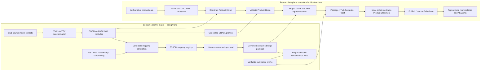
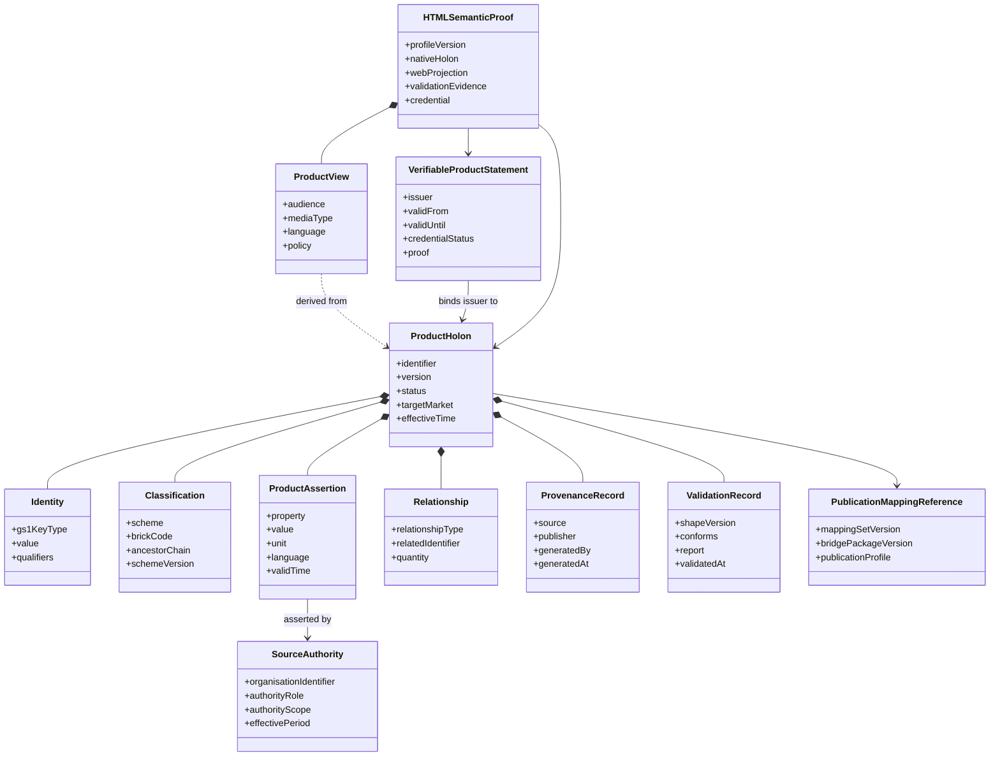
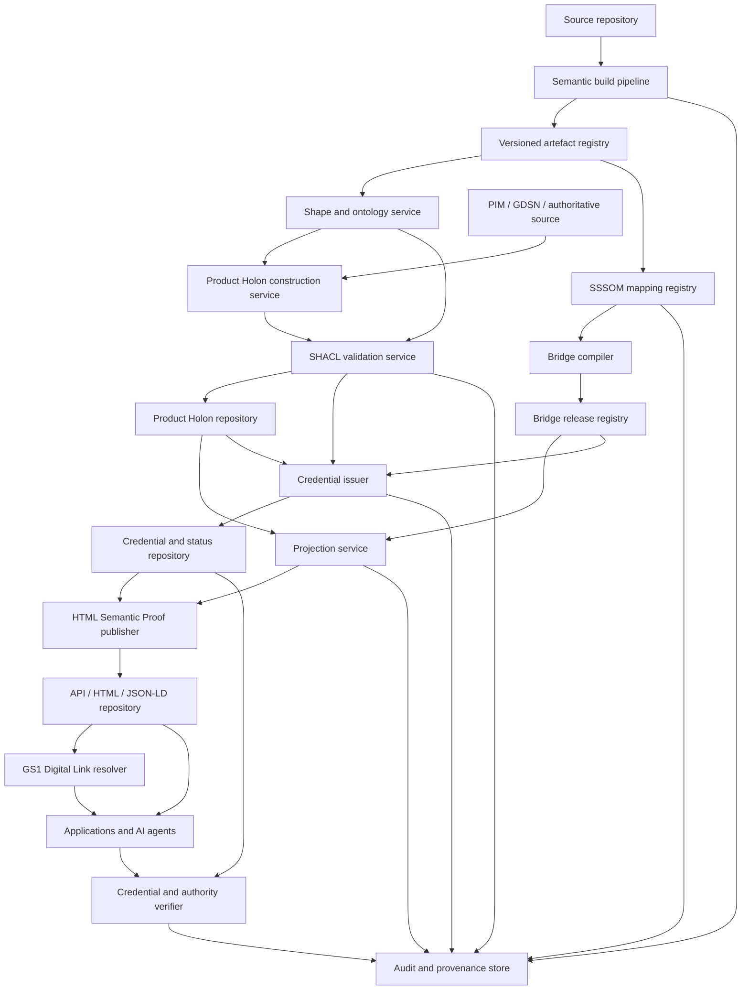

---
"@context":
  dct: "http://purl.org/dc/terms/"
  foaf: "http://xmlns.com/foaf/0.1/"
  prov: "http://www.w3.org/ns/prov#"
  adms: "http://www.w3.org/ns/adms#"
  owl: "http://www.w3.org/2002/07/owl#"
"@id": "urn:document:gs1-product-holon-architecture:2.1.0"
"@type": "foaf:Document"
dct:title: "GS1 Product Holon Architecture"
dct:description: >
  Working-draft semantic architecture for constructing, validating, governing,
  publishing, resolving and consuming bounded product knowledge graphs anchored
  by GS1 identifiers and derived from GDSN, GPC and GS1 Web Vocabulary assets,
  including an HTML Semantic Proof and cryptographically verifiable product statements.
dct:identifier: "GS1_Product_Holon_Architecture_v2.1.0"
dct:created: "2026-08-02"
dct:modified: "2026-08-17"
dct:language: "en-GB"
owl:versionInfo: "2.1.0"
adms:status: "Working Draft — proposed architecture for discussion"
dct:creator:
  "@type": "foaf:Person"
  foaf:name: "Chris Day"
  foaf:mbox: "mailto:chris.day@perdl.com"
prov:wasDerivedFrom:
  "@type": "foaf:Document"
  dct:title: "K10X Layer 1 and GS1 Web Vocabulary in retail shopping experiences"
  dct:identifier: "gs1-gdsn-holon-v1.31.0"
  owl:versionInfo: "1.31.0"
dct:references:
  - "https://www.gs1.org/standards/gdsn"
  - "https://ref.gs1.org/voc/"
  - "https://ref.gs1.org/standards/resolver/"
  - "https://www.w3.org/TR/shacl/"
  - "https://www.w3.org/TR/owl2-overview/"
  - "https://mapping-commons.github.io/sssom/"
  - "https://www.w3.org/TR/json-ld11/"
  - "https://www.w3.org/TR/vc-data-model-2.0/"
  - "https://www.w3.org/TR/vc-data-integrity/"
  - "https://www.w3.org/TR/vc-di-ecdsa/"
  - "https://www.w3.org/TR/vc-bitstring-status-list/"
  - "https://www.w3.org/TR/cid-1.0/"
dct:license: "To be determined before external publication"
---

# GS1 Product Holon Architecture

## A proposed semantic architecture for governed, validated and agent-ready product data

**Version:** 2.1.0  
**Date:** 17 August 2026  
**Status:** Working Draft — proposed architecture for discussion  
**Authority notice:** This document does not represent an approved GS1 standard, an approved GS1 architecture or a formally adopted GS1 term. “Product Holon” is a working architectural term introduced by this proposal.

---

## Document control

### Document purpose

This document defines a proposed architecture for constructing, validating, aligning, publishing, resolving and consuming bounded product knowledge graphs anchored by GS1 identifiers. It consolidates the architectural conclusions reached in the source investigation `gs1-gdsn-holon-v1.31.0.md` and separates them from the detailed research history, code listings, validation results and mapping evidence retained in the companion technical evidence pack.

### Intended audience

The document is intended for GS1 architecture, standards, data-modelling, GDSN, GPC, Web Vocabulary, Digital Link, semantic-web, API, AI-readiness and implementation stakeholders. It also provides a basis for discussion with Member Organisations, data pools, brand owners, retailers, marketplaces, solution providers and AI-agent implementers.

### Status vocabulary

The following labels are used consistently:

| Label | Meaning |
|---|---|
| **GS1 standard capability** | Behaviour explicitly defined by an approved GS1 standard or published GS1 vocabulary. |
| **Source-derived semantic artefact** | An ontology, shape or other machine-readable artefact generated from GS1 source models. It is not automatically an approved GS1 publication. |
| **Proposed architecture** | A design introduced by this document for evaluation and possible adoption. |
| **Reference implementation** | Tooling or code that demonstrates part of the proposal. It is not, by itself, a normative implementation. |
| **Candidate mapping** | An unreviewed or provisionally reviewed correspondence between semantic terms. |
| **Reviewed mapping** | A correspondence approved through the mapping-governance process defined in this document. |
| **Compiled artefact** | An OWL axiom, rule, query or other executable output generated from reviewed mapping records. |
| **HTML Semantic Proof** | A human-readable product page that embeds or links machine-readable Product Holon representations, source authority, conformance evidence and a verifiable product-statement credential. |
| **Verifiable Product Statement** | A W3C Verifiable Credential that binds an issuer to structured product statements or to integrity-protected resources containing those statements. “Verifiable” establishes authorship, integrity and status; it does not by itself establish factual truth. |

### Requirement language

The terms **shall**, **should** and **may** describe requirements within this proposed architecture. Their use does not confer GS1 standard status. A future standards deliverable would need to restate and approve any normative requirements through the applicable GS1 governance process.

### Licence

The source document did not establish a licence. The licence for this architecture and its technical evidence pack shall be determined before external publication or reuse beyond the authorised working group.

---

## Contents

- [Executive summary](#executive-summary)
- [1. Purpose and scope](#1-purpose-and-scope)
- [2. Architecture drivers and principles](#2-architecture-drivers-and-principles)
- [3. Product Holon conceptual model](#3-product-holon-conceptual-model)
- [4. Architecture overview](#4-architecture-overview)
- [5. Phase 1 — Build the semantic foundation](#5-phase-1--build-the-semantic-foundation)
- [6. Phase 2 — Construct and validate Product Holons](#6-phase-2--construct-and-validate-product-holons)
- [7. Phase 3 — Align through a governed semantic bridge](#7-phase-3--align-through-a-governed-semantic-bridge)
- [8. Phase 4 — Publish, resolve and consume](#8-phase-4--publish-resolve-and-consume)
- [9. Cross-cutting governance and conformance](#9-cross-cutting-governance-and-conformance)
- [10. Reference implementation](#10-reference-implementation)
- [11. Benefits, limitations and risks](#11-benefits-limitations-and-risks)
- [12. Adoption roadmap](#12-adoption-roadmap)
- [Annex A — Terms and definitions](#annex-a--terms-and-definitions)
- [Annex B — Proposed implementation conformance checklist](#annex-b--proposed-implementation-conformance-checklist)
- [Annex C — Version history](#annex-c--version-history)
- [Annex D — Companion artefact](#annex-d--companion-artefact)

---

## Executive summary

### The problem

GS1 product information is represented across complementary but differently shaped assets. GDSN provides a rich business-to-business master-data model and exchange environment. GPC supplies a global product-classification hierarchy with Brick-scoped attributes and controlled values. GS1 Web Vocabulary extends schema.org with product terms suitable for public web publication and machine interpretation. GS1 Digital Link provides resolvable identifiers and link-selection mechanisms. These assets are individually valuable, but an implementer still has to decide how to create a bounded, product-specific representation, validate it, govern mappings between semantic models and publish the appropriate view to each consumer.

The source investigation demonstrated why neither the full GDSN model nor Web Vocabulary alone is sufficient for every purpose. A full GDSN/GPC model is too large and operationally broad to serve directly as an AI-facing product record. Web Vocabulary is intentionally bounded and web-oriented; it does not provide all Brick-specific facets, the full GDSN code-list depth or a category-specific validation profile. Product data also changes ownership as it moves through the ecosystem: a brand owner is authoritative for manufacturer product facts, while a marketplace is authoritative for price, availability, seller identity and reviews. Treating all of these facts as one undifferentiated feed creates governance and trust problems.

### The proposed response

This architecture introduces the **Product Holon** as a bounded, independently addressable and composable product representation. A Product Holon is anchored by a GS1 identifier, normally a GTIN, and combines the product’s classification, applicable attributes, relationships, provenance, validation evidence and references to governed publication mappings. It is a whole in its own operational context while remaining part of larger classification, trade-item, logistics and publication graphs.

The Product Holon is not a replacement for GDSN, GPC, GS1 Web Vocabulary, schema.org or GS1 Digital Link. It is an architectural unit that connects them:

1. source models are transformed into semantic and validation artefacts;
2. a bounded product instance is constructed and validated;
3. reviewed semantic mappings are compiled into a governed bridge package;
4. audience-appropriate representations are published and resolved for applications and AI agents.

The Phase 4 end deliverable is a **GS1 Product Holon Verifiable Publication Profile and HTML Semantic Proof**. It packages a canonical GDSN/GPC-aligned Product Holon, a schema.org/GS1 Web Vocabulary discovery projection, explicit source-authority and provenance metadata, SHACL conformance evidence and a W3C Verifiable Credential that binds an authorised issuer to the published product statements or to cryptographic digests of the resources that contain them.

### Two architectural planes

The architecture separates design-time governance from runtime product processing.

**The semantic control plane** transforms and versions source models, generates ontology and SHACL artefacts, produces lexical mapping candidates, curates mappings in SSSOM, compiles reviewed mappings into OWL and rule modules, and maintains conformance tests. It changes when standards, source models or approved mappings change.

**The product data plane** resolves a product to its classification, constructs a Product Holon from authoritative product data, validates it, applies a released semantic bridge package, generates the required representations and publishes or resolves them. It runs per product, per version, per target market or per relevant product instance.

This separation corrects the linear impression created by the source investigation’s final process diagram. Lexical candidate generation and mapping curation operate over semantic models in the control plane; they are not performed separately for each validated Product Holon.

### Architecture at a glance



### Principal outcomes

The architecture is intended to deliver the following outcomes:

- a right-sized product graph rather than an unrestricted exposure of the full GDSN and GPC models;
- category-aware validation generated from the same semantic sources as the product representation;
- explicit separation between product truth and seller- or marketplace-owned commercial facts;
- versioned, auditable mappings rather than ad hoc name matching embedded in application code;
- multiple representations generated from one governed product representation;
- deterministic validation and reasoning at the trust boundary, with an LLM confined to retrieval, interpretation and narration rather than final rule execution;
- resolvable machine-readable product information through existing GS1 Digital Link and HTTP mechanisms;
- an inspectable HTML Semantic Proof that binds product identity, structured facts, source authority, conformance evidence and credential status into one publication package;
- a cryptographically verifiable product-statement layer that supports reliance decisions without misrepresenting a valid signature as proof of factual truth;
- a scalable path from the current reference implementation to a governed GS1 semantic publication capability.

### Key architectural decisions

| Decision | Consolidated position |
|---|---|
| Product Holon status | A proposed working term, not an existing GS1-defined concept. |
| Unit of product representation | A bounded product-instance graph anchored by a GS1 identifier and classification. |
| Holon versus validation shape | The Product Holon is instance data; SHACL shapes are separate validation contracts. |
| GDSN and GPC modules | Kept as distinct source-derived semantic modules with explicit relationships. |
| Mapping lifecycle | Candidate generation may be automated; approval is human-governed and recorded in SSSOM. |
| Direct equivalence | Used only where source and target terms have compatible meaning and graph shape. |
| Structural transformation | Implemented through reviewed DL-safe rules or transformation rules, not forced into unsound OWL equivalence. |
| SPARQL role | Used as a thin projection/export layer or as an explicitly versioned transform where required; it is not part of the OWL ontology itself. |
| Publication fallback | Publishable facts without a first-class target use `schema:additionalProperty` and `schema:PropertyValue`; non-public facts remain excluded. |
| AI role | Retrieve and narrate validated facts; do not replace SHACL, OWL, rule or query engines. |
| Canonical and discovery representations | Retain a GDSN/GPC-aligned canonical Product Holon and derive a schema.org/GS1 Web Vocabulary discovery projection from the same release. |
| Verifiable publication | Package the product page, semantic representations, authority metadata, conformance evidence and credential reference as an HTML Semantic Proof. |
| Credential semantics | Use a Verifiable Product Statement to establish issuer authorship, integrity, validity and status; do not describe cryptographic verification alone as proof that every product claim is factually true. |

### Open issues

The architecture remains a working draft. The following issues require formal resolution:

- whether GS1 should adopt “Product Holon” as an architectural term;
- the governance body and approval criteria for GDSN/GPC-to-Web Vocabulary mappings;
- the authoritative namespaces, persistence policy and release model for source-derived GDSN and GPC semantic artefacts;
- the extent to which the current fixed cross-category GDSN SHACL profile should become category-aware;
- the security, authorisation and commercial-data policies for non-public representations;
- the conformance-test suite, performance targets and operational service levels;
- the registered link types and resolver profiles required for Product Holon representations;
- the GS1 trust framework that proves an issuer is authorised for a GTIN, claim type, market and effective period;
- the profile namespace, cryptographic suite, key-management, credential-status and withdrawal policies for Verifiable Product Statements;
- the formal FoDS workstream ownership and hand-off between semantic publication, the proposed 8.4.a semantic proof profile and 8.4.b verification and use;
- the licence and publication status of the architecture and generated artefacts.

---

## 1. Purpose and scope

### 1.1 Purpose

The purpose of this document is to define a coherent Product Holon Architecture that connects GS1 source models, semantic artefacts, validation, mapping governance, publication and AI consumption. It states the current consolidated architecture rather than reproducing the chronological research path by which it was developed.

### 1.2 Scope

The architecture covers:

- transformation of GDSN and GPC source-model extracts into machine-readable semantic artefacts;
- generation of GPC Brick-scoped and selected GDSN SHACL constraints;
- construction of a bounded Product Holon for a GTIN or other appropriately qualified GS1 identifier;
- validation of product-instance data against released shapes;
- governance of mappings between GDSN, GPC, GS1 Web Vocabulary and schema.org;
- compilation of reviewed mappings into executable bridge artefacts;
- generation of business-to-business, marketplace, public-web and agent-facing representations;
- publication and resolution through APIs, feeds and GS1 Digital Link mechanisms;
- deterministic validation and reasoning in support of AI-enabled product discovery and interpretation.

### 1.3 Intended audience

The primary audience comprises architecture and standards specialists. Secondary audiences include product-data publishers, solution providers, data-pool operators, marketplaces, resolver operators and AI-agent developers who need to understand the authority, validation and publication boundaries.

### 1.4 Out of scope

The following are outside the present scope:

- replacement of GDSN data-pool publication and subscription services;
- replacement of GPC classification governance;
- definition of a new GS1 identification key;
- redesign of GS1 Web Vocabulary or schema.org;
- definition of marketplace pricing, availability, seller or review models beyond their relationship to product truth;
- autonomous or decentralised product nodes as a requirement of GS1 Digital Link;
- a complete production security architecture;
- formal GS1 approval, standardisation or certification;
- a claim that every GDSN or GPC term has a Web Vocabulary equivalent.

### 1.5 Relationship to GS1 standards and services

The architecture reuses existing GS1 assets in distinct roles:

| Asset | Role in the architecture |
|---|---|
| GDSN and the Global Data Model | Authoritative source semantics and business-to-business product facts, subject to the governance of the applicable GS1 standards and implementations. |
| GPC | Product classification, Brick scope, Brick-specific attribute types and controlled values. |
| GS1 Web Vocabulary | Public, schema.org-aligned publication vocabulary for supported product concepts. |
| GS1 Digital Link | Identification and resolution mechanisms for linking GS1 identifiers to one or more representations or services. |
| GS1 identifiers | Stable identity anchors for product and related entities. |

The architecture does not treat these assets as competitors. It assigns them complementary roles within one information lifecycle.

### 1.6 Status of the Product Holon concept

“Holon” originates outside GS1 and denotes a unit that is both a whole and part of a larger whole. The source investigation found no evidence that “Product Holon” is an existing GS1-defined term. This architecture therefore uses it as an explicit proposal. Standards-backed behaviours, source-derived artefacts and new architectural choices are labelled separately throughout.

### 1.7 Document conventions

Logical property names are used in conceptual examples for readability. The current generated GDSN ontology uses opaque source-ID-based CURIEs such as `gdsn:a812659001` and `gdsn:assoc_-1935341322_-474206270_1`. Production bindings shall be generated from the released semantic artefacts and mapping registry rather than inferred from the readability-oriented examples in this document.

---

## 2. Architecture drivers and principles

### 2.1 Current-state challenges

The architecture responds to six related challenges.

**Application-centric transformation.** Brand owners and trading partners commonly transform data from PLM, PIM, ERP, DAM, regulatory and supplier systems into application-specific message or feed structures. Repeating this transformation for GDSN, marketplaces, web pages, AI feeds and connected packaging creates duplication and semantic drift.

**Large source models.** The inspected GDSN ontology contains thousands of attributes and hundreds of code lists, including retailer- and region-specific extensions. The inspected GPC ontology contains 22,281 classes, including 5,318 Bricks and thousands of attribute types and values. These models are valuable sources but are not suitable as unrestricted per-product payloads.

**Category specificity.** Web Vocabulary and schema.org provide generic publication terms but do not reproduce every GPC Brick-specific facet. Conversely, GPC provides category-specific facets but is not the vocabulary that public web parsers and product feeds generally expect.

**Validation gap.** Publishing structured data does not, by itself, prove that the data is complete, structurally sound or category-appropriate. A product graph needs a validation contract generated from the same source semantics.

**Mapping governance.** Opaque generated identifiers, structural differences and differing vocabulary scope make naive local-name or label matching unsafe. Mapping candidates require provenance, review, cardinality analysis, structural analysis and version control.

**AI trust.** AI agents need bounded, current and traceable product facts. They should not be asked to infer product truth from an unrestricted model, execute final compliance rules or silently repair invalid source data.

### 2.2 Stakeholders and use cases

| Stakeholder | Representative use cases |
|---|---|
| Brand owner or manufacturer | Construct a governed product representation from source systems; validate it before publication; maintain provenance and lifecycle. |
| Data pool and trading partner | Exchange complete, recipient-appropriate master data using GDSN mechanisms. |
| Retailer or distributor | Consume authoritative product facts; apply local assortment and commercial data; publish selected views. |
| Marketplace | Reuse product truth while adding seller-owned `Offer`, availability, price and review information. |
| Regulator or conformity assessor | Trace assertions to source, rules and validation evidence. |
| Consumer application | Retrieve a bounded, human-appropriate and machine-readable product representation. |
| AI agent | Retrieve validated product facts, follow semantic links and generate grounded answers without inventing attributes. |
| Standards and vocabulary steward | Govern source models, mapping sets, semantic releases and deprecations. |

### 2.3 Proposed architecture requirements

| ID | Requirement |
|---|---|
| PH-R01 | Every Product Holon shall have a stable identity anchored by an applicable GS1 identifier. |
| PH-R02 | A Product Holon shall declare its product classification and the version of the classification scheme used. |
| PH-R03 | A Product Holon shall contain only assertions applicable to the represented product, context and release. |
| PH-R04 | Each assertion shall be traceable to an authoritative source, publisher or transformation. |
| PH-R05 | Product-instance data shall be validated against released SHACL shapes before approved publication. |
| PH-R06 | Validation shapes, ontology modules, mapping sets and product instances shall remain distinct artefact classes. |
| PH-R07 | Semantic mappings shall be versioned and governed as first-class records, not embedded only in application code. |
| PH-R08 | Automated lexical matches shall remain candidates until reviewed by an authorised human or governance process. |
| PH-R09 | Direct OWL equivalence shall only be compiled where meaning, cardinality and graph shape are compatible. |
| PH-R10 | The architecture shall support multiple audience-specific representations derived from one governed product representation. |
| PH-R11 | Manufacturer-owned product facts shall be distinguishable from seller- or marketplace-owned commercial facts. |
| PH-R12 | Deterministic engines shall perform validation, entailment and approved transformations at the trust boundary. |
| PH-R13 | The architecture shall preserve unmapped but publishable facts without presenting them as first-class mapped terms. |
| PH-R14 | Non-public, commercially sensitive or recipient-specific facts shall be controlled by explicit publication policy. |
| PH-R15 | Every release shall be reproducible from versioned source models, mapping records, build tools and tests. |

### 2.4 Architecture principles

1. **Identity-centred.** Product information is organised around persistent GS1 identifiers rather than application records.
2. **Bounded but extensible.** A Product Holon is deliberately right-sized for one product and context, while retaining links to broader models.
3. **Semantically explicit.** Classes, properties, code values and mappings use resolvable identifiers and declared meanings.
4. **Source-authoritative.** Assertions retain the authority and provenance of the system or organisation entitled to state them.
5. **Validated before publication.** Machine-readable publication follows validation rather than substituting for it.
6. **Open-world compatible.** New facts and domain extensions may be added without forcing one closed, monolithic payload on every consumer.
7. **Representation-independent.** One governed product representation may produce several serialisations and audience views.
8. **Human-governed, machine-executable.** Machines generate candidates and compiled artefacts; accountable humans approve semantic commitments.
9. **Deterministic at the trust boundary.** Validation and rule execution are delegated to deterministic engines.
10. **Versioned and reproducible.** Source, generated, reviewed and compiled artefacts form a traceable release chain.

### 2.5 Assumptions and constraints

The architecture assumes that an implementation can obtain an authoritative product-to-GPC-Brick classification from a PIM, GDSN record, lookup file or service. The ontology files alone do not contain per-GTIN product instances. It also assumes that generated ontology identifiers may be opaque and that labels are therefore candidate-generation aids rather than semantic keys.

The current reference implementation demonstrates selected attributes and four Bricks. It does not establish complete GDSN coverage, production throughput, formal security controls or universal downstream parser behaviour.

### 2.6 Non-goals

The architecture does not seek to expose all available data to every consumer, flatten every GDSN code list into named Web Vocabulary properties, or use an LLM as a substitute for an ontology, validation engine, mapping registry or rules engine.

---

## 3. Product Holon conceptual model

### 3.1 Definition

A **Product Holon** is a bounded, versioned product-instance knowledge graph anchored by a GS1 identifier. It contains the classification, applicable product assertions, relationships, provenance and validation evidence needed to treat the product representation as a coherent whole, while retaining links to the wider GDSN, GPC, Web Vocabulary, trade-item and supply-chain graphs of which it is a part.

### 3.2 Core information objects



### 3.3 Identity and addressability

The Product Holon shall be anchored by a GS1 identifier appropriate to the represented level. For a trade item, this is normally a GTIN. Batch/lot, serial and other GS1 Digital Link qualifiers may refine the addressable product instance where authoritative data is available. The identifier does not imply that every representation is public; access policy remains separate from addressability.

### 3.4 Classification and semantic context

A Product Holon shall identify its GPC Brick and the GPC release used. The Brick establishes category scope and provides the set of applicable GPC Attribute Types and controlled values. The ancestor chain may be retained to support broader category reasoning and navigation.

### 3.5 Product assertions

Product assertions comprise populated GPC Brick facts and selected GDSN facts that apply to the specific item. The Product Holon does not copy every possible property from the source models. Absence and explicit zero shall remain distinguishable. A missing assertion means no assertion has been supplied; an explicit value of zero is a stated product fact.

### 3.6 Relationships and composition

Relationships may include trade-item hierarchy, component, contained item, replacement, variant or other governed links. A heterogeneous variety pack is represented as a parent Product Holon classified to an applicable Variety Pack Brick and linked to child Product Holons for constituent GTINs. The parent does not merge all child classifications into one undifferentiated record.

### 3.7 Provenance and source authority

Each assertion shall identify or inherit a provenance record sufficient to determine who stated it, which source system supplied it, which transformation produced it and when it became effective. Generated semantic identifiers do not replace business-source provenance.

Source authority is claim-specific. A brand owner may be authoritative for formulation and pack facts; a certification body for a certified claim; a laboratory for a test result; a regulator or manufacturer for a recall; and a seller for price and availability. The architecture shall preserve the authority role, organisation identifier, scope, market and effective period rather than applying one undifferentiated page-level assertion of authority.

### 3.8 Validation status and conformance evidence

The Product Holon and its SHACL validation shapes are separate artefacts. The holon carries or references a validation record identifying the shape release, result and report. A conforming result means the supplied graph satisfied the tested constraints; it does not establish the truth of a business assertion beyond the authority of its source. The same boundary applies to cryptographic verification: a valid credential proves that the secured statement is authentic and unaltered according to the verification method, not that every underlying claim is factually correct.

### 3.9 Publication mappings and representations

A Product Holon references the released mapping set and bridge package used to derive a representation. Web Vocabulary, schema.org, marketplace feeds and human-readable pages are views of the Product Holon, not independent sources of manufacturer product truth. A view may omit facts, restructure facts or add facts owned by the recipient, but it shall preserve source and ownership boundaries.

#### 3.9.1 Canonical and discovery representations

The canonical semantic representation should remain GDSN/GPC-aligned so that it can preserve Brick scope, controlled values, structured GDSN records, target-market context and source-model traceability. A schema.org/GS1 Web Vocabulary projection should be generated from the same released Product Holon for web discovery, search, marketplaces and general-purpose AI agents. The two representations shall identify the same product and release and shall not be maintained as independent product records.

#### 3.9.2 Verifiable Product Statement

A Verifiable Product Statement is a W3C Verifiable Credential whose subject is the Product Holon or a defined assertion set. The credential may carry selected statements directly or use `relatedResource` integrity digests to bind the issuer to the exact Product Holon, HTML script block, SHACL profile, validation report and mapping release. It shall identify its issuer, validity period, status mechanism and securing method.

#### 3.9.3 HTML Semantic Proof

The HTML Semantic Proof is the inspectable publication container for a product. It combines a human-readable page with one or more identifiable `application/ld+json` script blocks, links to the canonical native Product Holon and Verifiable Product Statement, source-authority metadata, conformance evidence and release information. The HTML page is a publication package, not a new source of truth.

### 3.10 Holon boundaries

The minimum boundary contains identity, classification, sufficient provenance and at least one product assertion or relationship. The maximum boundary is determined by applicability, publication policy and consumer need. The whole GDSN or GPC ontology is not part of each Product Holon; it is referenced as semantic context.

### 3.11 Nested and composite Product Holons

Product Holons may be nested through explicit relationships. Nesting shall not obscure identity: each child with its own GTIN remains independently addressable and validated. Logistics aggregation and event history may be linked from EPCIS or other event sources but are not automatically copied into the core product master-data graph.

### 3.12 Lifecycle and versioning

A Product Holon release shall identify:

- the product identifier and relevant qualifiers;
- the source-data effective time or version;
- GDSN and GPC semantic-release identifiers;
- the SHACL profile version;
- the SSSOM mapping-set and bridge-package versions;
- the publication profile and generated representation time;
- supersession or deprecation status where applicable.

### 3.13 Relationship to adjacent concepts

| Concept | Relationship to a Product Holon |
|---|---|
| GDSN trade-item record | An authoritative source and B2B representation; it may contain more recipient-specific detail than a bounded public Product Holon view. |
| Digital twin | Functionally comparable where a digital twin represents one product’s governed current state; no formal equivalence is asserted. |
| Digital Product Passport | May consume or link to a Product Holon, but introduces regulatory scope, lifecycle and evidence requirements beyond this architecture. |
| Data product | A Product Holon may be delivered as a data product, but the architecture focuses on the semantic product unit rather than the full operating model of a data product. |
| `schema:Product` or `gs1:Product` | A publication representation or class alignment, not the entire internal Product Holon model. |
| Marketplace listing | Combines product truth with marketplace-owned offers, ratings, availability and merchandising content. |
| SHACL shape | A validation contract applied to the holon, not the holon itself. |

---

## 4. Architecture overview

### 4.1 Four phases

| Phase | Purpose | Primary outputs |
|---|---|---|
| **1. Build the semantic foundation** | Transform source models into separately versioned GDSN and GPC semantic modules and validation inputs. | TSV artefacts, OWL modules, diagnostics, generated SHACL resources. |
| **2. Construct and validate Product Holons** | Assemble a bounded product-instance graph and test it against the applicable profiles. | Product Holon, validation report, provenance and release metadata. |
| **3. Align through a governed semantic bridge** | Curate and compile mappings from source semantics to approved publication semantics. | SSSOM mapping set, OWL bridge module, DL-safe rule module, export queries and regression tests. |
| **4. Publish, resolve and consume** | Generate and distribute audience-appropriate representations to systems, marketplaces, applications and AI agents. | GDSN/GPC-native representation, Web Vocabulary/schema.org JSON-LD, HTML Semantic Proof, Verifiable Product Statement, resolver links, APIs and feeds. |

### 4.2 Semantic control plane

The semantic control plane owns artefacts that apply across many products:

- source-model extracts and transformation rules;
- GDSN and GPC ontology modules;
- code-list and datatype resources;
- generated SHACL profiles;
- candidate mapping outputs;
- SSSOM mapping sets and review status;
- compiled OWL and DL-safe rule modules;
- projection/export queries;
- conformance tests, release manifests and deprecation records.

Changes in the control plane require controlled release and regression testing before they affect product publication.

### 4.3 Product data plane

The product data plane processes product-specific facts:

- resolve GTIN and GPC Brick;
- retrieve authoritative source values;
- assemble the Product Holon;
- validate it against the released profiles;
- select an authorised publication profile;
- apply the released bridge package;
- generate the canonical native representation and approved web discovery projection;
- package the human-readable page, machine-readable scripts, authority metadata and conformance evidence as an HTML Semantic Proof;
- issue or link a Verifiable Product Statement and status record;
- publish, distribute or resolve the proof package and its related resources;
- record provenance, validation, credential and publication evidence.

### 4.4 Logical components

| Component | Responsibility |
|---|---|
| Source-model repository | Stores versioned Navigator extracts and related source files. |
| Semantic transformation pipeline | Produces TSV and OWL artefacts, preserving diagnostics and source identifiers. |
| GDSN semantic module | Represents GDSN classes, properties, datatypes, associations and code-list structures. |
| GPC semantic module | Represents classification hierarchy, Bricks, Attribute Types and Attribute Values. |
| Shape-generation service | Produces Brick-scoped and selected cross-category SHACL shapes. |
| Product Holon construction service | Resolves classification and assembles bounded product-instance graphs. |
| Validation service | Runs SHACL and returns machine-readable reports. |
| Mapping candidate service | Generates lexical or other candidate correspondences across source and target vocabularies. |
| SSSOM mapping registry | Stores mappings, provenance, confidence, cardinality, justification and review status. |
| Bridge compiler | Generates reasoner-usable axioms/rules and export artefacts from approved mapping records. |
| Projection service | Produces Web Vocabulary, schema.org or other profile-specific representations. |
| HTML Semantic Proof publisher | Packages human-readable content, identifiable JSON-LD scripts, representation links, authority metadata and conformance evidence. |
| Credential issuer | Issues Verifiable Product Statements using an approved credential profile and signing policy. |
| Credential-status service | Publishes revocation, suspension or other current-status information. |
| Credential and authority verifier | Verifies securing mechanisms, resource digests, status and the issuer’s authority for the asserted product scope. |
| Publication repository or API | Stores or serves released Product Holons and derived representations. |
| GS1 Digital Link resolver | Selects appropriate links or representations using standard resolver mechanisms. |
| Provenance and audit store | Records source, build, validation, mapping, credential and publication evidence. |

### 4.5 End-to-end information flow

1. A source-model release is ingested and transformed.
2. Diagnostics are reviewed; no malformed multiplicity or limit is silently guessed.
3. Separate GDSN and GPC ontology modules and SHACL resources are released.
4. Candidate semantic mappings are generated over the released models and target vocabularies.
5. Mapping stewards review candidates in SSSOM and approve, reject or qualify them.
6. A bridge package is compiled and tested.
7. A product’s authoritative record supplies its GTIN, Brick and populated facts.
8. The Product Holon construction service creates a bounded graph.
9. The validation service applies the relevant Brick and GDSN shapes.
10. An authorised publication profile selects facts and invokes the released bridge package.
11. The publication service produces the canonical GDSN/GPC-aligned representation and the schema.org/GS1 Web Vocabulary discovery projection.
12. The HTML Semantic Proof publisher binds the page, script identifiers, source authority and conformance resources into one release.
13. The credential issuer signs selected product statements or cryptographic digests of the related resources and publishes credential status.
14. The proof package is published through the appropriate B2B, feed, API or resolver channel.
15. Consumers retrieve only the representation and authority level appropriate to their role and apply their own reliance policy.

### 4.6 Roles and responsibilities

| Role | Accountable responsibilities |
|---|---|
| GS1 source-model steward | Maintain authoritative model releases and change records. |
| Semantic artefact steward | Maintain transformation rules, namespaces, ontology releases and diagnostics. |
| Mapping steward | Review candidate mappings and record decisions in SSSOM. |
| Brand owner or data source | State and maintain product facts for which it is authoritative. |
| Data-pool or exchange operator | Transport and synchronise authorised B2B product data. |
| Resolver or publication operator | Serve approved representations according to link, media-type and access policies. |
| Credential issuer | Sign product statements only for the product, claim scope, market and effective period for which the issuer is authorised. |
| Trust and status operator | Publish issuer verification material, authority evidence and credential status. |
| Verifier or relying party | Validate the credential, resources, authority, context and evidence against a declared reliance policy. |
| Marketplace | Add and govern seller, offer, availability, rating and merchandising facts. |
| Conformance operator | Execute validation and regression tests and retain evidence. |
| AI agent | Retrieve, verify, interpret and narrate approved facts; it is not an authority for product truth. |

### 4.7 Trust and authority model

| Information category | Primary authority | Architectural treatment |
|---|---|---|
| Identifier allocation and key structure | Applicable GS1 identification governance | Used as the identity anchor; not inferred by an LLM. |
| GPC classification and value definitions | GPC governance and released source model | Referenced by version; used for scope and validation. |
| GDSN semantic definitions | GDSN/Global Data Model governance and released source model | Transformed into source-derived semantic artefacts with provenance. |
| Manufacturer product facts | Brand owner or authorised data source | Stored in the Product Holon with assertion provenance. |
| Mapping decisions | Designated semantic mapping governance | Recorded in SSSOM; compiled only after approval. |
| Price, availability and seller identity | Seller or marketplace | Added as `Offer`-level or equivalent commercial facts, separate from manufacturer product truth. |
| Reviews and ratings | Marketplace or review platform | Retain separate provenance and publication policy. |
| Credential authorship and integrity | Credential issuer controlling the approved verification method | Verified cryptographically and checked against current credential status. |
| Authority to assert product facts | Brand owner, authorised information provider, certification body, laboratory, regulator or other scoped authority | Verified independently of signature validity through registry, delegation, role, market and effective-period evidence. |
| Generated narrative | Application or AI agent | Derived output; shall reference validated facts and shall not be treated as a source assertion. |

### 4.8 Authoritative, generated and compiled artefacts

The architecture distinguishes four release classes:

1. **Authoritative source artefacts:** GS1 source-model releases and authoritative product records.
2. **Source-derived artefacts:** TSV, OWL and SHACL generated from those sources.
3. **Governed mapping artefacts:** SSSOM mapping records approved through review.
4. **Compiled and instance artefacts:** bridge axioms, rules, queries, Product Holons, validation reports, publication views, HTML Semantic Proofs and Verifiable Product Statements.

A compiled artefact shall be reproducible from its source release, tool version and mapping-set version.

### 4.9 Architecture decisions summary

The detailed decision records are retained in the companion technical evidence pack. The current binding decisions are:

- maintain separate GDSN and GPC modules;
- separate semantic control-plane processing from per-product data-plane processing;
- treat mappings as governed data in SSSOM;
- compile only reviewed mappings;
- use direct equivalence only for same-meaning, same-shape correspondences;
- use DL-safe rules for conditional semantic derivations where appropriate;
- keep SPARQL outside the ontology as a projection/export mechanism or explicitly versioned transform;
- use generic `PropertyValue` projection for publishable unmapped facts;
- exclude non-public facts through an explicit allow-list;
- require deterministic engines for validation, inference and approved transformation;
- retain a GDSN/GPC-aligned canonical Product Holon and derive the Web Vocabulary/schema.org projection;
- use an HTML Semantic Proof as the Phase 4 inspectable publication package;
- use Verifiable Product Statements for authorship, integrity and current-status verification, while keeping factual reliance dependent on source authority and evidence.


---

# Part I — Semantic foundation

## 5. Phase 1 — Build the semantic foundation

### 5.1 Objective

Phase 1 converts GS1 source-model material into explicit, versioned semantic and validation artefacts. It establishes the design-time foundation consumed by every later Product Holon release. The phase does not create product instances and does not publish Web Vocabulary representations.

### 5.2 Source inputs

The demonstrated pipeline begins with GDSN and GPC UML-model exports from GS1 Navigator. The source investigation identified the following representative inputs:

- `gdsn_classes.json`;
- `gdsn_classAttributes.json`;
- `gdsn_codeValues.json`;
- `gdsn_instances.json`;
- `gdsn_avps.json`;
- `gdsn_extendedAttributes.json`;
- `gdsn_extendedCodeValues.json`;
- `gdsn_gpcBricks.json`;
- `gdsn_validationRules.json`;
- `iso3166Countries.json`;
- `version.json`;
- a GPC hierarchy release such as `GPCv20260520GB.json`.

These files are source-model artefacts rather than product-instance data. A GTIN-to-Brick assignment must be obtained from an authoritative product record, data-pool export, PIM or lookup service.

### 5.3 JSON-to-TSV transformation

The reference tool `gdsn-json-to-tsv` transforms the source JSON into controlled tabular artefacts suitable for semantic generation. The documented outputs include:

- `Classes.tsv`;
- `Attributes.tsv`;
- `Datatypes.tsv`;
- `Enumerations.tsv`;
- `EnumerationNamedValues.tsv`;
- `AnnotationProperties.tsv`;
- `Annotations.tsv`;
- `diagnostics.tsv`.

GDSN and GPC are emitted as separate module directories. Code-valued classes are not duplicated as ordinary business classes and enumerations. Source identifiers and annotations are retained so that generated opaque CURIEs remain traceable to the source model.

### 5.4 Conversion policy

The semantic foundation shall follow a non-invention policy:

- malformed multiplicities or limits shall be preserved in source annotations and diagnostics;
- the transformation shall not guess a plausible cardinality where the source is malformed or incomplete;
- conversion warnings shall remain machine-readable and reviewable;
- source model identifiers shall be retained even where they are not human-readable;
- extended attributes without a reliable natural owner shall be represented through explicit synthetic containers rather than attached to an invented owner class;
- GDSN and GPC shall remain separate modules, with relationships expressed explicitly rather than by merging their source structures.

The source investigation found malformed multiplicities such as `..`, `1..` and `0...1`. The demonstrated policy leaves generated minimum and maximum values blank, preserves the original expression and emits a conversion warning.

### 5.5 TSV-to-OWL generation

The reference tool `uml2semantics-python` converts the TSV artefacts into OWL 2. The generated model may include:

- classes and subclass relations;
- object and datatype properties;
- datatype restrictions and facets;
- enumerations and named values;
- union and disjointness constructs for UML choice patterns;
- OWL 2 property chains where the source relationship supports multi-hop composition;
- annotations linking generated entities to source identifiers and model documentation.

Property chains are suitable for composing object-property paths towards the same target. They do not select a different output property based on a sibling data value; that type of conditional transformation remains a rule concern.

### 5.6 GPC semantic module

The inspected GPC artefact contains 22,281 classes arranged across Segments, Families, Classes, Bricks, Attribute Types and Attribute Values. The source investigation reported:

- 45 Segments;
- 162 Families;
- 938 Classes;
- 5,318 Bricks;
- 2,085 Brick-specific Attribute Types;
- 13,733 Attribute Values.

The architecture uses the GPC module for product classification, ancestor traversal, category-specific attribute scope and controlled values. A Brick’s child Attribute Types and their child Attribute Values provide the input to generated SHACL constraints.

### 5.7 GDSN semantic module

The inspected GDSN artefact contains 30,630 RDF descriptions and approximately 3,946 core trade-item attributes, supplemented by retailer- and region-specific extensions and 557 distinct code lists. The source investigation identified examples relevant to consumer and agent use cases, including allergens, nutrients, claims, certifications, recycled content, preparation instructions and recipes.

The architecture does not infer that all such attributes belong in every Product Holon or public representation. The GDSN module supplies semantic definitions, datatype and cardinality information, code-list references and business-to-business context. Publication remains policy-driven.

### 5.8 SHACL generation inputs

The shape-generation step consumes the GPC and, optionally, GDSN ontology modules. For a Brick:

1. the Brick becomes the `sh:targetClass`;
2. each level-5 child Attribute Type becomes an `sh:property`;
3. each level-6 child Attribute Value becomes a member of the allowed enumeration;
4. the source model supplies cardinality, datatype and code-list information where available;
5. reusable code-list resources should be referenced rather than repeatedly inlined where practical.

The current `gs1-gdsn-holon` reference implementation also supports an `--include-gdsn` option that adds a selected cross-category GDSN shape.

### 5.9 Diagnostics and release quality

A semantic-foundation release shall contain:

- a source manifest;
- transformation-tool versions;
- conversion diagnostics;
- unresolved-source issue counts;
- generated ontology serialisations;
- generated shape artefacts;
- parse and consistency test results;
- a change report from the previous release;
- a deprecation and migration report where identifiers or meanings change.

No generated artefact should be promoted to a release solely because it parses. Semantic diagnostics and regression tests shall be reviewed.

### 5.10 Versioning and provenance

The release manifest shall identify the Navigator/GDSN/GPC source versions, transformation versions, generation date and checksum of each output. Generated IRIs shall have a documented persistence policy. Where source IDs remain opaque, labels and source annotations shall be preserved but shall not be treated as globally unique semantic identifiers.

### 5.11 Phase outputs

Phase 1 produces:

- versioned GDSN and GPC semantic modules;
- SHACL profile inputs and generated shapes;
- code-list resources;
- diagnostics and conversion warnings;
- source-to-generated provenance;
- a release manifest suitable for downstream Product Holon construction and mapping governance.

---

# Part II — Product Holon construction

## 6. Phase 2 — Construct and validate Product Holons

### 6.1 Objective

Phase 2 creates a bounded product-instance graph from authoritative product data and validates it against the applicable released semantic profiles. This phase runs in the product data plane.

### 6.2 Required inputs

A construction request requires, at minimum:

- a GTIN or other applicable GS1 identifier;
- a GPC Brick assignment and GPC release;
- authoritative populated product facts;
- the applicable GDSN and GPC semantic-release identifiers;
- the applicable SHACL profile release;
- target-market, language, batch/lot, serial or audience context where relevant;
- source and publisher provenance.

A GTIN alone is insufficient unless a service can resolve it to the relevant product data and GPC Brick.

### 6.3 Construction sequence

1. Validate the identifier syntax and resolve any relevant GS1 Digital Link qualifiers.
2. Retrieve the authoritative product record and its current classification.
3. Load the applicable GPC Brick and ancestor chain.
4. Select populated Brick-scoped facts for the product.
5. Select applicable GDSN facts according to the Product Holon profile and data-access policy.
6. Preserve structured records, units, language and explicit zero values.
7. Attach relationships to parent, child or component Product Holons where required.
8. Attach source, transformation and effective-time provenance.
9. record the semantic and shape release identifiers.
10. emit the Product Holon as a graph suitable for SHACL validation.

### 6.4 Product Holon instance structure

The following example is conceptual and uses readable logical names. The production reference artefacts bind these concepts to generated CURIEs and mapping records.

```json
{
  "@context": {
    "ph": "https://example.org/product-holon/",
    "gpc": "gpc:",
    "gdsn": "gdsn:",
    "prov": "http://www.w3.org/ns/prov#"
  },
  "@id": "https://example.com/01/09506000134352",
  "@type": ["ph:ProductHolon", "gpc:10000030"],
  "ph:identity": {
    "ph:keyType": "GTIN",
    "ph:value": "09506000134352"
  },
  "ph:classification": {
    "ph:brick": "gpc:10000030",
    "ph:label": "Cheese (Frozen)",
    "ph:schemeVersion": "declared-by-release-manifest"
  },
  "ph:assertion": [
    { "ph:property": "gpc:20000031", "ph:value": "GOUDA" },
    { "ph:property": "gpc:20000192", "ph:value": "FIRM/SEMI-HARD" },
    { "ph:property": "gpc:20003081", "ph:value": "SEMI-HARD CHEESE" },
    { "ph:property": "gpc:20003080", "ph:value": "DIRECT CONSUMPTION" }
  ],
  "prov:wasDerivedFrom": "urn:source-record:authoritative-product-record",
  "ph:validationProfile": "urn:shape-release:gpc-brick-10000030-with-gdsn"
}
```

The example is not an assertion about a real commercial product. It demonstrates the bounded graph pattern established by the source evidence.

### 6.5 Brick-scoped attributes

Only Attribute Types defined for the selected Brick are included as category-specific facts. The source investigation showed that different Bricks have materially different profiles:

- Cheese (Frozen), `10000030`: six Attribute Types in the demonstrated release;
- Smartphones, `10001198`: two Attribute Types;
- Beer, `10000159`: nine Attribute Types in the source run, with six reproduced in the supplied shape excerpt;
- Sugar/Sugar Substitutes (Shelf Stable), `10000043`: one Attribute Type.

The architecture follows the released source even when an enumeration appears outdated. For example, the demonstrated Smartphone `System` enumeration stops at `3 G`. The semantic pipeline shall report and govern that source limitation; it shall not silently add `4 G` or `5 G`.

### 6.6 Cross-category GDSN facts

The current reference implementation adds a fixed, selected GDSN shape with eight properties across every tested Brick. The source comparison confirmed that this property set is identical for Cheese, Smartphones, Beer and Sugar. It includes GTIN, ingredient statement, recycled-content ratio, claim detail, allergen and nutrient structures.

This is a reference-implementation choice, not an architectural requirement that every category use the same eight properties. The fixed profile creates two known issues:

- some properties are inapplicable to a category, such as food-allergen slots for Smartphones;
- some clearly category-relevant GDSN properties are absent, including several cheese-related attributes found in the mapping evidence.

A production profile should therefore support a governed combination of cross-category core facts and category- or use-case-specific GDSN modules.

### 6.7 Structured records

The Product Holon shall preserve GDSN structure where that structure carries meaning. Allergen and nutrient data are not merely scalar strings. The real generated shape shows an allergen path through `AllergenRelatedInformation` and `Allergen`, while nutrient data passes through header/detail structures. Flattening may be appropriate for a publication view, but the source graph and the mapping record shall preserve how that flattening was derived.

### 6.8 Variety packs and composite products

GPC includes dedicated Variety Pack Bricks. The pack receives its own GTIN, classification and Product Holon. Constituent trade items retain their own GTINs, Bricks and Product Holons. GDSN trade-item hierarchy relationships link the parent and children, including quantities and component counts where supplied.

A composite Product Holon shall therefore reference child Product Holons rather than merge their category constraints. This supports independent validation, update and resolution of each constituent item.

### 6.9 SHACL validation

The validation service shall apply:

- the Brick-scoped GPC shape;
- the selected GDSN shape modules;
- identity and release-profile constraints;
- additional policy shapes where required for a publication or regulatory profile.

Validation shall return a machine-readable report with focus nodes, paths, constraint components and messages. A failing record shall not be silently repaired at the publication boundary.

### 6.10 Validation evidence

The source evidence records successful `pySHACL` tests in which:

- a conforming Cheese record returned `Conforms: True`;
- a deliberately invalid record returned `Conforms: False`;
- invalid firmness and nutrient codes were reported through `sh:InConstraintComponent`;
- a missing containment level was reported through `sh:MinCountConstraintComponent`;
- generated shapes for Cheese, Smartphones and Beer parsed and validated in the demonstrated generalisation check;
- the `gs1-gdsn-holon` tool incorporated parse, empty-graph, conforming-instance and broken-instance checks by default.

These results demonstrate the pattern, not full production conformance coverage.

### 6.11 Validation and truth

SHACL establishes conformity to the tested graph contract. It does not independently prove that the source assertion is factually correct. The architecture therefore requires both validation evidence and provenance. A valid but incorrectly sourced allergen assertion remains a data-governance failure.

### 6.12 Product Holon release states

A Product Holon may use the following proposed states:

| State | Meaning |
|---|---|
| Draft | Construction is incomplete or validation has not run. |
| Invalid | One or more required profiles fail. |
| Validated | Required profiles pass, but publication approval is pending. |
| Approved | Product and publication policies permit release. |
| Published | One or more representations have been released. |
| Superseded | A later Product Holon version has replaced this release. |
| Withdrawn | Publication is no longer authorised. |

### 6.13 Phase outputs

Phase 2 produces:

- a bounded Product Holon instance;
- a validation report;
- source and transformation provenance;
- links to parent or child Product Holons where applicable;
- a release status;
- the semantic and shape versions required by Phase 3 and Phase 4.

---

# Part III — Governed semantic alignment

## 7. Phase 3 — Align through a governed semantic bridge

### 7.1 Objective

Phase 3 creates and governs semantic correspondences between source-derived GDSN/GPC semantics and target publication semantics such as GS1 Web Vocabulary and schema.org. It is a design-time control-plane process. It does not run lexical mapping separately for each product.

### 7.2 Governed semantic bridge package

The bridge is a package of independently versioned artefacts, not a single ontology containing every mechanism:

| Artefact | Role |
|---|---|
| SSSOM mapping set | Source of truth for candidate, reviewed, approved and rejected mappings. |
| OWL bridge module | Compiled equivalence, subclass, subproperty or property-chain axioms where structurally sound. |
| DL-safe rule module | Conditional semantic derivations evaluated with the ontology over named Product Holon individuals. |
| SPARQL projection/export package | Extracts or serialises approved target graphs; may implement explicitly governed transforms that are not placed in the ontology. |
| Publication allow-list | Determines which facts may be emitted to each audience profile. |
| Regression and conformance tests | Demonstrate that released mappings still produce expected results after source or target changes. |
| Release manifest | Links every compiled artefact to the reviewed SSSOM records and source vocabulary releases. |

SPARQL queries are not part of the OWL ontology. They belong to the bridge package and have their own lifecycle.

### 7.3 Four publication routes

Every candidate product fact is assigned one of four routes.

| Route | Condition | Treatment |
|---|---|---|
| **Route 1 — direct semantic correspondence** | Source and target have compatible meaning, value space, cardinality and graph shape. | Compile an approved OWL mapping or deterministic property alias. |
| **Route 2 — structural transformation** | Meaning is compatible but source and target graph structures differ or the output property depends on a code/value condition. | Apply an approved DL-safe rule or versioned transform, then export the result. |
| **Route 3 — generic publication** | The fact is publishable but no approved first-class target term exists. | Emit `schema:additionalProperty` / `schema:PropertyValue` with the source property identifier and label. |
| **Route 4 — excluded** | The fact is B2B-only, commercially sensitive, inapplicable, unsupported or outside the publication profile. | Retain it in the authorised internal or B2B representation; do not emit it publicly. |

Route assignment is a mapping-governance decision, not a runtime guess by an LLM.

### 7.4 Candidate generation

Candidate mappings may be generated through:

- exact or normalised label comparison;
- synonym and annotation comparison;
- structural similarity;
- code-list and value-space comparison;
- source lineage and documentation;
- existing schema.org or Web Vocabulary alignments;
- domain-expert proposals.

The demonstrated LOOM/BioPortal run extracted 28,101 unique terms and produced 237 unique bidirectional candidate pairs, serialised as 474 directional mapping records:

- GDSN ↔ GPC: 38 unique pairs;
- GDSN ↔ GS1 Web Vocabulary: 184 unique pairs;
- GPC ↔ GS1 Web Vocabulary: 15 unique pairs.

All records were expressed as `skos:closeMatch`, which is appropriate for lexical candidates. The output is evidence for review, not authority for equivalence.

### 7.5 Limits of lexical matching

Labels are not semantic keys. Similar labels may hide different scope, range, cardinality or structure; dissimilar labels may express the same concept. Opaque generated GDSN CURIEs make labels necessary for candidate discovery, but labels alone remain insufficient for approval.

The source evidence found several examples:

- `allergenStatement` in Web Vocabulary is a language-tagged string, while the structured GDSN allergen path is a coded multi-hop record;
- a separate flat GDSN allergen-statement attribute is a more plausible direct candidate;
- `claimDetail` has no single lexical match, while components of its surrounding domain align to several distinct Web Vocabulary record types;
- multiple GDSN GTIN attributes map lexically to one `gs1:gtin` or `schema:gtin` concept, creating an n:1 cardinality issue that requires packaging-level review.

### 7.6 SSSOM mapping-set governance

Every mapping shall be represented as a first-class SSSOM record with, where applicable:

- `subject_id` and `subject_label`;
- `predicate_id`;
- `object_id` and `object_label`;
- mapping justification;
- mapping tool and tool version;
- source and target vocabulary releases;
- confidence;
- mapping cardinality;
- author and reviewer identifiers;
- review date and decision;
- comments describing structural assumptions;
- status: candidate, approved, rejected, superseded or deprecated.

An automated candidate should normally use `semapv:LexicalMatching` or the appropriate machine-matching justification. A reviewed decision records manual or composite curation. The exact predicate may remain `skos:closeMatch`, become `skos:exactMatch`, or compile into an OWL axiom only after the review establishes the required semantics.

### 7.7 Human review gate

The review process shall test:

1. identifier resolution and term status;
2. labels, definitions and domain context;
3. source and target value spaces;
4. datatype and language handling;
5. cardinality and mapping cardinality;
6. graph shape and nesting;
7. target publication behaviour;
8. loss, aggregation or transformation risk;
9. authority and intended audience;
10. regression examples and rejection cases.

No candidate shall be compiled into a reasoner-active equivalence solely because a lexical tool generated it.

### 7.8 Direct OWL mappings

An OWL `equivalentProperty` or equivalent-class axiom is appropriate only where the two terms denote the same relation or class over compatible graph structures. Domain aliases within Web Vocabulary are examples of straightforward equivalence. A source-derived GDSN-to-Web Vocabulary equivalence must be explicitly approved because Web Vocabulary does not publish links to the generated local GDSN namespace.

Where a two-hop object-property path reaches the same target individual expected by the target property, an OWL property chain may support a derived property. It shall not be used to convert a structured individual into a literal string or to branch on a data value.

### 7.9 DL-safe rule mappings

Conditional mappings may use DL-safe rules in an independently versioned module imported by the core bridge ontology. Every variable binds to named Product Holon individuals already present in the ABox. Representative cases include:

- mapping nutrient code `FAT` and its quantity to `schema:fatContent`;
- mapping `ENERC`, `PRO-` and `NA` to the corresponding schema.org nutrition properties;
- deriving an approved textual allergen statement from a structured coded chain where no authoritative flat statement is available;
- constructing an isomorphic publication assertion from a named source record.

The rule module shall be tested with the same semantic releases and mapping-set version as the Product Holon publication profile.

### 7.10 SPARQL projection and export

SPARQL may be used to:

- select the entailed target graph;
- construct the final JSON-LD publication graph;
- filter Route 4 properties;
- create generic `PropertyValue` nodes for Route 3;
- serialise audience-specific views;
- implement a transform that governance intentionally keeps outside the reasoner.

Where substantive transformation remains in SPARQL, the query is a governed compiled artefact with tests and provenance. Where SWRL has already entailed the target properties, the export query should remain thin and stable.

### 7.11 Generic `PropertyValue` projection

Route 3 preserves a publishable fact without claiming that it is a native Web Vocabulary or schema.org property. The representation shall include:

- `schema:additionalProperty`;
- a `schema:PropertyValue` node;
- the source property identifier in `schema:propertyID`;
- a human-readable name;
- the value and unit where applicable;
- source or provenance linkage where supported by the profile.

Downstream parsers may give generic properties less weight than first-class properties. The architecture treats Route 3 as loss-minimising publication, not semantic equivalence.

### 7.12 Current evidence-based mapping findings

The evidence pack records the full findings. The consolidated position is:

- GTIN has strong schema.org/Web Vocabulary support, but multiple source GTIN attributes require packaging-level cardinality review;
- `gdsn:a812659001` and `gs1:ingredientStatement` are a tool-corroborated candidate pair pending formal human approval;
- `gpc:20002867` and `gs1:sharpnessOfCheese` are independently corroborated candidate terms, with value-level equivalence still requiring review;
- `gdsn:a-1463136308` is the plausible direct candidate for `gs1:allergenStatement`; the structured allergen chain is a separate Route 2 case;
- nutrient codes `ENERC`, `FAT`, `PRO-` and `NA` have defined schema.org projection targets; other nutrients, such as calcium in the worked example, require Route 3 unless a governed target is added;
- every residual facet reproduced in the four-Brick mapping tables had no LOOM candidate to Web Vocabulary and currently uses Route 3; the source baseline elsewhere reports a 19-of-20 count, but its reproduced per-Brick lists do not reconcile to that total, so no consolidated numeric claim is made here;
- `packagingRecycledContentRatio` and `claimDetail` were present in the candidate term set but produced no direct Web Vocabulary match; they require structural review, decomposition, Route 3 or Route 4 treatment.

These are architectural inputs, not an approved GS1 crosswalk.

### 7.13 Bridge package versioning

A bridge release shall identify:

- source GDSN and GPC releases;
- target Web Vocabulary and schema.org releases;
- SSSOM mapping-set version and checksum;
- approved mapping count by predicate and route;
- rule-module version;
- export-query version;
- allow-list version;
- regression-test results;
- known rejected and deprecated mappings.

### 7.14 Drift detection and regression testing

Regression tests shall detect:

- removed or deprecated source and target terms;
- changed domains, ranges, cardinalities or code values;
- mappings whose graph shapes are no longer compatible;
- unexpected inference closure;
- lost or duplicated publication facts;
- invalid JSON-LD or SHACL output;
- changed Route 3 fallback counts;
- changed public/private classification.

### 7.15 Phase outputs

Phase 3 produces a released governed semantic bridge package, including its SSSOM source of truth, compiled semantic artefacts, export/projection rules, publication allow-lists, tests and release manifest.

---

# Part IV — Publication and consumption

## 8. Phase 4 — Publish, resolve and consume

### 8.1 Objective

Phase 4 produces and serves the representation appropriate to a recipient, purpose and access policy. It culminates in an inspectable HTML Semantic Proof and, for verified-publication conformance, a Verifiable Product Statement. It does not create a second independent source of product truth.

### 8.2 End deliverable — GS1 Product Holon Verifiable Publication Profile

The proposed end deliverable is the **GS1 Product Holon Verifiable Publication Profile — HTML Semantic Proof**:

> A human-readable HTML product page containing or linking an exact GTIN-anchored Product Holon, a schema.org/GS1 Web Vocabulary discovery projection, explicit source-authority and provenance metadata, versioned SHACL conformance evidence, governed mapping metadata and a W3C Verifiable Credential that cryptographically binds an authorised issuer to the structured product statements or to integrity-protected resources containing them.

The profile shall be independently testable. A browser, marketplace, application or AI agent should be able to locate the product scripts, retrieve the canonical resources, verify their integrity and status, identify the source authority and explain which evidence supports reliance on each statement.

### 8.3 Profile composition

| Subprofile | Purpose |
|---|---|
| **Native Product Holon Profile** | Canonical, bounded product graph expressed in GDSN- and GPC-aligned semantics. |
| **Web Discovery Projection Profile** | schema.org and GS1 Web Vocabulary representation for web crawlers, marketplaces and general-purpose agents. |
| **Source Authority and Provenance Profile** | Identifies who asserted a statement, their authority role, the source record, context, effective time and transformation lineage. |
| **Conformance Evidence Profile** | References SHACL shapes, validation report, mapping-set version, bridge release and build evidence. |
| **GS1 Product Statement Credential Profile** | W3C Verifiable Credential binding an authorised issuer to selected product statements or to digests of the resources that carry them. |

The five subprofiles form one release package but remain separate artefacts so that each can be versioned, verified and withdrawn independently.

### 8.4 Canonical native Holon and public discovery projection

The architecture does not choose between GDSN/GPC and Web Vocabulary/schema.org. It assigns them different roles:

```text
Authoritative GDSN/GPC Product Holon
                ↓
       governed semantic bridge
                ↓
schema.org / GS1 Web Vocabulary projection
```

The native Product Holon preserves the semantic depth required for validation and audit. The public discovery projection uses the terms and structures most likely to be recognised by web tooling and AI agents. Both shall identify the same GTIN, Product Holon release, source authority, validation report and mapping release.

The HTML profile may embed both representations in separate, uniquely identified `application/ld+json` script elements. Where the native representation is restricted or too large for the page, the profile shall link to it as an alternate representation and embed the public projection.

### 8.5 Publication lenses

| Lens | Typical recipient | Semantic form | Content direction |
|---|---|---|---|
| Manufacturer/internal | Product-data and governance systems | Native Product Holon, source-derived GDSN/GPC terms | Broad product truth, provenance and validation evidence. |
| Trading partner | GDSN/data-pool participant | GDSN-native or recipient-specific B2B representation | May be broader and recipient-specific. |
| Marketplace/feed | Feed-ingesting platform | Web Vocabulary/schema.org or platform profile | Narrower product facts; excludes internal B2B content. |
| Consumer/application | Browser, app or connected-pack experience | HTML Semantic Proof plus public JSON-LD | Public, comprehensible and policy-approved facts. |
| AI agent | Agent or retrieval service | Bounded JSON-LD/RDF, credential, validation and provenance references | Grounded facts suitable for deterministic verification, retrieval and explanation. |

The lenses are representations derived from the Product Holon. They are not separate holons unless they acquire their own identity, authority and lifecycle as independent data products.

### 8.6 Product and Offer separation

The Product Holon contains manufacturer- or authorised-source product truth. Price, currency, seller, availability, delivery terms and marketplace reviews belong to seller- or marketplace-owned objects such as `schema:Offer`, `schema:AggregateOffer` and rating structures.

A marketplace presenting one GTIN from several sellers should reuse one governed product representation and attach multiple offers. It should not create several divergent copies of the manufacturer’s product facts without provenance. A product-statement credential shall not sign seller-owned facts unless the named issuer is also the authority for those facts and the credential scope states that role explicitly.

### 8.7 HTML Semantic Proof

The HTML Semantic Proof shall provide:

- a canonical product URI based on the exact GS1 identifier and applicable qualifiers;
- a declared profile URI and profile version;
- one or more uniquely identified JSON-LD script elements;
- the public schema.org/GS1 Web Vocabulary projection;
- the native GDSN/GPC Product Holon, embedded or linked according to policy;
- source-authority and provenance references;
- validation, mapping and release references;
- a canonical Verifiable Product Statement served using the `application/vc` media type;
- human-readable status and evidence information that does not overstate verification as factual truth;
- links to superseding, withdrawn or historical releases where applicable.

JSON-LD 1.1 permits an individual script element to be addressed by a fragment identifier matching its `id`. The profile shall use stable script identifiers so that the credential can integrity-bind the exact script block or a canonical external representation. The canonical credential should be served as `application/vc`; an embedded copy may be provided for inspection only when byte-for-byte or dataset-level equivalence and lifecycle synchronisation are assured.

### 8.8 Source authority and grounding

At minimum, the source-authority profile shall identify:

| Element | Required meaning |
|---|---|
| Product subject | Exact GTIN and canonical GS1 Digital Link URI, with qualifiers where applicable. |
| Issuer identity | A resolvable organisation identifier and verification method. |
| GS1 organisation identity | GLN and, where relevant, the relationship to the applicable GS1 Company Prefix or registry record. |
| Authority role | Brand owner, information provider, certification body, laboratory, regulator, seller or other scoped role. |
| Authority scope | Product, claim type, target market, language, batch/lot, serial and effective period for which the issuer is entitled to assert. |
| Source record | PIM release, GDSN notification, certification record, laboratory result, regulatory record or another named source. |
| Source context | Data pool, recipient, target market, language, creation time, effective time and document status where present. |
| Semantic release | GDSN, GPC, Web Vocabulary and profile versions. |
| Mapping release | Reviewed SSSOM mapping set and bridge package. |
| Validation evidence | SHACL shape, validation report, validation time and tool version. |
| Publication release | Product Holon version, generated time, expiry and supersession status. |

Where statements have different authorities, the profile shall retain separate assertion sets or credentials rather than relying on a blanket page-level authority declaration.

### 8.9 Web Vocabulary and schema.org projection

The publication service applies the four routes defined in Phase 3:

- direct approved terms are emitted under their target identifiers;
- structured transformations create target shapes such as `schema:NutritionInformation`;
- residual publishable facets use `schema:PropertyValue`;
- excluded facts remain in authorised internal or B2B views.

A Product Holon remains the governed source representation even where its public projection uses `schema:Product` or `gs1:Product`. The projection shall link to the native Product Holon and identify the mapping release that produced it.

### 8.10 Verifiable Product Statement credential

The credential profile shall be based on stable W3C Recommendations unless a later specification is formally approved for the implementation. The initial baseline is:

- Verifiable Credentials Data Model v2.0;
- Verifiable Credential Data Integrity 1.0 or an approved JOSE/COSE securing method;
- an approved W3C cryptosuite such as the ECDSA Data Integrity Cryptosuites v1.0;
- Controlled Identifiers v1.0 for verification material where applicable;
- Bitstring Status List v1.0 or another approved credential-status method.

The credential shall include or define:

- `id`, `type`, `issuer`, `validFrom` and, where appropriate, `validUntil`;
- a `credentialSubject` that identifies the exact Product Holon or assertion set;
- a `credentialSchema` for the credential envelope and profile constraints;
- `evidence` references supporting the issuer’s reliance decision;
- `relatedResource` digests for the native Holon, web projection, contexts, SHACL profile, validation report and mapping release where those external resources are relied upon;
- `credentialStatus` for revocation, suspension or other lifecycle state;
- a securing mechanism identifying proof type, cryptosuite, verification method and proof purpose.

The credential may contain selected product assertions directly. For larger Product Holons, integrity-binding external resources through `relatedResource` is the preferred pattern because the credential can remain compact while a verifier can detect any change to the secured resources.

### 8.11 Verification and truth boundary

The profile shall use the term **Verifiable Product Statement**, not “cryptographic proof of product truth”. A successful credential verification can establish that:

- the securing mechanism is valid for the supplied verification method;
- the credential is an authentic statement of the issuer;
- the secured content or related resources have not been altered;
- the credential is within its validity period;
- its current status has not invalidated it, where status is supplied.

It does not, by itself, establish that every claim is factually true or that the issuer is entitled to assert it. The relying party must also evaluate issuer authority, source provenance, evidence, market and time context, semantic conformance and its own risk policy.

```text
Issuer identity
+ authority to make the assertion
+ source provenance and evidence
+ semantic and structural conformance
+ cryptographic integrity and authorship
+ credential status
+ market, qualifier and effective-time applicability
= evidence-backed reliance decision
```

### 8.12 GS1 Digital Link resolution

GS1 Digital Link and the GS1-Conformant Resolver mechanisms provide the standards-backed basis for linking a GS1 identifier to representations and services. Relevant mechanisms include:

- media-type negotiation, including JSON-LD requests;
- `linkType` selection for different linked resources;
- language and contextual selection;
- batch/lot and serial qualifiers where present;
- linkset responses and redirection to destination resources.

The resolver should make the HTML Semantic Proof, canonical Product Holon, public projection, validation evidence and Verifiable Product Statement discoverable as distinct linked resources. Product Holon-specific link types, a credential link type or authenticated B2B audience conventions remain proposed implementation choices requiring governance.

### 8.13 Content negotiation and access policy

Content negotiation selects representation; it does not establish authorisation. Non-public views shall require an access-control mechanism appropriate to the deployment. The publication service shall combine:

- requested media type and profile;
- link type;
- language and target market;
- authenticated role or recipient where needed;
- product qualifier and effective time;
- publication allow-list and data classification;
- credential disclosure and privacy policy.

### 8.14 API and feed publication

The architecture supports:

- static or cached JSON-LD documents;
- dynamic Product Holon APIs;
- product-catalogue feeds;
- GDSN-native exchange;
- resolver-linked resources;
- HTML Semantic Proof pages;
- Verifiable Product Statement retrieval and verification endpoints;
- graph query or retrieval services.

Every interface shall expose or make discoverable the product identifier, representation version, effective time, source authority, credential status and provenance sufficient for consumers to detect staleness, supersession and withdrawal.

### 8.15 AI-agent consumption and verification sequence

The preferred AI interaction pattern is neuro-symbolic and verification-aware:

1. resolve the exact GTIN and relevant qualifiers;
2. retrieve the HTML Semantic Proof or declared machine profile;
3. locate the required JSON-LD script by its identifier or retrieve the canonical Product Holon;
4. retrieve the Verifiable Product Statement;
5. verify the credential securing mechanism;
6. verify each relied-upon `relatedResource` digest;
7. resolve the issuer and verify control of the stated verification method;
8. establish that the issuer is authorised for the product, assertion type, market and effective period;
9. check credential status and validity period;
10. validate the Product Holon against the declared SHACL profile and release;
11. check target market, language, batch/lot, serial and effective-time applicability;
12. invoke deterministic OWL, rule or query services for approved derivations;
13. apply the relying party’s claim-specific trust policy;
14. use the LLM only to explain, compare or narrate the verified results, with provenance.

An agent shall abstain, ask for clarification or reduce confidence when identity, authority, integrity, status, applicability or conformance cannot be established.

### 8.16 Graph-based retrieval

A Product Holon is naturally suited to graph-based retrieval because it is constructed by traversing the product identifier, Brick, ancestor chain, applicable attributes and explicit relationships. The bounded graph avoids retrieving the entire source ontology and supports exact controlled-value lookup rather than relying only on embedding similarity.

This architecture uses “Graph-RAG” descriptively for graph-grounded retrieval. It does not require that the underlying authoritative graph be generated from unstructured text by an LLM.

### 8.17 Publication evidence

A publication event should record:

- Product Holon identifier and version;
- publication profile and audience;
- native and web representation identifiers and digests;
- source-authority assertion set;
- bridge-package and mapping-set versions;
- validation report identifier;
- credential identifier, issuer, proof method, status reference and validity period;
- generation time and effective time;
- media type and language;
- access policy;
- destination or resolver link;
- supersession, withdrawal or revocation relationship.

### 8.18 Proposed FoDS workstream hand-off

Subject to formal FoDS governance, the deliverable provides the following hand-off:

| Workstream | Proposed responsibility |
|---|---|
| **8.3.a — Machine-readable standards and models** | Supply governed, versioned source semantic and validation artefacts used by the Product Holon. |
| **8.3.b — Semantic and AI-ready publication** | Define and implement the canonical Product Holon, web projection, provenance, SHACL evidence, mapping release and publication package. |
| **8.4.a — Semantic profile for discovery and proof** | Own the HTML Semantic Proof and GS1 Product Statement Credential profiles, script discovery rules, verification contract and conformance tests. |
| **8.4.b — AI interfaces** | Discover, retrieve, verify, ground and use the proof package through agent-ready interfaces, with evidence-aware abstention and explanation. |

The 8.4.a allocation is a proposed architecture boundary supplied for this revision; it requires confirmation against the authoritative 8.4.a project plan.

### 8.19 Phase outputs

Phase 4 produces authorised native and web representations, an HTML Semantic Proof, a Verifiable Product Statement and status record, APIs, feeds and resolver links, together with source-authority, validation, credential and publication evidence.

---

## 9. Cross-cutting governance and conformance

### 9.1 Governance domains

The architecture requires coordinated governance across six domains:

1. source-model governance;
2. semantic artefact generation;
3. mapping governance;
4. product-data governance;
5. publication and resolver governance;
6. issuer authority, credential, key and status governance.

A change in one domain may trigger rebuild and regression in the others.

### 9.2 Source authority

Source authority shall be explicit. A generated ontology is authoritative only as a faithful, traceable representation of its source release; it does not supersede the approved source standard. A Product Holon assertion is authoritative only to the extent that its publisher is entitled to state the fact. A valid signature proves control of a verification method, not authority for a GTIN or claim; the issuer-to-product and issuer-to-claim relationship shall therefore be established through GS1 identity, registry, delegation or other governed evidence.

### 9.3 Mapping governance lifecycle

The proposed lifecycle is:

`discovered → candidate → under review → approved/rejected → compiled → released → superseded/deprecated`.

Rejected mappings remain in the registry with rationale so that automated tools do not repeatedly reintroduce them without evidence.

### 9.4 Change management

A release-impact assessment shall be triggered by:

- source model additions, removals or identifier changes;
- label or definition changes;
- datatype, domain, range or cardinality changes;
- code-list changes;
- target vocabulary deprecation;
- mapping approval or rejection;
- change to a publication allow-list;
- rule or query modification;
- resolver-profile or access-policy change.

### 9.5 Security and access control

The architecture separates public, partner, restricted and internal facts. Implementations shall define:

- authentication and authorisation mechanisms;
- recipient and purpose controls;
- protection of commercially sensitive data;
- audit logging;
- rate limiting and abuse controls;
- integrity protection for released artefacts;
- signing-key generation, storage, rotation, recovery and compromise response;
- credential status, revocation, suspension and expiry;
- remote JSON-LD context and related-resource integrity controls;
- incident and withdrawal procedures.

No security mechanism was demonstrated in the source evidence; these controls are required for production architecture completion.

### 9.6 Privacy

Most product master data is not personal data, but provenance, user context, personalisation, reviews, account identifiers and scan analytics may introduce privacy obligations. Product Holon identity shall not be conflated with user identity. Resolver and agent implementations shall minimise and govern personal-context processing.

### 9.7 Proposed conformance levels

| Level | Name | Minimum evidence |
|---|---|---|
| PH-C1 | Semantic foundation | Versioned GDSN/GPC artefacts, diagnostics, parse tests and source provenance. |
| PH-C2 | Product construction | Identifier, classification, bounded assertions, provenance and release metadata. |
| PH-C3 | Validation | Applicable SHACL profiles and a successful validation report. |
| PH-C4 | Governed alignment | Released SSSOM mapping set, approved bridge package and regression tests. |
| PH-C5 | Publication | Authorised view, product/offer separation, publication provenance and media/profile metadata. |
| PH-C6 | Resolution and agent use | Resolver/API behaviour, access policy, current-version discovery and deterministic reasoning boundary. |
| PH-C7 | Verifiable publication proof | HTML Semantic Proof, canonical and discovery representations, source-authority evidence, successful credential and resource-digest verification, issuer-authority check, current credential status and a retained verification report. |

An implementation may conform to an earlier level without implementing every later publication capability. A future formal conformance specification would need testable normative criteria for each level.

### 9.8 Conformance evidence retention

Evidence should be retained for the lifetime of a released representation and an agreed period after supersession. At minimum, this includes source checksums, build manifests, shape versions, validation reports, mapping approvals, compiled artefact checksums, related-resource digests, credential issuance and status events, key and verification-method history, verification reports, publication events and withdrawal records.

### 9.9 Licence and intellectual property

The licence for source-derived semantic artefacts, mapping sets, generated shapes and examples shall be established before external publication. Tool licences and source-model usage rights shall be recorded separately from document copyright.

---

## 10. Reference implementation

### 10.1 Purpose

The reference implementation demonstrates that the architecture can be built from the supplied source-model pipeline and tested with real generated artefacts. It does not establish a production service or complete GS1 conformance.

### 10.2 Demonstrated toolchain

| Tool or artefact | Demonstrated role |
|---|---|
| `gdsn-json-to-tsv` | Convert Navigator JSON source models into TSV semantic-generation inputs and diagnostics. |
| `uml2semantics-python` | Generate OWL 2 semantic modules from TSV. |
| `gs1-gdsn-holon` | Generate Brick-scoped SHACL shapes and an optional selected GDSN shape; run validation checks. |
| `pySHACL` | Parse and validate SHACL shapes and test instances. |
| `rdflib` and `owlrl` | Execute representative RDF/OWL entailment and transformation tests. |
| `ncbo/bioportal_mappings` | Generate LOOM lexical mapping candidates across GDSN, GPC and Web Vocabulary terms. |
| SSSOM | Target representation for governed mapping records. |
| OWL/SWRL and SPARQL | Compile approved semantic alignments and export publication graphs. |

### 10.3 Proposed deployment model



This deployment view is proposed from the demonstrated components. The source evidence did not include production infrastructure, service-level or security implementation.

### 10.4 Build and release pipeline

A reference build should:

1. pin source model and tool versions;
2. transform JSON to TSV and fail on unreviewed fatal diagnostics;
3. generate OWL and SHACL;
4. parse and test all artefacts;
5. generate mapping candidates;
6. import candidates into SSSOM without marking them approved;
7. compile only approved mappings;
8. run semantic and publication regression tests;
9. package artefacts with manifests and checksums;
10. generate and validate the HTML Semantic Proof, including script identifiers and canonical links;
11. compute related-resource digests and issue a Verifiable Product Statement using an approved key and credential profile;
12. publish credential status and execute independent verification, including issuer-authority checks;
13. publish only after governance approval and retain the verification report.

### 10.5 Test strategy

The test suite should include:

- source-to-TSV count and identifier checks;
- ontology parsing and consistency checks;
- SHACL parse tests;
- conforming and deliberately invalid Product Holon instances;
- one test per mapping route;
- cardinality and structural mismatch tests;
- rule termination and DL-safety checks;
- JSON-LD context, script-fragment discovery and expansion tests;
- native-to-web identity and release-consistency tests;
- Verifiable Credential schema, securing-mechanism, validity and status tests;
- related-resource digest and tamper tests;
- issuer-key control and issuer-authority tests;
- publication allow-list tests;
- product/offer separation tests;
- resolver content-negotiation and access-policy tests;
- version drift and deprecation tests;
- catalogue-scale performance tests.

### 10.6 Operational monitoring

A production implementation should monitor:

- source and target vocabulary changes;
- build failures and diagnostic trends;
- validation failure rates by Brick and property;
- candidate, approved and rejected mapping counts;
- projection fallback rates to Route 3;
- resolver availability and representation latency;
- stale or superseded Product Holon requests;
- credential issuance, verification, revocation, suspension and expiry events;
- verification-method and signing-key changes;
- related-resource digest mismatches;
- issuer-authority resolution failures;
- access-control failures;
- unexplained changes in published triple counts.

### 10.7 Performance and scalability

The source evidence demonstrates bounded per-product graphs and automated shape generation but does not provide catalogue-scale benchmarks. Before production adoption, testing should establish:

- ontology and shape build duration;
- Product Holon construction and validation latency;
- bridge inference and projection cost;
- storage and cache strategy;
- resolver throughput;
- incremental rebuild behaviour after a mapping or vocabulary change.

### 10.8 Reference implementation limitations

- only a selected cross-category GDSN profile is demonstrated;
- four representative Bricks were examined in depth;
- several product values in worked examples are illustrative;
- mapping candidates have not completed a formal GS1 review process;
- security, authorisation and operational service levels are not implemented in the evidence;
- the Manchester Syntax example was hand-checked rather than formally parsed in the source investigation;
- production resolver behaviour for Product Holon-specific profiles remains proposed;
- the HTML Semantic Proof and Verifiable Product Statement are specified as a reference profile but have not yet been implemented with production keys, status infrastructure or an approved GS1 issuer-authority trust framework.

---

## 11. Benefits, limitations and risks

### 11.1 Benefits for brand owners

- reduces repeated transformation by establishing one governed product representation;
- exposes source-data quality issues before publication;
- maintains a traceable relationship between internal facts and external representations;
- supports multiple channels without manually duplicating product descriptions;
- allows category-specific extension without exposing the entire GDSN model.

### 11.2 Benefits for trading partners and marketplaces

- supports reuse of authoritative product truth;
- separates stable product facts from seller-specific offers;
- provides explicit version, provenance and validation evidence;
- permits B2B detail and public detail to coexist without one universal payload;
- improves the basis for faceted search through GPC-controlled values.

### 11.3 Benefits for consumers and AI agents

- bounded product context reduces irrelevant attributes;
- controlled values improve exact filtering for allergies, claims, certifications and category facets;
- validation catches structural and value errors before publication;
- resolvable identifiers support current representations;
- provenance and deterministic rules improve explainability and auditability.

### 11.4 Interoperability benefits

The architecture does not require all systems to adopt one physical model. It provides explicit semantic modules, mappings and publication profiles that allow different systems to retain their operational structures while sharing meaning and evidence.

### 11.5 Known limitations

- Product Holon is not yet an approved GS1 term;
- the current source-derived namespaces and persistence policy require governance;
- Web Vocabulary coverage of Brick-specific facets is limited;
- generic `PropertyValue` publication may be interpreted less strongly by downstream systems;
- mapping approval is labour-intensive and cannot be replaced by lexical matching;
- a fixed cross-category GDSN shape is not sufficient for all categories;
- the source evidence does not demonstrate production-scale performance or security;
- resolver mechanisms are reusable, but a Product Holon-specific profile is not yet standardised.

### 11.6 Risk register

| Risk | Consequence | Mitigation |
|---|---|---|
| Working term is mistaken for approved GS1 terminology | Governance and stakeholder confusion | Retain status notice; obtain formal architecture decision before external positioning. |
| Lexical candidate is compiled as equivalence | Incorrect inference and publication | Mandatory SSSOM review gate; structural and cardinality tests. |
| Generated opaque IRIs change between releases | Broken mappings and references | Persistence policy, source-ID tracking, release diff and deprecation records. |
| Shape profile is too broad or too narrow | Inapplicable fields or missing validation | Modular core plus category/use-case profiles; monitor validation and Route 4 rates. |
| Product and Offer facts are merged | Incorrect authority and stale commercial data | Separate product, offer, seller and review objects with provenance. |
| LLM performs final rule logic | Non-deterministic results and poor auditability | Deterministic SHACL/OWL/rule/query services; LLM restricted to retrieval and narration. |
| Public view leaks partner-specific data | Commercial or contractual harm | Explicit allow-lists, access control, data classification and publication tests. |
| Vocabulary drift silently removes facts | Incomplete or misleading views | Release-pinned bridge packages and regression tests. |
| Route 3 facts are ignored by consumers | Reduced discoverability | Prioritise first-class mappings, publish source IDs, measure downstream behaviour. |
| Valid signature is treated as factual truth | False confidence in an incorrect or unauthorised claim | Require authority, evidence, market/time and semantic-conformance checks; use “Verifiable Product Statement”. |
| Issuer key is compromised or mis-scoped | Forged or over-broad product statements | Key protection and rotation, scoped authority, credential status, compromise response and audit. |
| Related Product Holon changes after credential issuance | Credential appears valid while the relied-upon resource has drifted | Bind exact resources with `relatedResource` digests and fail verification on mismatch. |
| Credential and embedded page copy diverge | Conflicting verification results | Prefer one canonical `application/vc` resource; embed only under strict synchronisation and digest controls. |
| Licence remains unresolved | Publication or reuse blocked | Resolve document, source and generated-artefact licensing before external release. |

### 11.7 Open architecture decisions

The following decisions should be taken through a formal architecture process:

- name and status of the Product Holon concept;
- authoritative hosting and namespace policy;
- minimum Product Holon profile;
- mapping governance membership and approval thresholds;
- modular GDSN shape strategy;
- public, partner and internal publication profiles;
- Product Holon resolver link types or profiles;
- HTML Semantic Proof and Product Statement Credential profile namespace;
- issuer-authority trust model, approved cryptosuites, verification methods and status infrastructure;
- credential granularity, expiry, renewal and withdrawal rules;
- formal workstream ownership across 8.3.b, 8.4.a and 8.4.b;
- conformance levels and certification approach;
- security and operational requirements.

---

## 12. Adoption roadmap

### 12.1 Stage 0 — Architecture decision and governance setup

- approve or rename the working concept;
- nominate source-model, semantic, mapping and publication owners;
- resolve licence and publication status;
- approve the two-plane and four-phase architecture;
- establish an Architecture Decision Record and SSSOM repository.

### 12.2 Stage 1 — Minimum viable Product Holon profile

Use the four demonstrated Bricks as an initial test set:

- Cheese (Frozen), `10000030`;
- Smartphones, `10001198`;
- Beer, `10000159`;
- Sugar/Sugar Substitutes (Shelf Stable), `10000043`.

Define:

- the minimum identity, classification, provenance and validation fields;
- a modular cross-category GDSN core;
- category-specific GDSN additions;
- canonical JSON-LD contexts;
- expected conforming and non-conforming examples.

### 12.3 Stage 2 — Mapping-governance pilot

- import all 237 unique LOOM candidate pairs into SSSOM;
- prioritise the GDSN-to-Web Vocabulary candidates relevant to the MVP Bricks;
- review cardinality, graph shape and publication route;
- record rejected mappings as well as approved mappings;
- compile a bridge package and regression suite;
- measure Route 1, Route 2, Route 3 and Route 4 distribution.

### 12.4 Stage 3 — Verifiable publication and resolver pilot

- define the versioned HTML Semantic Proof and GS1 Product Statement Credential profiles;
- publish validated native GDSN/GPC and schema.org/GS1 Web Vocabulary representations for the MVP Product Holons;
- expose a human-readable page with stable JSON-LD script identifiers and canonical alternate links;
- bind the Product Holon, script, SHACL profile, validation report and mapping release using credential `relatedResource` digests;
- implement an issuer verification method, signing policy and credential-status service using W3C Recommendation-track standards;
- preserve Product and Offer separation;
- test media-type, profile, language and link-type selection;
- introduce access control for partner-only representations;
- demonstrate verification of signature, resource integrity, issuer authority, status, validity, context and SHACL conformance;
- test retrieval by an AI agent that is unable to bypass validation, verification and reasoning services.

### 12.5 Stage 4 — Scale and harden

- expand Brick and attribute coverage;
- benchmark catalogue-scale build, validation and publication performance;
- implement incremental rebuilds;
- introduce security, monitoring, withdrawal and service-level controls;
- validate namespace persistence and deprecation behaviour;
- establish production release management.

### 12.6 Stage 5 — Standardisation and ecosystem adoption

- evaluate whether the architecture should become a GS1 architecture principle, technical specification, implementation guideline or profile;
- align terminology and artefact status with GS1 governance;
- publish conformance tests and implementation guidance;
- engage data pools, Member Organisations, brand owners, marketplaces and AI ecosystem participants;
- define migration and coexistence with existing implementations.

### 12.7 Success measures

Proposed measures include:

- percentage of Product Holons passing validation on first submission;
- reduction in duplicated channel-specific transformation logic;
- proportion of published facts using reviewed first-class mappings;
- Route 3 fallback rate by Brick and property;
- mapping review throughput and rejection rate;
- time to detect and remediate vocabulary drift;
- resolver freshness and availability;
- percentage of HTML Semantic Proofs passing JSON-LD, profile and linked-resource tests;
- credential verification, status and authority-resolution success rates;
- number and rate of digest mismatches, revocations, suspensions and stale credentials;
- time for an agent to retrieve and verify an evidence-backed product answer;
- reduction in divergent marketplace product descriptions;
- AI answer accuracy against validated product facts;
- traceability of every published assertion to source and mapping release.

---

# Annex A — Terms and definitions

| Term | Definition in this document |
|---|---|
| Product Holon | A bounded, versioned product-instance knowledge graph anchored by a GS1 identifier and linked to wider semantic and product graphs. |
| Product Holon view | An audience- and policy-specific representation derived from a Product Holon. |
| Semantic control plane | Design-time processes and artefacts used to generate, govern, compile and test reusable semantics. |
| Product data plane | Per-product processes that construct, validate, project and publish product-instance data. |
| Semantic bridge package | The released combination of SSSOM mappings, compiled OWL/rules, projection queries, publication policies and tests. |
| Mapping candidate | A possible correspondence awaiting review. |
| Reviewed mapping | A mapping decision approved through the designated governance process. |
| Route 1 | Direct same-meaning, compatible-shape semantic correspondence. |
| Route 2 | Governed structural or conditional transformation. |
| Route 3 | Generic publication through `schema:PropertyValue`. |
| Route 4 | Exclusion from the applicable publication view. |
| Source-derived artefact | A semantic or validation artefact generated from an authoritative source model. |
| Publication profile | A governed selection and transformation policy for a target audience or interface. |
| HTML Semantic Proof | A human-readable product page that embeds or links machine-readable Product Holon views, source-authority metadata, conformance evidence and a canonical Verifiable Product Statement. |
| Verifiable Product Statement | A W3C Verifiable Credential binding an issuer to product statements or to integrity-protected resources containing them. |
| Source authority | The scoped entitlement of an identified organisation to assert a particular product fact for a product, market, qualifier and effective period. |
| Evidence-backed reliance decision | A verifier’s decision based on issuer identity and authority, provenance, evidence, conformance, cryptographic integrity, status and contextual applicability. |

# Annex B — Proposed implementation conformance checklist

An implementation claiming Product Holon Architecture alignment should be able to answer **yes** to the applicable statements:

- [ ] The product representation is anchored by a valid GS1 identifier.
- [ ] The GPC Brick and source release are declared.
- [ ] Product assertions are bounded to the represented item and context.
- [ ] Source and transformation provenance are retained.
- [ ] Ontologies, SHACL shapes, mapping sets and product instances are separate artefacts.
- [ ] Required SHACL validation has completed successfully.
- [ ] Mapping candidates and approved mappings are distinguishable.
- [ ] Approved mappings are stored in a versioned SSSOM set.
- [ ] Direct equivalence has passed meaning, shape and cardinality review.
- [ ] Structural transforms are versioned and tested.
- [ ] Public publication uses an explicit allow-list.
- [ ] Generic fallbacks retain the source property identifier.
- [ ] Manufacturer product facts are separated from marketplace offers and reviews.
- [ ] LLM output is downstream of deterministic retrieval, validation and reasoning.
- [ ] Every published representation identifies its Product Holon, bridge and profile versions.
- [ ] Superseded and withdrawn representations can be detected.
- [ ] The HTML page declares the Semantic Proof profile and stable JSON-LD script identifiers.
- [ ] The canonical native Product Holon and public discovery projection identify the same GTIN and release.
- [ ] Source authority is scoped by issuer role, product, claim, market and effective period.
- [ ] A canonical Verifiable Product Statement is discoverable using `application/vc`.
- [ ] The credential securing mechanism verifies with the declared verification method.
- [ ] Every relied-upon external resource passes its `relatedResource` digest check.
- [ ] Credential validity and current status have been checked.
- [ ] The issuer’s authority for the asserted scope has been verified independently of the signature.
- [ ] The verification result does not describe cryptographic validity alone as proof of factual truth.
- [ ] A retained verification report records signature, digest, status, authority, context and SHACL outcomes.

# Annex C — Version history

| Version | Date | Change |
|---|---|---|
| 2.1.0 | 2026-08-17 | Adds the GS1 Product Holon Verifiable Publication Profile and HTML Semantic Proof as the Phase 4 end deliverable. Defines canonical GDSN/GPC and schema.org/GS1 Web Vocabulary representations, source-authority and provenance requirements, a W3C Verifiable Product Statement credential, related-resource integrity binding, credential status, the verification-and-truth boundary, PH-C7 conformance, reference deployment components, acceptance tests and the proposed 8.3.b → 8.4.a → 8.4.b hand-off. |
| 2.0.0 | 2026-08-02 | Major restructure of `gs1-gdsn-holon-v1.31.0.md` into a core architecture. Introduces the two-plane model; moves K10X, technical code, detailed validation evidence, mapping experiments and research history to a companion technical evidence pack; consolidates superseded conclusions; adopts institutional working-draft tone; separates Product Holon instances, shapes, mapping sets and compiled bridge artefacts. |

# Annex D — Companion artefact

Detailed evidence, code, worked examples, mapping results, Architecture Decision Records and source references are contained in:

`GS1_Product_Holon_Architecture_Technical_Evidence_and_Reference_Implementation_v1.3.0.md`

