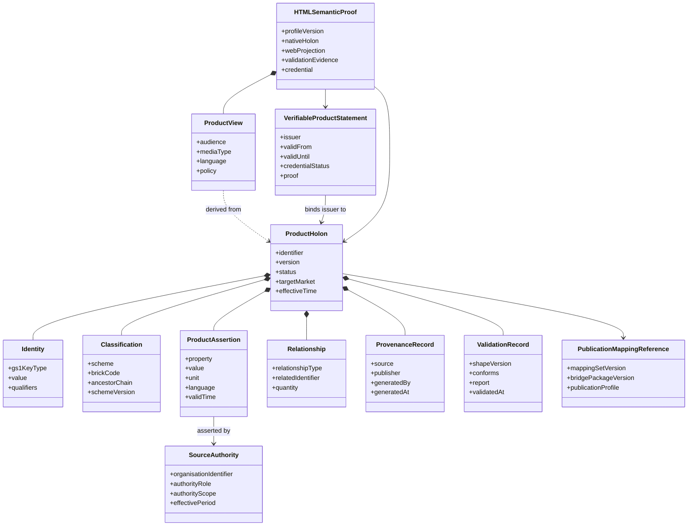

# Conceptual Model
## 3. Product Holon conceptual model

### 3.1 Definition

A **Product Holon** is a bounded, versioned product-instance knowledge graph anchored by a GS1 identifier. It contains the classification, applicable product assertions, relationships, provenance and validation evidence needed to treat the product representation as a coherent whole, while retaining links to the wider GDSN, GPC, Web Vocabulary, trade-item and supply-chain graphs of which it is a part.

### 3.2 Core information objects

### 3.3 Identity and addressability

The Product Holon shall be anchored by a GS1 identifier appropriate to the represented level. For a trade item, this is normally a GTIN. Batch/lot, serial and other GS1 Digital Link qualifiers may refine the addressable product instance where authoritative data is available. The identifier does not imply that every representation is public; access policy remains separate from addressability.

### 3.4 Classification and semantic context

A Product Holon shall identify its GPC Brick and the GPC release used. The Brick establishes category scope and provides the set of applicable GPC Attribute Types and controlled values. The ancestor chain may be retained to support broader category reasoning and navigation.

### 3.5 Product assertions

Product assertions comprise populated GPC Brick facts and selected GDSN facts that apply to the specific item. The Product Holon does not copy every possible property from the source models. Absence and explicit zero shall remain distinguishable. A missing assertion means no assertion has been supplied; an explicit value of zero is a stated product fact.

### 3.6 Relationships and composition

Relationships may include trade-item hierarchy, component, contained item, replacement, variant or other governed links. A heterogeneous variety pack is represented as a parent Product Holon classified to an applicable Variety Pack Brick and linked to child Product Holons for constituent GTINs. The parent does not merge all child classifications into one undifferentiated record.

### 3.7 Provenance and source authority

Each assertion shall identify or inherit a provenance record sufficient to determine who stated it, which source system supplied it, which transformation produced it and when it became effective. Generated semantic identifiers do not replace business-source provenance.

Source authority is claim-specific. A brand owner may be authoritative for formulation and pack facts; a certification body for a certified claim; a laboratory for a test result; a regulator or manufacturer for a recall; and a seller for price and availability. The architecture shall preserve the authority role, organisation identifier, scope, market and effective period rather than applying one undifferentiated page-level assertion of authority.

### 3.8 Validation status and conformance evidence

The Product Holon and its SHACL validation shapes are separate artefacts. The holon carries or references a validation record identifying the shape release, result and report. A conforming result means the supplied graph satisfied the tested constraints; it does not establish the truth of a business assertion beyond the authority of its source. The same boundary applies to cryptographic verification: a valid credential proves that the secured statement is authentic and unaltered according to the verification method, not that every underlying claim is factually correct.

### 3.9 Publication mappings and representations

A Product Holon references the released mapping set and bridge package used to derive a representation. Web Vocabulary, schema.org, marketplace feeds and human-readable pages are views of the Product Holon, not independent sources of manufacturer product truth. A view may omit facts, restructure facts or add facts owned by the recipient, but it shall preserve source and ownership boundaries.

#### 3.9.1 Canonical and discovery representations

The canonical semantic representation should remain GDSN/GPC-aligned so that it can preserve Brick scope, controlled values, structured GDSN records, target-market context and source-model traceability. A schema.org/GS1 Web Vocabulary projection should be generated from the same released Product Holon for web discovery, search, marketplaces and general-purpose AI agents. The two representations shall identify the same product and release and shall not be maintained as independent product records.

#### 3.9.2 Verifiable Product Statement

A Verifiable Product Statement is a W3C Verifiable Credential whose subject is the Product Holon or a defined assertion set. The credential may carry selected statements directly or use `relatedResource` integrity digests to bind the issuer to the exact Product Holon, HTML script block, SHACL profile, validation report and mapping release. It shall identify its issuer, validity period, status mechanism and securing method.

#### 3.9.3 HTML Semantic Proof

The HTML Semantic Proof is the inspectable publication container for a product. It combines a human-readable page with one or more identifiable `application/ld+json` script blocks, links to the canonical native Product Holon and Verifiable Product Statement, source-authority metadata, conformance evidence and release information. The HTML page is a publication package, not a new source of truth.

### 3.10 Holon boundaries

The minimum boundary contains identity, classification, sufficient provenance and at least one product assertion or relationship. The maximum boundary is determined by applicability, publication policy and consumer need. The whole GDSN or GPC ontology is not part of each Product Holon; it is referenced as semantic context.

### 3.11 Nested and composite Product Holons

Product Holons may be nested through explicit relationships. Nesting shall not obscure identity: each child with its own GTIN remains independently addressable and validated. Logistics aggregation and event history may be linked from EPCIS or other event sources but are not automatically copied into the core product master-data graph.

### 3.12 Lifecycle and versioning

A Product Holon release shall identify:

- the product identifier and relevant qualifiers;
- the source-data effective time or version;
- GDSN and GPC semantic-release identifiers;
- the SHACL profile version;
- the SSSOM mapping-set and bridge-package versions;
- the publication profile and generated representation time;
- supersession or deprecation status where applicable.

### 3.13 Relationship to adjacent concepts

| Concept | Relationship to a Product Holon |
|---|---|
| GDSN trade-item record | An authoritative source and B2B representation; it may contain more recipient-specific detail than a bounded public Product Holon view. |
| Digital twin | Functionally comparable where a digital twin represents one product’s governed current state; no formal equivalence is asserted. |
| Digital Product Passport | May consume or link to a Product Holon, but introduces regulatory scope, lifecycle and evidence requirements beyond this architecture. |
| Data product | A Product Holon may be delivered as a data product, but the architecture focuses on the semantic product unit rather than the full operating model of a data product. |
| `schema:Product` or `gs1:Product` | A publication representation or class alignment, not the entire internal Product Holon model. |
| Marketplace listing | Combines product truth with marketplace-owned offers, ratings, availability and merchandising content. |
| SHACL shape | A validation contract applied to the holon, not the holon itself. |

---
