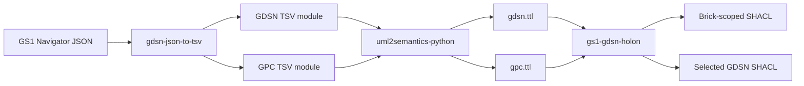

# Ontology and SHACL Pipeline
## 4. Ontology and shape-generation pipeline

### 4.1 End-to-end source pipeline

The demonstrated source pipeline is:

### 4.2 JSON-to-TSV findings

The source investigation identified an undocumented numeric `type` field across GDSN UML classes. Five inferred categories were routed to different TSV outputs:

- XML Schema primitive-like datatypes;
- UML business classes;
- GDSN named datatypes such as GTIN or GLN;
- GS1 code-list classes;
- UML enumeration classes.

Code-valued classes were excluded from `Classes.tsv` to prevent double representation as both classes and enumerations.

### 4.3 Malformed source constraints

Fifteen of approximately 2,274 attribute multiplicities were reported as malformed, with examples such as `..`, `1..` and `0...1`. Several limits were also malformed. The transformation policy was:

- do not guess;
- leave generated minimum and maximum blank;
- preserve the original expression;
- emit `gdsn:conversionWarning` or equivalent diagnostics.

This is a material architecture principle because downstream SHACL and ontology constraints must not give false precision to defective source metadata.

### 4.4 Extended attributes

The source mapping documentation did not provide a reliable natural owner class for all extended attributes. The reference transformation therefore placed them under synthetic containers such as `gdsn:GDSNAVP` and `gdsn:GDSNExtendedAttribute`, optionally grouped by `groupName`.

This is an explicit modelling decision and should remain traceable in generated annotations and mapping records.

### 4.5 OWL generation capabilities

The reported `uml2semantics-python` capabilities include:

- classes and properties;
- datatype restrictions;
- enumeration patterns;
- `owl:unionOf` and disjointness for exclusive choices;
- property chains supplied through a dedicated TSV;
- source annotations and IRI construction.

The presence of property-chain support confirms the intended boundary: OWL can compose object-property paths, but conditional branching on data values remains outside pure OWL DL.

### 4.6 Independent convergence of the SHACL implementation

The `gs1-gdsn-holon` CLI was developed independently of the initial speculative examples but implemented the same central pattern:

- generate a Brick-scoped shape from `gpc.ttl`;
- optionally add a selected GDSN shape with `--include-gdsn`;
- require a Brick code or GTIN-to-Brick mapping because the ontology contains no product instances;
- run `pySHACL` checks by default;
- include parse, empty-graph, conforming-instance and deliberately broken-instance tests.

This convergence is supporting evidence for the architecture. It is not proof that the reference implementation is a complete GS1 solution.

---
