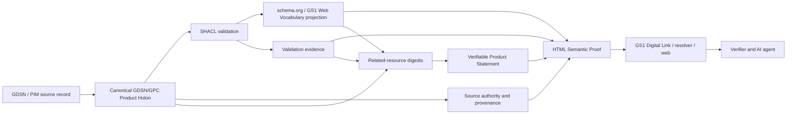

# Verifiable Publication Evidence
## Part VIII — Verifiable publication evidence

## 30. HTML Semantic Proof and Verifiable Product Statement reference profile

### 30.1 Portfolio and architecture evidence

The supplementary project material describes one portfolio composed of:

- GS1 identifiers as the identity anchor;
- advanced data carriers and GS1 Digital Link as the access mechanism;
- GS1 Web Vocabulary, in combination with schema.org, as the machine-readable grammar;
- Verifiable Credentials as the proof layer for source-signed claims;
- GS1 registries as an identity and trust layer;
- resolver links as the connections to audience-appropriate authoritative resources.

The Phase 4 architecture visual already groups a JSON-LD Product Holon, conformance certificate, provenance record, metadata envelope and an optional Verifiable Credential into one publication package. This reference profile makes that package explicit and makes the credential mandatory for the **verified HTML Semantic Proof** conformance level. The profile remains proposed and is not represented as an already approved GS1 standard.

### 30.2 Profile package

| Subprofile | Required artefact | Verification purpose |
|---|---|---|
| Native Product Holon | GDSN/GPC-aligned JSON-LD or RDF | Preserve deep semantic source structure, classification and traceability. |
| Web Discovery Projection | schema.org/GS1 Web Vocabulary JSON-LD | Support web crawlers, marketplaces and general-purpose agents. |
| Source Authority and Provenance | JSON-LD authority/evidence record | State who asserted each fact, their role, source, context and effective period. |
| Conformance Evidence | SHACL profile and validation report | Demonstrate structural and semantic conformance to a named release. |
| Product Statement Credential | W3C Verifiable Credential | Bind the issuer to the statements or exact resource digests and expose current status. |
| HTML Semantic Proof | HTML page and link/script manifest | Make all proof components discoverable from the product page and GTIN identity. |

The canonical Product Holon and web projection are two representations of one governed release. They shall not be maintained independently.

### 30.3 Reference information flow



### 30.4 Concrete source-authority evidence from the supplied GDSN notification

The supplied `CatalogueItemNotification_ADD.xml` provides a useful source-grounding example. The values below are **observed in that message**; they do not, by themselves, establish a cryptographic signing relationship.

| Evidence element | Observed value | Profile use |
|---|---|---|
| Standard Business Document sender | GLN `2100000000005` | Identifies the message sender; the same value is used as `sourceDataPool`. |
| Standard Business Document receiver | GLN `9501101020641` | Identifies the message receiver at the document-envelope level. |
| GDSN data recipient | GLN `9501101020665` | Identifies the catalogue-item data recipient carried inside the GDSN payload. |
| Source data pool | GLN `2100000000005` | Records the exchange source. |
| Content owner | GLN `1234567890128` | Appears in transaction, command and notification identification. |
| Brand owner | GLN `1234567890128` | Identifies the stated brand owner for the trade item. |
| Information provider | GLN `1234567890128`, party name `Data Source` | Identifies the party maintaining the trade-item information. |
| Notification identifier | `6733be2e-590f-4c9b-bd42-a38aeb79b39c` | Source-evidence identifier for the product statements. |
| Notification creation time | `2026-07-16T06:22:25.377+00:00` | Source-event time. |
| Document status | `ORIGINAL` | Source-document lifecycle status. |
| Base-unit GTIN | `25196100024899` | Product subject used by the reference HTML and credential below. |
| Parent GTIN | `25196100024882` | Case-level Product Holon linked to 20 base units. |
| GPC Brick | `10000002` — Fruit – Unprepared/Unprocessed (Frozen) | Category context for the base and parent trade items. |
| Target market | `840` | Market context carried into the authority and applicability checks. |
| Functional name | `Fruit – Unprepared/Unprocessed` | Source product description. |
| Brand name | `Kiln_TT9` | Source brand-name assertion. |
| Effective time | `2026-07-11T04:41:53.737+00:00` | Applicability time for the source facts. |

The XML supports a source chain from message sender and data pool to content owner, information provider and brand owner. The supplied `kato-instances(1).ttl` independently confirms the GDSN-aligned graph pattern for the same base unit: the product is typed as `gdsn:c863999331` and `gpc:10000002`, uses `gdsn:a5339` for GTIN, `gdsn:cv180120` for `BASE_UNIT_OR_EACH`, and links to separate classification, synchronisation-date, brand-owner, information-provider, target-market and description nodes. The native script below follows that graph structure using publication-safe placeholder URIs.

A production verifier must still determine that the credential issuer controls the stated signing key and is authorised to sign the relevant statements for the GTIN, target market and effective period. That trust relationship might be established through GS1 registry evidence, a governed delegation or another approved trust framework.

### 30.5 Illustrative HTML Semantic Proof

The following self-contained structural example uses the observed base-unit GTIN and source metadata. All `example.org` URIs, contexts, validation reports, digests and proof values are placeholders. The example demonstrates the profile structure; it is not a signed production artefact.

```html
<!doctype html>
<html lang="en">
<head>
  <meta charset="utf-8">
  <title>Kiln_TT9 Fruit – Unprepared/Unprocessed</title>

  <link rel="canonical"
        href="https://example.org/01/25196100024899">
  <link rel="profile"
        href="https://example.org/profiles/gs1-product-holon-html-proof/1.0">
  <link rel="alternate"
        type="application/ld+json"
        href="https://example.org/01/25196100024899#gs1-product-holon-native">
  <link rel="alternate"
        type="application/ld+json"
        href="https://example.org/01/25196100024899#gs1-product-holon-web">
  <link rel="alternate"
        type="application/vc"
        href="https://example.org/credentials/product/25196100024899/1">
</head>
<body>
  <main>
    <h1>Kiln_TT9 Fruit – Unprepared/Unprocessed</h1>
    <p>Exact GTIN: 25196100024899</p>
    <p>Target market: 840</p>
  </main>

  <script id="gs1-product-holon-native" type="application/ld+json">
  {
    "@context": {
      "gdsn": "urn:gs1:std:gdsn:",
      "gpc": "urn:gs1:std:gpc:",
      "holon": "https://example.org/vocab/product-holon#",
      "rdf": "http://www.w3.org/1999/02/22-rdf-syntax-ns#",
      "xsd": "http://www.w3.org/2001/XMLSchema#"
    },
    "@graph": [
      {
        "@id": "https://example.org/01/25196100024899",
        "@type": ["gdsn:c863999331", "gpc:10000002", "holon:ProductHolon"],
        "gdsn:a5339": "25196100024899",
        "gdsn:a1326222280": {"@id": "gdsn:cv180120"},
        "gdsn:assoc_863999331_-1698192853_1": {
          "@id": "https://example.org/holon/25196100024899/classification"
        },
        "gdsn:assoc_863999331_1327077224_10": {
          "@id": "https://example.org/holon/25196100024899/synchronisation-dates"
        },
        "gdsn:assoc_863999331_1352305416_11": {
          "@id": "https://example.org/holon/25196100024899/trade-item-information"
        },
        "gdsn:assoc_863999331_845_3": {
          "@id": "https://example.org/holon/25196100024899/brand-owner"
        },
        "gdsn:assoc_863999331_845_4": {
          "@id": "https://example.org/holon/25196100024899/information-provider"
        },
        "gdsn:assoc_863999331_919_6": {
          "@id": "https://example.org/holon/25196100024899/target-market"
        },
        "holon:sourceAuthority": {
          "@type": "holon:SourceAuthority",
          "holon:contentOwnerGln": "1234567890128",
          "holon:brandOwnerGln": "1234567890128",
          "holon:informationProviderGln": "1234567890128",
          "holon:sourceDataPoolGln": "2100000000005",
          "holon:dataRecipientGln": "9501101020665",
          "holon:sourceDocument": {
            "@id": "https://example.org/gdsn/notifications/6733be2e-590f-4c9b-bd42-a38aeb79b39c"
          }
        },
        "holon:validationReport": {
          "@id": "https://example.org/validation/25196100024899/2026-08-17"
        },
        "holon:mappingRelease": {
          "@id": "https://example.org/mappings/product-web/1.0"
        }
      },
      {
        "@id": "https://example.org/holon/25196100024899/classification",
        "@type": "gdsn:c-1698192853",
        "gdsn:a289210221": "10000002",
        "gdsn:a-872066840": "Fruit – Unprepared/Unprocessed (Frozen)"
      },
      {
        "@id": "https://example.org/holon/25196100024899/synchronisation-dates",
        "@type": "gdsn:c1327077224",
        "gdsn:a101169311": {
          "@value": "2026-07-11T04:41:53.737Z",
          "@type": "xsd:dateTime"
        },
        "gdsn:a1274695156": {
          "@value": "2026-07-11T04:41:53.737Z",
          "@type": "xsd:dateTime"
        }
      },
      {
        "@id": "https://example.org/holon/25196100024899/brand-owner",
        "@type": "gdsn:c845",
        "gdsn:a-1479739869": "1234567890128"
      },
      {
        "@id": "https://example.org/holon/25196100024899/information-provider",
        "@type": "gdsn:c845",
        "gdsn:a-1479739869": "1234567890128",
        "gdsn:a-1454997754": "Data Source"
      },
      {
        "@id": "https://example.org/holon/25196100024899/target-market",
        "@type": "gdsn:c919",
        "holon:targetMarketCountryCode": "840"
      },
      {
        "@id": "https://example.org/holon/25196100024899/trade-item-information",
        "@type": "gdsn:c1352305416",
        "gdsn:extensionModule": {
          "@id": "https://example.org/holon/25196100024899/trade-item-description-module"
        }
      },
      {
        "@id": "https://example.org/holon/25196100024899/trade-item-description-module",
        "@type": ["gdsn:GDSNExtensionModule", "gdsn:c1343046870"],
        "gdsn:assoc_1343046870_1204161147_1": {
          "@id": "https://example.org/holon/25196100024899/trade-item-description-information"
        }
      },
      {
        "@id": "https://example.org/holon/25196100024899/trade-item-description-information",
        "@type": "gdsn:c1204161147",
        "gdsn:a1986433438": {
          "@id": "https://example.org/holon/25196100024899/functional-name"
        },
        "gdsn:assoc_1204161147_1350303678_4": {
          "@id": "https://example.org/holon/25196100024899/brand-name-information"
        }
      },
      {
        "@id": "https://example.org/holon/25196100024899/functional-name",
        "@type": "gdsn:c1441",
        "rdf:value": {
          "@value": "Fruit – Unprepared/Unprocessed",
          "@language": "en"
        },
        "gdsn:a7139": "en"
      },
      {
        "@id": "https://example.org/holon/25196100024899/brand-name-information",
        "@type": "gdsn:c1350303678",
        "gdsn:a308904173": "Kiln_TT9"
      }
    ]
  }
  </script>

  <script id="gs1-product-holon-web" type="application/ld+json">
  {
    "@context": [
      "https://schema.org",
      {
        "gs1": "https://ref.gs1.org/voc/",
        "holon": "https://example.org/vocab/product-holon#"
      }
    ],
    "@id": "https://example.org/01/25196100024899",
    "@type": ["Product", "gs1:Product", "holon:ProductHolonView"],
    "gs1:gtin": "25196100024899",
    "name": "Kiln_TT9 Fruit – Unprepared/Unprocessed",
    "brand": {
      "@type": "Brand",
      "name": "Kiln_TT9"
    },
    "category": {
      "@id": "urn:gs1:std:gpc:10000002"
    },
    "holon:nativeHolon": {
      "@id": "https://example.org/01/25196100024899#gs1-product-holon-native"
    },
    "holon:sourceAuthority": {
      "@id": "https://example.org/417/1234567890128"
    },
    "holon:validationReport": {
      "@id": "https://example.org/validation/25196100024899/2026-08-17"
    },
    "holon:verifiableCredential": {
      "@id": "https://example.org/credentials/product/25196100024899/1"
    }
  }
  </script>
</body>
</html>
```

The web example keeps the `gs1:` and `holon:` prefix mappings inline rather than depending on a provisional remote Web Vocabulary context. A production profile shall publish a persistent, protected context for all custom terms and pin the context release. The two script identifiers allow a JSON-LD processor to address the native and web blocks independently. A credential profile that digests an inline script shall also define the exact extraction and canonicalisation procedure; otherwise the credential should bind a canonical external representation.

### 30.6 Illustrative GS1 Product Statement Credential

The credential below binds the issuer to the Product Holon and integrity-protects related resources. It uses the W3C VC Data Model v2.0 structure. The profile context, digests, schema, status index, verification method and proof are placeholders.

```json
{
  "@context": [
    "https://www.w3.org/ns/credentials/v2",
    "https://example.org/contexts/gs1-product-statement/1.0"
  ],
  "id": "https://example.org/credentials/product/25196100024899/1",
  "type": [
    "VerifiableCredential",
    "GS1ProductStatementCredential"
  ],
  "issuer": {
    "id": "https://example.org/417/1234567890128",
    "type": ["Organization", "GS1ProductDataIssuer"],
    "gln": "1234567890128",
    "authorityRole": [
      "brandOwner",
      "informationProviderOfTradeItem"
    ]
  },
  "validFrom": "2026-08-17T09:00:00Z",
  "validUntil": "2027-08-17T09:00:00Z",
  "credentialSubject": {
    "id": "https://example.org/01/25196100024899",
    "type": ["GS1ProductHolon", "Product"],
    "gtin": "25196100024899",
    "targetMarketCountryCode": "840",
    "sourceEffectiveFrom": "2026-07-11T04:41:53.737Z",
    "sourceDocument": {
      "id": "https://example.org/gdsn/notifications/6733be2e-590f-4c9b-bd42-a38aeb79b39c"
    },
    "assertionSet": {
      "id": "https://example.org/01/25196100024899#gs1-product-holon-native"
    }
  },
  "credentialSchema": {
    "id": "https://example.org/schemas/gs1-product-statement-v1.json",
    "type": "JsonSchema"
  },
  "relatedResource": [
    {
      "id": "https://example.org/01/25196100024899#gs1-product-holon-native",
      "mediaType": "application/ld+json",
      "digestSRI": "sha384-REPLACE_WITH_COMPUTED_DIGEST"
    },
    {
      "id": "https://example.org/01/25196100024899#gs1-product-holon-web",
      "mediaType": "application/ld+json",
      "digestSRI": "sha384-REPLACE_WITH_COMPUTED_DIGEST"
    },
    {
      "id": "https://example.org/shapes/gpc/10000002/1.0",
      "mediaType": "text/turtle",
      "digestSRI": "sha384-REPLACE_WITH_COMPUTED_DIGEST"
    },
    {
      "id": "https://example.org/validation/25196100024899/2026-08-17",
      "mediaType": "application/ld+json",
      "digestSRI": "sha384-REPLACE_WITH_COMPUTED_DIGEST"
    },
    {
      "id": "https://example.org/mappings/product-web/1.0",
      "mediaType": "text/tab-separated-values",
      "digestSRI": "sha384-REPLACE_WITH_COMPUTED_DIGEST"
    },
    {
      "id": "https://example.org/gdsn/notifications/6733be2e-590f-4c9b-bd42-a38aeb79b39c",
      "mediaType": "application/xml",
      "digestSRI": "sha384-REPLACE_WITH_COMPUTED_DIGEST"
    },
    {
      "id": "https://example.org/authority/1234567890128/25196100024899",
      "mediaType": "application/ld+json",
      "digestSRI": "sha384-REPLACE_WITH_COMPUTED_DIGEST"
    }
  ],
  "evidence": [
    {
      "id": "https://example.org/gdsn/notifications/6733be2e-590f-4c9b-bd42-a38aeb79b39c",
      "type": "GS1GDSNSourceEvidence"
    },
    {
      "id": "https://example.org/validation/25196100024899/2026-08-17",
      "type": "SHACLValidationEvidence"
    },
    {
      "id": "https://example.org/authority/1234567890128/25196100024899",
      "type": "GS1IssuerAuthorityEvidence"
    }
  ],
  "credentialStatus": {
    "id": "https://example.org/credentials/status/1#2468",
    "type": "BitstringStatusListEntry",
    "statusPurpose": "revocation",
    "statusListIndex": "2468",
    "statusListCredential":
      "https://example.org/credentials/status/1"
  },
  "proof": {
    "type": "DataIntegrityProof",
    "cryptosuite": "ecdsa-rdfc-2019",
    "created": "2026-08-17T09:00:00Z",
    "verificationMethod":
      "https://example.org/issuers/1234567890128#key-1",
    "proofPurpose": "assertionMethod",
    "proofValue": "REPLACE_WITH_GENERATED_PROOF"
  }
}
```

The example intentionally separates three checks:

1. `proof` establishes cryptographic authorship and integrity for the credential;
2. `relatedResource` binds exact external representations and evidence to the credential;
3. `GS1IssuerAuthorityEvidence` is the proposed trust-layer evidence that the issuer is entitled to assert the relevant product facts.

A JSON Schema referenced through `credentialSchema` can test the credential envelope. It does not replace SHACL validation of the Product Holon graph.

### 30.7 Standards status and securing-method choice

The reference profile pins its initial normative basis to W3C Recommendations published on 15 May 2025:

- Verifiable Credentials Data Model v2.0;
- Verifiable Credential Data Integrity 1.0;
- Data Integrity ECDSA Cryptosuites v1.0 or Data Integrity EdDSA Cryptosuites v1.0;
- Controlled Identifiers v1.0;
- Bitstring Status List v1.0;
- Securing Verifiable Credentials using JOSE and COSE where an enveloping proof is selected.

As of this revision, VC Data Model v2.1 and Data Integrity 1.1 are Working Drafts. They may inform future evolution but shall not silently replace the Recommendation baseline in a governed profile. The securing mechanism is a policy choice: a JSON-LD-native implementation may prefer a Data Integrity cryptosuite, while deployments aligned to existing JOSE infrastructure may prefer `application/vc+jwt`. The profile shall state which representations and cryptosuites are permitted and tested.

### 30.8 Verification algorithm

A verifier should produce a structured report covering five groups of checks:

**A. Identity and retrieval**

1. validate the GTIN and qualifiers;
2. resolve the canonical product URI;
3. locate the declared HTML Semantic Proof profile and required script identifiers;
4. retrieve the canonical credential and related resources using the declared media types.

**B. Cryptographic integrity and lifecycle**

5. validate the credential structure and securing mechanism;
6. dereference the verification method and establish key control;
7. check `validFrom`, `validUntil` and credential status;
8. calculate and compare each relied-upon `relatedResource` digest.

**C. Authority and evidence**

9. verify the issuer’s GLN or equivalent organisation identity;
10. verify the issuer’s authority for the GTIN, claim types, target market and effective period;
11. retrieve and evaluate the GDSN, certification, laboratory, regulatory or other evidence required by policy.

**D. Semantic and contextual conformance**

12. expand and parse the JSON-LD contexts;
13. confirm native and web representations identify the same Product Holon release;
14. execute the declared SHACL validation or verify the retained report and resource digest;
15. check target market, language, batch/lot, serial and effective-time applicability;
16. confirm that seller-owned Offer facts are not misrepresented as manufacturer-signed product truth.

**E. Reliance and explanation**

17. apply the relying party’s claim-specific trust policy;
18. retain a machine-readable verification report;
19. provide the agent only with facts that passed the required checks;
20. explain uncertainty or abstain when any mandatory check fails.

### 30.9 Truth and reliance boundary

The W3C VC model explicitly distinguishes verification from evaluation of claim truth. For this architecture:

- **SHACL conformance** means that a graph met the declared constraints;
- **credential verification** means that the credential is an authentic and current statement of the issuer under the selected securing and status mechanisms;
- **resource-digest verification** means that a retrieved resource is the resource integrity-bound by the issuer;
- **authority verification** means that the issuer is entitled to make the specified statement in the specified scope;
- **factual reliance** remains a policy decision based on authority, evidence, context and risk.

The preferred phrase is **evidence-backed, verifiable product statement**, not “cryptographically verified truth”.

### 30.10 Acceptance-test catalogue

| Test ID | Test | Expected result |
|---|---|---|
| HSP-01 | Parse HTML and locate required profile and script identifiers. | All required elements found exactly once. |
| HSP-02 | Expand each JSON-LD script using the pinned contexts. | Valid RDF dataset; no undefined or redefined protected terms. |
| HSP-03 | Compare GTIN and Product Holon release across native, web and credential resources. | Exact identity and release match. |
| HSP-04 | Validate Product Holon against the declared SHACL profiles. | `sh:conforms true`; retained report digest matches. |
| HSP-05 | Verify W3C credential securing mechanism. | Signature/proof succeeds with approved cryptosuite and verification method. |
| HSP-06 | Modify one byte in the native Holon and re-run verification. | Related-resource digest failure. |
| HSP-07 | Check credential validity and status. | Current and not revoked or suspended. |
| HSP-08 | Revoke the credential in the status list. | Verification report marks credential unusable. |
| HSP-09 | Resolve issuer identity and authority for the GTIN and target market. | Authorised scope established or verification fails closed. |
| HSP-10 | Remove issuer-authority evidence while retaining a valid signature. | Cryptographic check passes; reliance check fails or remains indeterminate. |
| HSP-11 | Change mapping-set or shape version without reissuing the credential. | Digest or release-consistency check fails. |
| HSP-12 | Add seller price into the manufacturer assertion set. | Product/Offer authority test fails. |
| HSP-13 | Request an inapplicable market, language, lot or time context. | Agent abstains or retrieves the applicable representation. |
| HSP-14 | Rotate the issuer key and verify historical and current credentials. | Both verify according to key-history and validity policy. |
| HSP-15 | Generate an agent answer. | Every material statement links to verified source and evidence; failed checks are disclosed. |

### 30.11 Proposed FoDS ownership and hand-off

The reference profile suggests this delivery boundary:

```text
8.3.a
governed machine-readable source models and validation assets
        ↓
8.3.b
canonical Product Holon + web projection + provenance + SHACL evidence
        ↓
8.4.a
HTML Semantic Proof + Product Statement Credential profile + verification contract
        ↓
8.4.b
agent discovery + cryptographic/authority verification + grounded use
```

The 8.4.a ownership is based on the architectural direction supplied for this revision. The authoritative 8.4.a plan was not included among the reviewed sources and should be checked before the workstream boundary is treated as formally agreed.

### 30.12 Reference implementation work items

A minimal implementation should add the following modules to the existing reference pipeline:

- versioned Product Holon web-profile context;
- HTML proof renderer with deterministic script identifiers;
- canonical resource serialiser and digest generator;
- credential schema and JSON-LD context;
- credential issuer using a controlled test key;
- controlled identifier or equivalent verification-method document;
- status-list issuer and resolver;
- issuer-authority evidence resolver;
- independent verifier returning a structured report;
- tamper, revocation, expiry, key-rotation and authority-scope tests;
- a demonstration agent that consumes only the verification report and verified graph.

A proof-of-concept shall use non-production keys and clearly labelled example namespaces until GS1 governance approves the issuer, namespace, cryptosuite and status policies.

---
