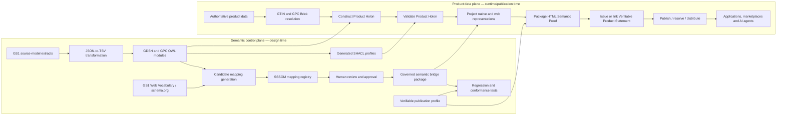

# Product Holon Architecture
Primary guide to the proposed GS1 Product Holon Architecture. The detailed technical evidence is maintained in the nested evidence section.

## A proposed semantic architecture for governed, validated and agent-ready product data

**Version:** 2.1.0  
**Date:** 17 August 2026  
**Status:** Working Draft — proposed architecture for discussion  
**Authority notice:** This document does not represent an approved GS1 standard, an approved GS1 architecture or a formally adopted GS1 term. “Product Holon” is a working architectural term introduced by this proposal.

---

## Document control

### Document purpose

This document defines a proposed architecture for constructing, validating, aligning, publishing, resolving and consuming bounded product knowledge graphs anchored by GS1 identifiers. It consolidates the architectural conclusions reached in the source investigation `gs1-gdsn-holon-v1.31.0.md` and separates them from the detailed research history, code listings, validation results and mapping evidence retained in the companion technical evidence pack.

### Intended audience

The document is intended for GS1 architecture, standards, data-modelling, GDSN, GPC, Web Vocabulary, Digital Link, semantic-web, API, AI-readiness and implementation stakeholders. It also provides a basis for discussion with Member Organisations, data pools, brand owners, retailers, marketplaces, solution providers and AI-agent implementers.

### Status vocabulary

The following labels are used consistently:

| Label | Meaning |
|---|---|
| **GS1 standard capability** | Behaviour explicitly defined by an approved GS1 standard or published GS1 vocabulary. |
| **Source-derived semantic artefact** | An ontology, shape or other machine-readable artefact generated from GS1 source models. It is not automatically an approved GS1 publication. |
| **Proposed architecture** | A design introduced by this document for evaluation and possible adoption. |
| **Reference implementation** | Tooling or code that demonstrates part of the proposal. It is not, by itself, a normative implementation. |
| **Candidate mapping** | An unreviewed or provisionally reviewed correspondence between semantic terms. |
| **Reviewed mapping** | A correspondence approved through the mapping-governance process defined in this document. |
| **Compiled artefact** | An OWL axiom, rule, query or other executable output generated from reviewed mapping records. |
| **HTML Semantic Proof** | A human-readable product page that embeds or links machine-readable Product Holon representations, source authority, conformance evidence and a verifiable product-statement credential. |
| **Verifiable Product Statement** | A W3C Verifiable Credential that binds an issuer to structured product statements or to integrity-protected resources containing those statements. “Verifiable” establishes authorship, integrity and status; it does not by itself establish factual truth. |

### Requirement language

The terms **shall**, **should** and **may** describe requirements within this proposed architecture. Their use does not confer GS1 standard status. A future standards deliverable would need to restate and approve any normative requirements through the applicable GS1 governance process.

### Licence

The source document did not establish a licence. The licence for this architecture and its technical evidence pack shall be determined before external publication or reuse beyond the authorised working group.

---

## Section Guide

- [Purpose and Scope](purpose-and-scope.md)
- [Drivers and Principles](drivers-and-principles.md)
- [Conceptual Model](conceptual-model.md)
- [Architecture Overview](architecture-overview.md)
- [Semantic Foundation](semantic-foundation.md)
- [Holon Construction](product-holon-construction.md)
- [Semantic Bridge](semantic-bridge.md)
- [Publication and Consumption](publication-and-consumption.md)
- [Governance and Conformance](governance-and-conformance.md)
- [Reference Implementation](reference-implementation.md)
- [Roadmap](roadmap.md)
- [Terms and Conformance Checklist](terms.md)
- [Technical Evidence](evidence/index.md)

---

## Executive summary

### The problem

GS1 product information is represented across complementary but differently shaped assets. GDSN provides a rich business-to-business master-data model and exchange environment. GPC supplies a global product-classification hierarchy with Brick-scoped attributes and controlled values. GS1 Web Vocabulary extends schema.org with product terms suitable for public web publication and machine interpretation. GS1 Digital Link provides resolvable identifiers and link-selection mechanisms. These assets are individually valuable, but an implementer still has to decide how to create a bounded, product-specific representation, validate it, govern mappings between semantic models and publish the appropriate view to each consumer.

The source investigation demonstrated why neither the full GDSN model nor Web Vocabulary alone is sufficient for every purpose. A full GDSN/GPC model is too large and operationally broad to serve directly as an AI-facing product record. Web Vocabulary is intentionally bounded and web-oriented; it does not provide all Brick-specific facets, the full GDSN code-list depth or a category-specific validation profile. Product data also changes ownership as it moves through the ecosystem: a brand owner is authoritative for manufacturer product facts, while a marketplace is authoritative for price, availability, seller identity and reviews. Treating all of these facts as one undifferentiated feed creates governance and trust problems.

### The proposed response

This architecture introduces the **Product Holon** as a bounded, independently addressable and composable product representation. A Product Holon is anchored by a GS1 identifier, normally a GTIN, and combines the product’s classification, applicable attributes, relationships, provenance, validation evidence and references to governed publication mappings. It is a whole in its own operational context while remaining part of larger classification, trade-item, logistics and publication graphs.

The Product Holon is not a replacement for GDSN, GPC, GS1 Web Vocabulary, schema.org or GS1 Digital Link. It is an architectural unit that connects them:

1. source models are transformed into semantic and validation artefacts;
2. a bounded product instance is constructed and validated;
3. reviewed semantic mappings are compiled into a governed bridge package;
4. audience-appropriate representations are published and resolved for applications and AI agents.

The Phase 4 end deliverable is a **GS1 Product Holon Verifiable Publication Profile and HTML Semantic Proof**. It packages a canonical GDSN/GPC-aligned Product Holon, a schema.org/GS1 Web Vocabulary discovery projection, explicit source-authority and provenance metadata, SHACL conformance evidence and a W3C Verifiable Credential that binds an authorised issuer to the published product statements or to cryptographic digests of the resources that contain them.

### Two architectural planes

The architecture separates design-time governance from runtime product processing.

**The semantic control plane** transforms and versions source models, generates ontology and SHACL artefacts, produces lexical mapping candidates, curates mappings in SSSOM, compiles reviewed mappings into OWL and rule modules, and maintains conformance tests. It changes when standards, source models or approved mappings change.

**The product data plane** resolves a product to its classification, constructs a Product Holon from authoritative product data, validates it, applies a released semantic bridge package, generates the required representations and publishes or resolves them. It runs per product, per version, per target market or per relevant product instance.

This separation corrects the linear impression created by the source investigation’s final process diagram. Lexical candidate generation and mapping curation operate over semantic models in the control plane; they are not performed separately for each validated Product Holon.

### Architecture at a glance

### Principal outcomes

The architecture is intended to deliver the following outcomes:

- a right-sized product graph rather than an unrestricted exposure of the full GDSN and GPC models;
- category-aware validation generated from the same semantic sources as the product representation;
- explicit separation between product truth and seller- or marketplace-owned commercial facts;
- versioned, auditable mappings rather than ad hoc name matching embedded in application code;
- multiple representations generated from one governed product representation;
- deterministic validation and reasoning at the trust boundary, with an LLM confined to retrieval, interpretation and narration rather than final rule execution;
- resolvable machine-readable product information through existing GS1 Digital Link and HTTP mechanisms;
- an inspectable HTML Semantic Proof that binds product identity, structured facts, source authority, conformance evidence and credential status into one publication package;
- a cryptographically verifiable product-statement layer that supports reliance decisions without misrepresenting a valid signature as proof of factual truth;
- a scalable path from the current reference implementation to a governed GS1 semantic publication capability.

### Key architectural decisions

| Decision | Consolidated position |
|---|---|
| Product Holon status | A proposed working term, not an existing GS1-defined concept. |
| Unit of product representation | A bounded product-instance graph anchored by a GS1 identifier and classification. |
| Holon versus validation shape | The Product Holon is instance data; SHACL shapes are separate validation contracts. |
| GDSN and GPC modules | Kept as distinct source-derived semantic modules with explicit relationships. |
| Mapping lifecycle | Candidate generation may be automated; approval is human-governed and recorded in SSSOM. |
| Direct equivalence | Used only where source and target terms have compatible meaning and graph shape. |
| Structural transformation | Implemented through reviewed DL-safe rules or transformation rules, not forced into unsound OWL equivalence. |
| SPARQL role | Used as a thin projection/export layer or as an explicitly versioned transform where required; it is not part of the OWL ontology itself. |
| Publication fallback | Publishable facts without a first-class target use `schema:additionalProperty` and `schema:PropertyValue`; non-public facts remain excluded. |
| AI role | Retrieve and narrate validated facts; do not replace SHACL, OWL, rule or query engines. |
| Canonical and discovery representations | Retain a GDSN/GPC-aligned canonical Product Holon and derive a schema.org/GS1 Web Vocabulary discovery projection from the same release. |
| Verifiable publication | Package the product page, semantic representations, authority metadata, conformance evidence and credential reference as an HTML Semantic Proof. |
| Credential semantics | Use a Verifiable Product Statement to establish issuer authorship, integrity, validity and status; do not describe cryptographic verification alone as proof that every product claim is factually true. |

### Open issues

The architecture remains a working draft. The following issues require formal resolution:

- whether GS1 should adopt “Product Holon” as an architectural term;
- the governance body and approval criteria for GDSN/GPC-to-Web Vocabulary mappings;
- the authoritative namespaces, persistence policy and release model for source-derived GDSN and GPC semantic artefacts;
- the extent to which the current fixed cross-category GDSN SHACL profile should become category-aware;
- the security, authorisation and commercial-data policies for non-public representations;
- the conformance-test suite, performance targets and operational service levels;
- the registered link types and resolver profiles required for Product Holon representations;
- the GS1 trust framework that proves an issuer is authorised for a GTIN, claim type, market and effective period;
- the profile namespace, cryptographic suite, key-management, credential-status and withdrawal policies for Verifiable Product Statements;
- the formal FoDS workstream ownership and hand-off between semantic publication, the proposed 8.4.a semantic proof profile and 8.4.b verification and use;
- the licence and publication status of the architecture and generated artefacts.

---
