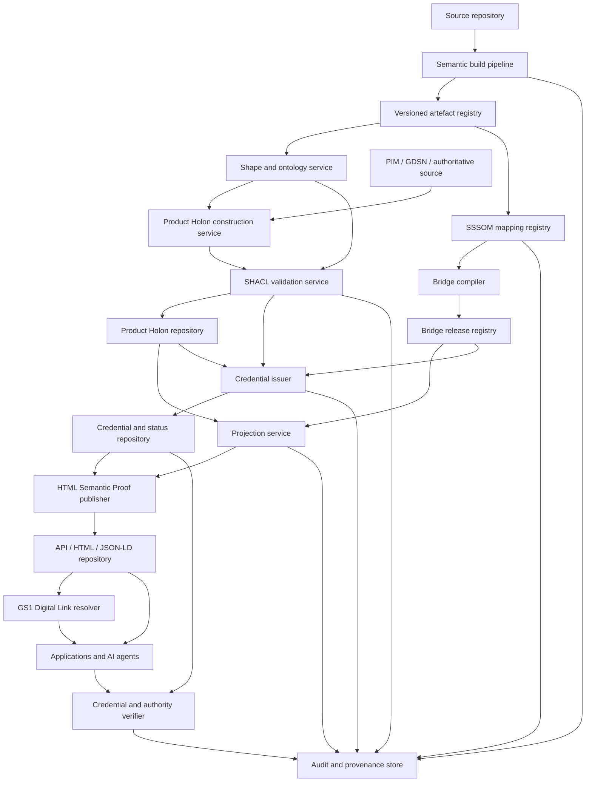

# Reference Implementation
## 10. Reference implementation

### 10.1 Purpose

The reference implementation demonstrates that the architecture can be built from the supplied source-model pipeline and tested with real generated artefacts. It does not establish a production service or complete GS1 conformance.

### 10.2 Demonstrated toolchain

| Tool or artefact | Demonstrated role |
|---|---|
| `gdsn-json-to-tsv` | Convert Navigator JSON source models into TSV semantic-generation inputs and diagnostics. |
| `uml2semantics-python` | Generate OWL 2 semantic modules from TSV. |
| `gs1-gdsn-holon` | Generate Brick-scoped SHACL shapes and an optional selected GDSN shape; run validation checks. |
| `pySHACL` | Parse and validate SHACL shapes and test instances. |
| `rdflib` and `owlrl` | Execute representative RDF/OWL entailment and transformation tests. |
| `ncbo/bioportal_mappings` | Generate LOOM lexical mapping candidates across GDSN, GPC and Web Vocabulary terms. |
| SSSOM | Target representation for governed mapping records. |
| OWL/SWRL and SPARQL | Compile approved semantic alignments and export publication graphs. |

### 10.3 Proposed deployment model

This deployment view is proposed from the demonstrated components. The source evidence did not include production infrastructure, service-level or security implementation.

### 10.4 Build and release pipeline

A reference build should:

1. pin source model and tool versions;
2. transform JSON to TSV and fail on unreviewed fatal diagnostics;
3. generate OWL and SHACL;
4. parse and test all artefacts;
5. generate mapping candidates;
6. import candidates into SSSOM without marking them approved;
7. compile only approved mappings;
8. run semantic and publication regression tests;
9. package artefacts with manifests and checksums;
10. generate and validate the HTML Semantic Proof, including script identifiers and canonical links;
11. compute related-resource digests and issue a Verifiable Product Statement using an approved key and credential profile;
12. publish credential status and execute independent verification, including issuer-authority checks;
13. publish only after governance approval and retain the verification report.

### 10.5 Test strategy

The test suite should include:

- source-to-TSV count and identifier checks;
- ontology parsing and consistency checks;
- SHACL parse tests;
- conforming and deliberately invalid Product Holon instances;
- one test per mapping route;
- cardinality and structural mismatch tests;
- rule termination and DL-safety checks;
- JSON-LD context, script-fragment discovery and expansion tests;
- native-to-web identity and release-consistency tests;
- Verifiable Credential schema, securing-mechanism, validity and status tests;
- related-resource digest and tamper tests;
- issuer-key control and issuer-authority tests;
- publication allow-list tests;
- product/offer separation tests;
- resolver content-negotiation and access-policy tests;
- version drift and deprecation tests;
- catalogue-scale performance tests.

### 10.6 Operational monitoring

A production implementation should monitor:

- source and target vocabulary changes;
- build failures and diagnostic trends;
- validation failure rates by Brick and property;
- candidate, approved and rejected mapping counts;
- projection fallback rates to Route 3;
- resolver availability and representation latency;
- stale or superseded Product Holon requests;
- credential issuance, verification, revocation, suspension and expiry events;
- verification-method and signing-key changes;
- related-resource digest mismatches;
- issuer-authority resolution failures;
- access-control failures;
- unexplained changes in published triple counts.

### 10.7 Performance and scalability

The source evidence demonstrates bounded per-product graphs and automated shape generation but does not provide catalogue-scale benchmarks. Before production adoption, testing should establish:

- ontology and shape build duration;
- Product Holon construction and validation latency;
- bridge inference and projection cost;
- storage and cache strategy;
- resolver throughput;
- incremental rebuild behaviour after a mapping or vocabulary change.

### 10.8 Reference implementation limitations

- only a selected cross-category GDSN profile is demonstrated;
- four representative Bricks were examined in depth;
- several product values in worked examples are illustrative;
- mapping candidates have not completed a formal GS1 review process;
- security, authorisation and operational service levels are not implemented in the evidence;
- the Manchester Syntax example was hand-checked rather than formally parsed in the source investigation;
- production resolver behaviour for Product Holon-specific profiles remains proposed;
- the HTML Semantic Proof and Verifiable Product Statement are specified as a reference profile but have not yet been implemented with production keys, status infrastructure or an approved GS1 issuer-authority trust framework.

---
