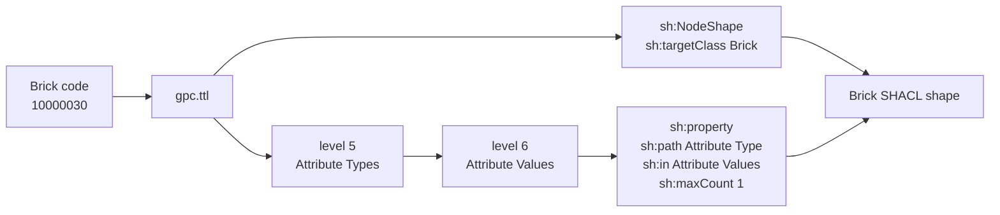
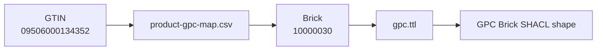
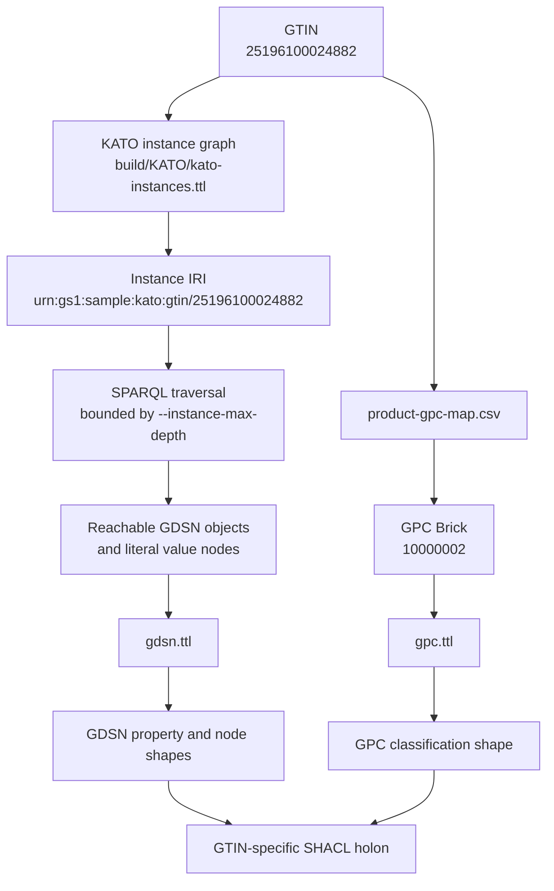
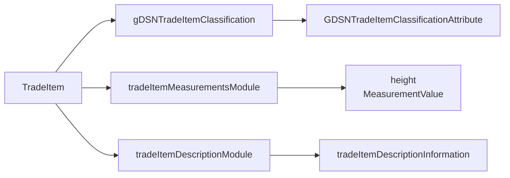

# SHACL Holon Shapes

`gs1-gdsn-holon` generates SHACL shapes from the ontology modules and, when
available, product instance data.

## Brick-only Flow

For a GPC Brick input, the holon is built entirely from `gpc.ttl`. The Brick
class becomes the SHACL target, each level-5 child becomes a property path, and
each level-6 child becomes an allowed value.



Generate a GPC Brick SHACL shape:

```bash
./gs1-gdsn-holon 10000030 \
  --gpc build/gpc.ttl \
  --output build/shacl/gpc-brick-10000030.shacl.ttl
```

## GTIN with GPC Map

For a GTIN input without RDF instance data, the executable first resolves the
GTIN to a Brick using `product-gpc-map.csv`, then follows the same Brick-only
GPC shape generation path.



Generate a GTIN holon using `product-gpc-map.csv`:

```bash
./gs1-gdsn-holon 09506000134352 \
  --input-kind gtin \
  --gtin-map product-gpc-map.csv \
  --gtin-column gtin \
  --brick-column brickCode \
  --output build/shacl/gtin-09506000134352.shacl.ttl
```

## Instance-aware GDSN Flow

When `--include-gdsn` and `--include-instance-objects` are used, the generator
resolves the GTIN resource in the instance graph, discovers reachable GDSN
objects and properties, and then uses `gdsn.ttl` to derive SHACL paths, node
shapes, datatypes, classes, multiplicities, and code-list constraints.



The traversal path can also be printed for inspection:



Generate an instance-aware KATO holon:

```bash
./gs1-gdsn-holon 25196100024882 \
  --input-kind gtin \
  --instance-data build/KATO/kato-instances.ttl \
  --instance-base-iri urn:gs1:sample:kato: \
  --gpc build/gpc.ttl \
  --gdsn build/gdsn.ttl \
  --include-gdsn \
  --include-instance-objects \
  --output build/shacl/kato-25196100024882-holon.shacl.ttl \
  --report-json build/shacl/kato-25196100024882-holon.report.json
```

The default `--instance-max-depth 5` covers the implemented KATO extension
module paths and structured type-3 value nodes.

When `--output` is omitted, the SHACL Turtle is written to stdout.
