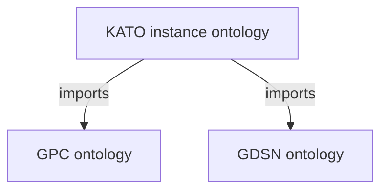

# Loading GPC, GDSN, and KATO in Protégé

Open the KATO instance ontology as the main ontology in Protégé Desktop, then
resolve its imports to the local GPC and GDSN files. GPC and GDSN can load in
either order; both must be available in KATO's imports closure.

## Prepare the files

Use these generated files from the repository root:

| Purpose | Local file | Ontology IRI |
| --- | --- | --- |
| GPC classification vocabulary | `build/gpc.ttl` | `urn:gs1:std:gpc:` |
| GDSN trade item model | `build/gdsn.ttl` | `urn:gs1:std:gdsn:` |
| KATO product instances and import declarations | `build/KATO/kato-instances.ttl` | `urn:gs1:sample:kato:ontology` |

If the files are missing, follow [Ontology generation](uml2semantics.md) and
[KATO instance generation](../instances/kato.md) first.

The KATO file already declares these imports:

```turtle
@prefix kato: <urn:gs1:sample:kato:> .
@prefix owl: <http://www.w3.org/2002/07/owl#> .

kato:ontology a owl:Ontology ;
    owl:imports <urn:gs1:std:gdsn:>,
                <urn:gs1:std:gpc:> .
```



## Open KATO and resolve the imports

1. Start Protégé Desktop and select **File → Open**.
2. Open `build/KATO/kato-instances.ttl`.
3. When Protégé asks for the location of `urn:gs1:std:gpc:`, select the local
   file `build/gpc.ttl`.
4. When it asks for `urn:gs1:std:gdsn:`, select `build/gdsn.ttl`.
   The prompts may appear in either order.
5. Keep `urn:gs1:sample:kato:ontology` as the active ontology.

The imported identifiers are URNs, not downloadable HTTP addresses. Protégé
needs a local-file mapping for each one. If it already has those mappings,
it may resolve the imports without prompting.

!!! note "Use the imports in one workspace"
    Opening GPC, GDSN, and KATO in three separate windows does not establish
    their import relationships. Open KATO and resolve both dependencies within
    its ontology workspace.

## Verify the loaded ontologies

In **Active Ontology → Imported Ontologies**, check that both the GPC and GDSN
imports show their local document locations. An entry showing only an import
IRI, without a loaded document location, indicates that the import did not
resolve.

Use the class and individual views to inspect the combined model. For example,
the generated KATO data contains these product individual IRIs:

```text
urn:gs1:sample:kato:gtin/25196100024882
urn:gs1:sample:kato:gtin/25196100024899
```

With KATO active, its imports make the GPC and GDSN definitions available for
interpreting those individuals. GPC and GDSN remain separate ontology modules.

## Troubleshooting

| Symptom | Check |
| --- | --- |
| Protégé cannot retrieve a `urn:gs1:std:...` import | Resolve the import to its local Turtle file rather than attempting a web download. |
| An import appears without a document location | Reopen KATO and resolve the missing import; check that the selected file still exists. |
| Classes or individuals seem to be missing | Confirm KATO is active and both imports are loaded in that workspace. |
| An import still fails after selecting a file | Check the ontology IRI inside that file against the table above, including the trailing colon on the GPC and GDSN IRIs. |
| Import resolution stops working after moving files | Update the local-file mappings to the new locations. |

The [GraphDB loading guide](graphdb.md) describes a different workflow using
named graphs. Protégé's ontology imports are not GraphDB named graph assignments.

## Further reading

- [Protégé: Imported Ontologies](https://protegeproject.github.io/protege/views/imported-ontologies/)
- [Protégé tutorial: local and remote imports](https://github.com/geneontology/protege-tutorial/blob/master/docs/Imports.md)
