# Core Requirements and Profile Family

*Source version 1.2.0. Draft for discussion and validation.*

## 4. Definition of a semantic publication profile

A semantic publication profile is a named, versioned specification that constrains and combines existing standards and GS1 requirements for a defined publication purpose.

Every profile should state:

1. **Scope** — the artefact classes and use cases covered.
2. **Normative basis** — the external and GS1 specifications reused.
3. **Semantic model** — the classes, properties, controlled terms and relationships required.
4. **Identity rules** — persistent identifiers for the artefact, version, components and concepts.
5. **Metadata rules** — descriptive, administrative, technical and governance metadata.
6. **Representations** — mandatory and optional serialisations.
7. **Access and discovery** — how metadata and representations are found and retrieved.
8. **Validation** — executable constraints and conformance tests.
9. **Provenance and authority** — source, publisher, approver, derivation and change history.
10. **Lifecycle** — status, versioning, supersession, deprecation and persistence.
11. **Agentic affordances** — how machines discover capabilities, interpret operations and assess safety.
12. **Conformance classes** — mandatory, recommended and optional requirements.

A profile should be published as a complete package, not only as prose. The normative package should normally include:

- human-readable specification;
- machine-readable profile metadata;
- JSON Schema and/or SHACL shapes;
- controlled vocabulary or ontology module;
- valid and invalid examples;
- conformance test suite;
- change log;
- implementation guidance;
- publication manifest;
- source-to-output traceability information.

---

## 5. Common requirements for all profiles

The proposed **GS1 Core Semantic Publication Profile** supplies requirements inherited by every specialised profile.

| Requirement area | Core requirement |
| --- | --- |
| Persistent identity | Each artefact, version and addressable component has a globally unique, persistent and dereferenceable identifier where feasible. |
| Authority | The authoritative publisher, owner, approving body and maintenance responsibility are explicit. |
| Artefact classification | The resource is typed as a standard, clause, table, code list, schema, ontology, profile, mapping, API description, dataset, service or other governed class. |
| Rich metadata | Title, description, scope, language, audience, status, dates, themes, keywords, applicable sectors and dependencies are supplied. |
| Versioning | Current version, version identifier, release date, prior version, successor, compatibility and change classification are machine-readable. |
| Provenance | Source artefact, derivation activity, transformation software, responsible agents, approval and publication events are recorded. |
| Semantic relationships | References, dependencies, mappings, imports, compositions, replacements and applicability relations are qualified rather than embedded only as text. |
| Representation | The abstract artefact is distinguished from each distribution or serialisation. |
| Validation | Machine-executable constraints and test examples are provided for structured outputs. |
| Discoverability | Metadata are registered or indexed in a searchable catalogue or registry and linked from the authoritative page. |
| Access | Access protocols, authentication, authorisation, media types and content negotiation are documented. |
| Rights and policy | Licence, usage conditions, confidentiality and access restrictions are explicit. |
| Persistence | Metadata remain available when a version or distribution is withdrawn; tombstone records preserve identity and status. |
| Human usability | Human-readable HTML and/or Markdown representations accompany machine-oriented outputs. |
| Machine citation | Addressable components have stable anchors or identifiers suitable for citation and retrieval. |
| Security | Security classification, sensitivity, unsafe operations and policy constraints are declared where applicable. |
| Observability | Conformance status, generation timestamp, checksum and validation report are publishable. |

---

## 6. Proposed profile family

```mermaid
flowchart TB
    CORE[GS1 Core Semantic Publication Profile]

    CORE --> STD[Standards Artefact Profile]
    CORE --> VOC[Vocabulary and Code List Profile]
    CORE --> ONT[Ontology and Web Vocabulary Profile]
    CORE --> DP[Context Data Product Profile]
    CORE --> MAP[Semantic Mapping Profile]
    CORE --> REG[Registry Record Profile]
    CORE --> VC[Verifiable Claims Profile]
    CORE --> API[GenAI-Enabled API Profile]

    FAIR[FAIR Conformance Overlay]
    MD[Markdown Serialisation Overlay]
    LD[Linked Data Serialisation Overlay]
    AIR[AI Retrieval Overlay]
    AG[Agentic Interface Overlay]

    FAIR -. applies to .-> STD
    FAIR -. applies to .-> VOC
    FAIR -. applies to .-> ONT
    FAIR -. applies to .-> DP
    MD -. applies to .-> STD
    MD -. applies to .-> DP
    LD -. applies to .-> VOC
    LD -. applies to .-> ONT
    LD -. applies to .-> DP
    AIR -. applies to .-> STD
    LD -. applies to .-> API
    FAIR -. applies to .-> API
    AG -. applies to .-> API
    AG -. applies to .-> REG
    AG -. applies to .-> DP
```

The distinction between **base profiles** and **overlays** prevents unnecessary proliferation. For example, AI retrieval requirements can be applied to a standards artefact, ontology or data product without creating three unrelated AI profiles.

---
