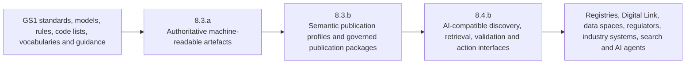

# Workstream Boundaries

*Source version 1.2.0. Draft for discussion and validation.*

## 3. Workstream boundaries and handoffs

### 3.1 Capability chain

### 3.2 Responsibilities

| Concern | 8.3.a | 8.3.b | 8.4.b |
| --- | --- | --- | --- |
| Authoritative standards content | Owns or coordinates creation and maintenance | References and preserves authority | Consumes without redefining |
| Structured source artefact | Produces and versions | Defines publication conformance | Exposes through interfaces |
| Semantic identity and metadata | Provides source identifiers where available | Defines mandatory semantic metadata and persistent identification | Uses identifiers for discovery and responses |
| Linked-data representation | May generate source serialisation | Defines contexts, profiles, mappings, content negotiation and validation | Retrieves and serves representations |
| Markdown representation | May generate source text | Defines source-preserving Markdown serialisation profile | Uses Markdown for retrieval, citation and human-readable responses |
| OpenAPI | May describe a standards-related API | Defines agentic and semantic augmentation profile | Implements and operates API/interface |
| Agent protocols | Supplies authoritative operations and resources | Defines semantic projection and protocol binding rules | Implements MCP, A2A, UCP or other interfaces |
| FAIR conformance | Supplies authoritative metadata and identifiers | Defines FAIR controls and tests | Preserves FAIR access and discovery behaviour |
| Registry platform operation | Out of scope except standards dependencies | Defines semantic registry record profile | Implements query, verification and agent access |

### 3.3 Boundary statement

8.3.b should **not** be described as creating a new infrastructure platform unless a separately approved implementation decision requires one. Its primary output is a reusable semantic publication capability comprising:

- application profiles;
- semantic models and mappings;
- metadata requirements;
- serialisation rules;
- publication manifests;
- validation shapes and schemas;
- provenance patterns;
- agentic overlays and projections;
- conformance tests;
- governance and lifecycle rules.

---

## Relationship to This Repository

The Product Holon architecture also proposes an 8.4.a discovery and proof role. These are separate draft allocations; this conversion does not reconcile their ownership. See [the architecture handoff](../architecture/publication-and-consumption.md).
